# [트랙특화] ChatGPT 챗봇 Programming

## ⭐GIT : 분산 버전 관리 시스템

리누스 토르발스 : git와 분산 버전 관리 시스템인 Git의 창시자 

Git 자체는 Github, Gitlab과 관계 없음. 단순 정보 업로드를 위한 공간임

버전 관리 : 변화를 기록하고 추적하는 것, 마지막 파일과 변경 사항만 남기기

ex) Google docs 內 Words

중앙 집중식 : 버전은 중앙 서버에 저장되고 중앙 서버에서 파일을 가져와 다시 중앙에 업로드

분산식 : 버전을 여러 개의 복제된 저장소에 저장 및 관리

- 중앙 서버에 의존하지 않고도 동시에 다양한 작업을 수행할 수 있음
    - 개발자들 간의 작업 충돌을 줄여주고 개발 생산성을 향상
- 중앙 서버의 장애나 손실에 대비하여 백업과 복구가 용이
- 인터넷에 연결되지 않은 환경에서도 작업을 계속할 수 있음
    - 변경 이력과 코드를 로컬 저장소에 기록하고, 나중에 중앙 서버와 동기화

## GIT 영역

지역 저장소 (local repository) : 작업하는 컴퓨터의 저장소

원격 저장소 (remote repository) : 로컬이 아닌 컴퓨터 혹은 서버의 저장소

- Working Directory : 실제 작업 중인 파일들이 위치하는 영역
- Staging Area : Working Directory에서 변경된 파일 중, 다음 버전에 포함시킬 파일들을 선택적으로 추가하거나 제외할 수 있는 준비 영역
- Repository : 버전 이력과 파일들이 영구적으로 저장되는 영역. 모든 버전과 변경 이력이 기록됨
- 로컬 : 현재 사용자가 직접 접속하고 있는 기기 또는 시스템. 개인 컴퓨터, 노트북, 태블릿 등 사용자가 직접 조작하는 환경 (cf. 온라인)

## 다양한 원격 저장소 서비스

- [GitLab](https://about.gitlab.com/)
- [GitHub](https://github.com/)
- Bitbucket

## GIT 명령어

`git init` : 로컬 저장소 설정(초기화). git의 버전 관리를 시작할 디렉토리에서 진행

    git init
  
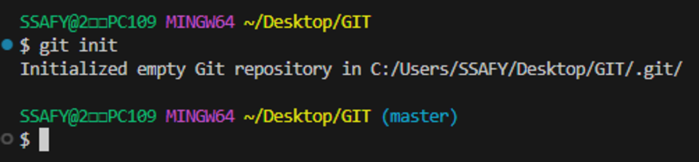
    
(master)가 보이는 경우 git의 영역 내에 있다는 뜻임.
    
올바르지 않은 위치에서 git init 명령을 내린 경우, git init 명령을 내린 디렉토리에서 .git (숨긴 항목) 폴더를 삭제
  
- git 로컬 저장소 내에 또 다른 git 로컬 저장소를 만들지 말 것
  - 즉, 이미 git 로컬 저장소인 디렉토리 내부 하단에서 git init 명령어를 다시 입력하지 말 것
  - git 저장소 안에 git 저장소가 있을 경우 가장 바깥 쪽의 git 저장소가 안쪽의 git 저장소의 변경사항을 추적할 수 없기 때문
  
`git add` : 변경사항이 있는 파일을 Staging Area에 추가

    git add [이름]
    
`git add .` : 현재 디렉토리 내 변경사항이 있는 모든 파일을 Staging Area에 추가

    git add .
    
`git commit` : Staging Area에 있는 파일들을 저장소에 기록. 해당 시점의 버전을 생성하고 변경 이력을 남기는 것

    git commit [-m] ["메세지"]
    
- 해당 명령 실행 전, author identity unknown 문제를 해결해야 함. (Gitlab에 설정한 정보와 동일하게)
    - `git config --global user.email "[you@example.com](mailto:you@example.com)"`
    - `git config --global [user.name](http://user.name/) "Your Name"`

- Commit : 변경된 파일들을 저장하는 행위.
  
`git status`: master, commits 관련 현재 상태에 대한 정보를 출력함

    git status
    
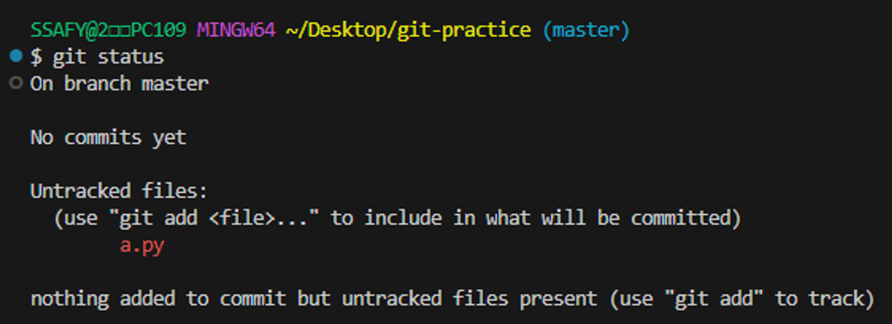

- a.py라는 파일에 Staging Area에 버전이 기록되지 않은 변경 사항이 있는 경우, “Untracked files”라는 status를 출력함.(Working Directory)
        
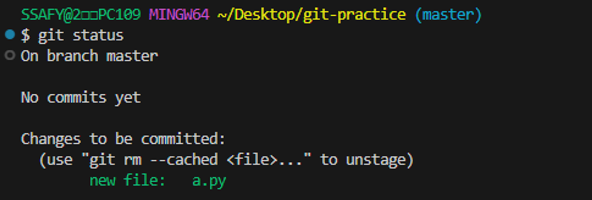
        
- a.py라는 파일을 `add` 시키면 파일명이 초록색으로 변경함(Staging Area)

`git log` : 현재까지 저장된 commit(version)을 출력함

    git log
    
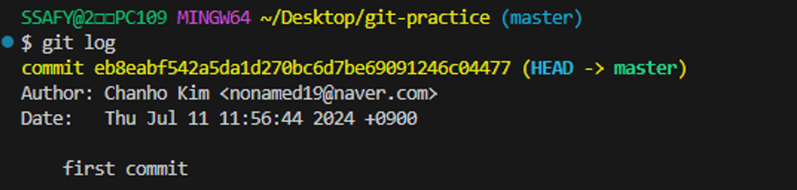
    
`git log —oneline` : commit 목록 한 줄로 보기

    git log --oneline

`git remote` : 로컬 저장소에 원격 저장소 추가

    git remote add origin remote_repo_url
    
origin : 추가하는 원격 저장소 별칭.
    
- 별칭을 사용해 로컬 저장소 한 개에 여러 원격 저장소를 추가 할 수 있음(개발자들 간의 암묵적인 약속)
    
remote_repo_url : 추가하는 원격 저장소 주소
    
ex) https://github.com/nonamed19/git-practice
    
`git push` : 원격 저장소에 commit 목록을 업로드
    
    git push origin master
    
- git push는 기존 대비 변경사항(commit)만 원격 저장소에 올라감
- commit 이력이 없다면 push 할 수 없음

`git pull` : 원격 저장소에 있는 변경사항(commit)만을 다운로드

    git pull
    
`git clone` : 원격 저장소 전체를 복제(다운로드)

    git clone remote_repo_url
    
- `git clone`으로 받은 프로젝트는 이미 `git init`이 되어 있음
    
`git remote -v` : 연결되어 있는 원격 저장소의 리스트를 출력

    git remote -v

`.gitignore` : git에 연관되지 않는 파일을 설정하기 위해 사용
    
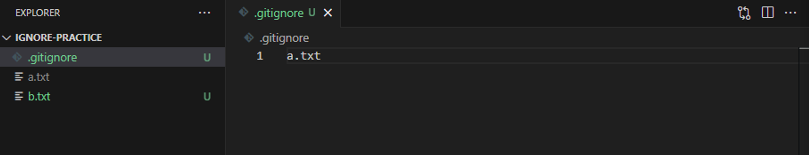
    
[gitignore.io](https://www.toptal.com/developers/gitignore/)
    
- Windows, Python, VisualStuodioCode는 PJT 초반에 세팅하기

주의사항 : 이미 git의 관리를 받은 이력이 있는 파일이나 디렉토리는 나중에 gitignore에 작성해도 적용되지 않음 (git rm —cached 명령어를 통해 git 캐시에서 삭제 필요)

`git revert` : 특정 commit을 없었던 일로 만드는 작업(재설정)
    
    git revert <commit id>
    
- 프로젝트 기록에서 commit을 없었던 일로 처리 후 그 결과를 새로운 commit으로 추가함.
- 없었던 일로 처리한다는 commit이 추가되어 전체 commit의 개수는 +1.
- 변경 사항을 안전하게 실행 취소할 수 있도록 도와주는 순방향 실행 취소 작업
- ⭐git에서 기록이 손실되는 것을 방지하며 기록의 무결성과 협업의 신뢰성을 높임

`git revert` : 추가 명령어

    1. git revert <commit id1> <commit id2> <commit id3>
    2. git revert <commit id1>..<commit id2>
    3. git revert --no-edit <commit id>
    4. git revert --no-commit <commit id>
    
`git reset` : 특정 commit으로 되돌아 가고, 해당 commit 이후의 commit은 모두 삭제(되돌리기)

    git reset --option <commit id>
    
`git reset` : 추가 명령어, 삭제되는 commit들의 기록을 어떤 영역에 남길 것인지 옵션을 활용해 조정할 수 있음

    git reset --soft # 삭제된 commit의 기록을 staging area에 남김
    git reset --mixed # 삭제된 commit의 기록을 working directory에 남김(기본 옵션값)
    git reset --hard # 삭제된 commit의 기록을 남기지 않음
    
- `git reset —soft`
    
    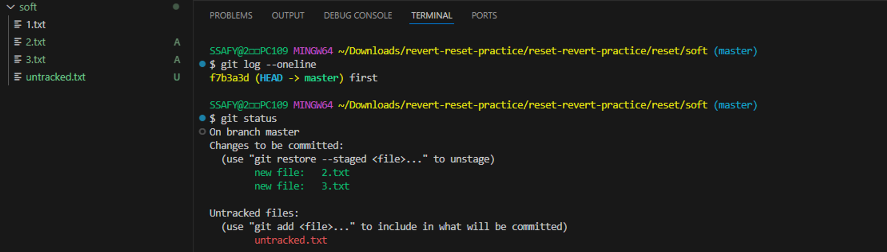
    
- `git reset —mixed`
    
    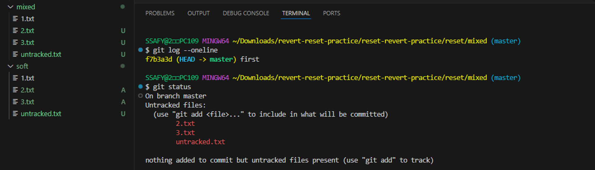
    
- `git reset —hard`
    
    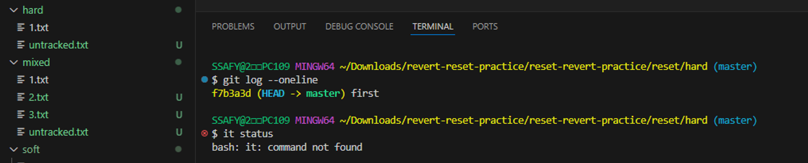
    
`git reflog` : HEAD가 이전에 가리켰던 모든 commit을 보여줌. `reset`의 `—hard` 옵션을 통해 지워진 commit도 `reflog`로 조회하여 복구 가능

    git reflog ...

`git restore` : working directory에서 파일을 수정한 뒤, 파일의 수정 사항을 취소하고, 원래 모습대로 되돌리는 작업

    git restore <file>

- 해당 작업은 원래 파일을 덮어쓰는 원리이기 때문에 수정한 내용은 전부 사라짐. (내용 복원 불가)
    
`git rm —cached` : staging area에서 working directory로 되돌리기(remove)
- git 저장소에 commit이 없는 경우

        git rm --cached <file>

`git restore —staged` : staging area에서 working directory로 되돌리기
- git 저장소에 commit이 존재하는 경우

        git restore --staged <file>

`git commit` 수정하기 : 불필요한 commit을 생성하지 않고, 직전 commit을 수정할 수 있기 때문에 git에서 꼭 필요한 기능 중 하나임.

    git commit --amend

1. `git commit` 직전 commit의 메세지 수정
    
    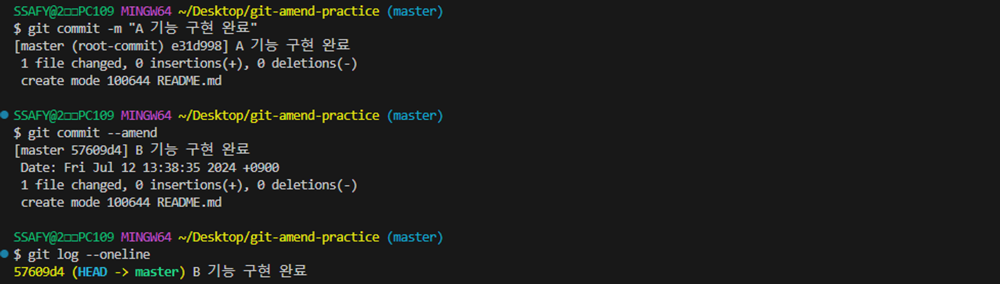
    
2. `git commit` 직전 commit 항목 수정 
    
    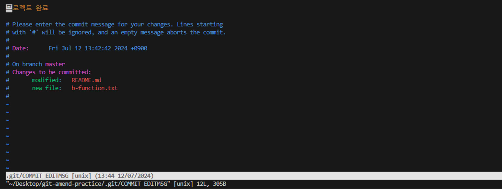

# Vim
vi 호환 텍스트 편집기며, 키보드로만 조작이 가능함. VS Code의 원조격.

입력 모드 : 명령 모드에서 I 키를 입력
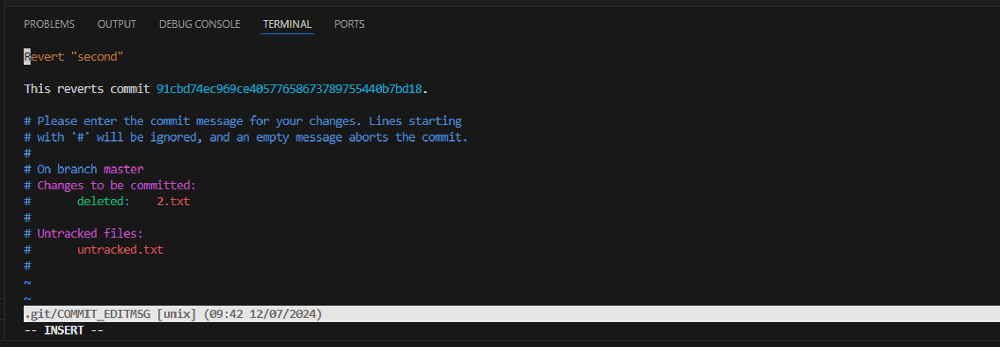

명령 모드 : 입력 모드에서 esc 키를 입력
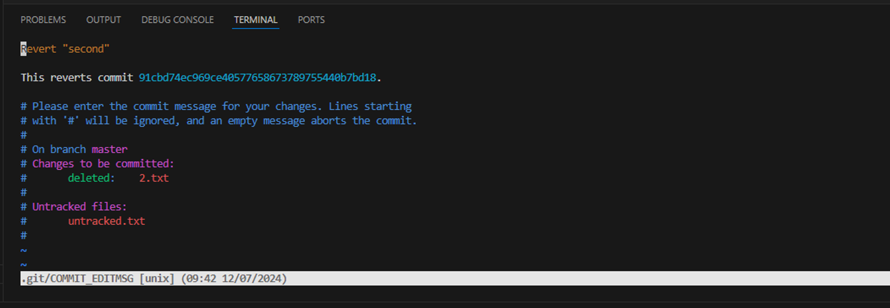

Vim 종료 : shift + ; 입력 후 wq (write+quit) 입력