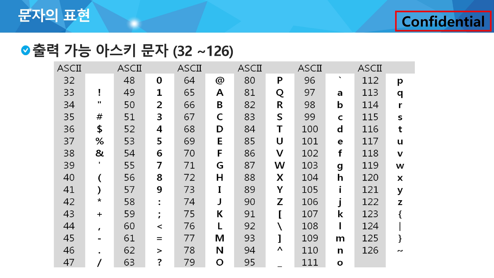

### 컴퓨터에서의 문자표현

메모리는 숫자만을 저장할 수 있기 때문에 각 문자에 대응하는 숫자를 정해 놓고 이것을 메모리에 저자장하는 방식이 사용됨

코드체계를 통해 영어가 대소문자 합쳐서 52자 이므로 6(64가지)비트면 모두 표현할 수 있다.

ex. 000000 → ‘a’

ex. 000001 → ‘b’

네트워크가 발전되기 전 미국의 각 지역 별로 코드체계를 정해 놓고 사용했지만,

네트워크(인터넷)가 발전하면서 서로간에 정보를 주고 받을 때 정보를 달리 해석한다는 문제가 생김.

→ ASCII(American Standard Code for International Interchange) : 문자 인코딩 표준이 제정됨

<br>

### 표준 ASCII :

7-bit 인코딩으로 128문자를 표현하며 33개의 출력 불가능한 제어 문자들과 공백을 비롯한 95개의 출력 가능한 문자들로 이루어짐.



### 확장 ASCII (ANSI, American National Standard Institute):

8-bit(1Byte) 인코딩으로 표준 문자 이외의 악센트 문자, 도형 문자, 특수 문자, 특수 기호 등 부가적인 문자를 128개 추가할 수 있게 하는 부호.

확장 부호는 표준 아스키와 같은 다른 프로그램이나 컴퓨터 사이에 교환되지 못함.

.png)

### 유니코드(Unicode) : 다국어 처리 표준

오늘날 대부분의 컴퓨터는 문자를 읽고 쓰는데 ASCII 형식을 사용함

컴퓨터가 발전하면서 미국 뿐 아니라 각 나라에서 자국의 문자를 표현하기 위해서 코드체계를 만들어서 사용하게 되었음. (including Korea)

이러한 코드체계는 국가 간에 정보를 주고 받을 때 발생하였으며, 이를 위해 유니코드를 마련함. 

.png)

유니코드를 저장하는 변수의 크기에 따라 character set로 분류됨

- UCS-2(Universal Character Set 2)
- UCS-4(Universal Character Set 4)

그러나, 바이트 순서(UCS-2, UCS-4 구분)에 대해서 표준화되지 못하여 외부 인코딩이 필요하게 됨

.png)

big-endian : 메모리에 데이터를 저장할 때 상위 바이트(큰 쪽)을 먼저 저장하는 방식

little-endian : 메모리에 데이터를 저장할 때 하위 바이트(작은 쪽)을 먼저 저장하는 방식

### 유니코드 인코딩

UTF-8 (Unicode Transformation Format : 가변 1 ~ 4 Byte) : in web

UTF-16 (Unicode Transformation Format : 가변 2 ~ 4 Byte) : in windows, java

UTF-32 (Unicode Transformation format : 고정 4 Byte) : in unix

<br>

### 문자열

.png)

java(객체지향 언어)에서의 문자열 처리 → 유니코드(UTF16)으로 저장

문자열 데이터를 저장, 처리해주는 클래스(String)를 제공함

```java
String str = "abc"; or
String str = new String("abc")
```

java.lang.String 클래스에는 기본적인 객체 메타 데이터 외에도 네 가지 필드가 포함되어 있음

- hash 값 (hash)
- 문자열의 길이 (count)
- 문자열 데이터의 시작점 (offset)
- 실제 문자열 배열에 대한 참조 (value)

C언어에서의 문자열 처리 → ASCII Code로 저장

문자열은 문자들의 배열 형태로 구현된 응용 자료형

문자배열에 문자열을 저장할 때는 항상 마지막에 끝을 표시하는 널문자(’\0’)을 넣어줘야 함

```c
char ary[] = {'a', 'b', 'c', '\0'}; or
char ary[] = "abc";
```

Python에서의 문자열 처리 → 유니코드(UTF8)로 저장

char 타입 없음

텍스트 데이터의 취급방법이 통일되어 있음

문자열 기호 : ‘(홑따옴표)’, “(쌍따옴표)”, ‘’’(홑따옴표 3개)’’’, “””(쌍따옴표 3개)”””

연결 : 이어 붙여주는 역할 <문자열 + 문자열>

반복 : 수만큼 문자열이 반복 <문자열 * 수>

문자열은 시퀀스 자료형으로 분류되고, 시퀀스 자료형에서 사용할 수 있는 인덱싱, 슬라이싱 연산들을 사용할 수 있음

문자열은 튜플과 같이 요소값을 변경할 수 없음(immutable)

### 문자열 뒤집기

1. 자기 문자열에서 뒤집는 방법 : *임시 변수 필요, 반복 수행을 문자열 길이의 반만큼만*
2. 새로운 빈 문자열을 만들어 소스의 뒤에서부터 읽어서 타겟에 쓰는 방법

### 문자열 비교

파이썬에서는 `==` 연산자와 `is` 연산자를 제공

- == 연산자는 내부적으로 특수 메서드 `__eq__()`를 호출

ex. 문자열 비교함수 in C 코드

```c
int my_strcmp(const char *str1, const char *str2)
{
    int i = 0;
    while(str1[i] != '\0')
    {
        if(str1[i] != str2[i]) break;
        i++;
    }
    return (str1[i] - str2[i]);
}
```

- 문자열이 같으면 0 리턴
- str1이 str2보다 사전 순서상 앞서면 음수 혹은 -1 리턴
- str1이 str2보다 사전 순서상 나중이면 양수 혹은 1 리턴

### 문자열 숫자를 정수로 변환하기

파이썬에서는 숫자와 문자변환 함수를 제공 (`int()`, `float()`, `str()`, `repr()`)

ex. `int()`와 같은 `atoi()` 함수 in Python

```python
def atoi(s):
    i = 0
    for x in s:
        i = i*10 + ord(x) - ord('0')
    return i
```

- 양의 정수를 입력 받아 문자열로 변환하는 함수
- 입력 값 : 변환할 정수 값, 변환된 문자열을 저장할 문자배열
- 반환 값 : 없음

[참고] `ord()` :  하나의 문자를 인자로 받고 해당 문자에 해당하는 유니코드 정수를 반환

[참고] `chr()` : 하나의 정수를 인자로 받고 해당 정수에 해당하는 유니코드 문자를 반환

<br>

### 패턴 매칭

- 고지식한 패턴 검색 알고리즘(Brute Force)
    
    본문 문자열을 처음부터 끝까지 차례대로 순회하면서 패턴 내의 문자들을 일일이 비교하는 방식으로 동작
    
    시간 복잡도 : O(mn) (최악의 경우)
    
    .png)
    
    - 패턴 매칭 in pseudo code(during class)
        
        ```python
        i = j = 0
        # N = length of the list
        while i < N and j < N
            if t[i] == t[j] # 일치
                i += 1
                j += 1
            else:           # 불일치
                i = i-j+1
                j = 0
        ```
        
    - 패턴 매칭 in pseudo code(in textbook)
        
        ```python
        p = "is" # 찾을 패턴
        t = "This is a book~!" # 전체 텍스트
        M = len(p) # 찾을 패턴의 길이
        N = len(t) # 전체 텍스트의 길이
        
        def BruteForce(p, t):
            i = 0 # t의 인덱스
            j = 0 # p의 인덱스
            while j < M and i < N:
                if t[i] != p[j]:
                    i = i-j
                    j = -1
                i = i+1
                j = j+1
            if j == M: return i-M # 검색 성공
            else: return -1       # 검색 실패
        ```
        
    - 패턴 매칭 in python code(during class)
        
        ```python
        t = 'TTTTTATTABC'
        p = 'TTA'
        N = len(t)
        M = len(p)
        cnt = 0
        for i in range(N-M+1): # 비교 시작 위치
            for j in range(M):
                if t[i+j] != p[j]:
                    break # for j, 다음 글자부터 비교 시작
            else: # for j가 중단 없이 반복되면
                cnt += 1 # 패턴 개수 1 증가
        print(cnt)
        ```
        
- 카프-라빈 알고리즘
    
    시간 복잡도 : O(n)
    
- KMP 알고리즘
    
    불일치가 발생한 텍스트 스트링의 앞 부분에 어떤 문자가 있는지를 미리 알고 있으므로, 불일치가 발생한 앞 부분에 대해서 다시 비교하지 않고 매칭을 수행
    
    .png)
    
    배열을 전처리하여 배열 next[M]을 구해서 잘못된 시작을 최소화함
    
    - next[M] : 불일치가 발생했을 경우 이동할 다음 위치
    
    시간 복잡도 : O(m + n)
    
    - KMP 알고리즘 in python code(during class)
        
        ```python
        def kmp(t, p)
            N = len(t)
            M = len(p)
            lps = [0] * (M+1)
            # preprocessing
            j = 0 # 일치한 개수 == 비교할 패턴 위치
            lps[0] = -1
            for i in range(1, M):
                lps[i] = j
                if p[i] == p[j]:
                    j += 1
                else: 
                    j = 0
            lps[M] = j
            
            # search
            i = 0 # 비교할 텍스트 위치
            j = 0 # 비교할 패턴 위치
            while i < N and j <= M:
                if j == -1 or t[i] == p[j]: # 첫 글자가 불일치했거나, 일치하면
                    i += 1
                    j += 1
                else: # 불일치
                    j = lps[j]
                if j == M: # 패턴을 찾을 경우
                    print(i-M, end = ' ') # 패턴의 인덱스 출력
                    j = lps[j]
        ```
        
- 보이어-무어 알고리즘
    
    오른쪽에서 왼쪽으로 비교
    
    대부분의 상용 소프트웨어에서 채택하고 있는 알고리즘
    
    패턴의 오른쪽 끝에 있는 문자가 불일치 하고 이 문자가 패턴 내에 존재하지 않는 경우, 이동 거리는 패턴의 길이만큼이 됨
    
    시간 복잡도 : O(mn) (최악의 경우)
    
    .png)
    
    보이어-무어 알고리즘은 텍스트 문자를 다 보지 않아도 됨
    
    발상의 전환 : 패턴의 오른쪽부터 비교한다
    

ex. 고지식한 패턴 검색 알고리즘을 통한  패턴 매칭

```python
def f(t, p): # 패턴 p와 일치하는 구간의 시작 인덱스 리턴, 일치하는 경우가 없으면 -1 리턴
    N = len(t)
    M = len(p)

    for i in range(N - M + 1): # 비교 시작 위치
        for j in range(M):
            if t[i+j] != p[j]:
                break # for j, 다음 글자부터 비교 시작
        else: # for j가 중단없이 반복되면
            return i # 패턴을 찾은 경우
    return -1

t = 'TTTTTATTABC'
p = 'TTA'

print(f(t, p))
```

<br>

---

### 문자열 암호화 : 시저 암호(Caesar cipher)

줄리어스 시저가 사용했다고 하는 암호

시저는 기원전 100년경에 로마에서 활약했던 장군임

시저 암호는 평문에서 사용되고 있는 알파벳을 일정한 문자 수만큼 [평행이동] 시킴으로써 암호화를 행한다.

.png)

exclusive-or
<br>

---
### 문자열 압축