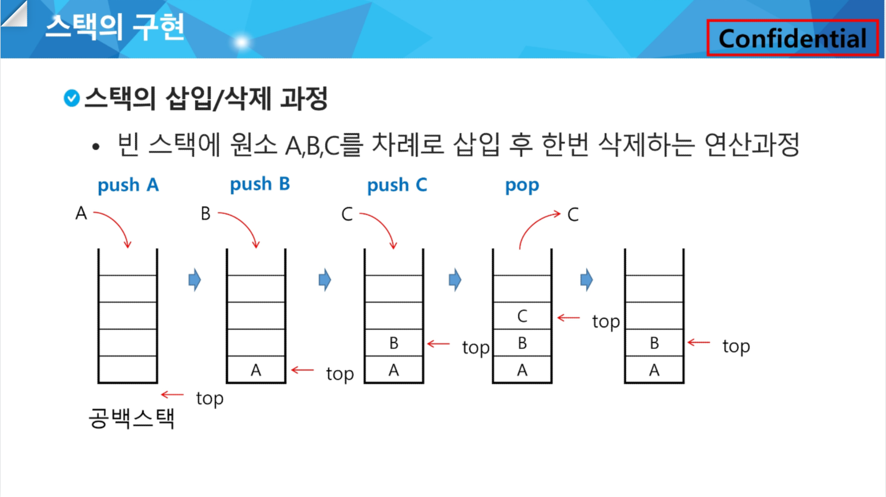

### Stack :

물건을 쌓아 올리듯 자료를 쌓아 올린 형태의 자료구조

스택에 저장된 자료는 선형 구조를 가짐

- 선형구조 : 자료 간의 관계가 1대 1의 관계를 가짐
- 비선형구조 : 자료 간의 관계가 1대 N의 관계를 가짐(예 : 트리)

스택에 자료를 삽입하거나 스택에서 자료를 꺼낼 수 있음

후입선출(LIFO, Last-In-First-Out) : 마지막에 삽입한 자료를 가장 먼저 꺼냄

스택을 프로그램에서 구현하기 위해서 필요한 자료구조와 연산 :

자료구조 : 자료를 선형으로 저장할 저장소

- 배열을 사용할 수 있음
- 저장소 자체를 스택이라 부르기도 함
- 스택에서 마지막 삽입된 원소의 위치를 top이라 부름

<br>

### 연산 :



- 삽입(push) : 저장소에 자료를 저장. `append` 메소드를 통해 리스트의 마지막에 데이터를 삽입
    
    ```python
    def push(item):
        s.append(item)
    ```
    
    ```python
    def push(item, size):
        global top
        top += 1
        if top == size:
            print('overflow!')
        else:
            stack[top] = item
    
    size = 10
    stack = [0] * size
    top = -1
    
    push(10, size)
    top += 1 # push(20)
    stack[top] = 20
    ```
    
- 삭제(pop) : 저장소에서 자료를 꺼냄. 꺼낸 자료는 삽입한 자료의 역순으로 꺼냄
    
    ```python
    def pop():
        if len(s) == 0:
            # underflow
            return
        else:
            return s.pop();
    ```
    
    ```python
    def pop():
        global top
        if top == -1:
            print('underflow')
            return 0
        else:
            top -= 1
            return stack[top+1]
    
    print(pop())
    
    if top > -1: # pop()
        top -= 1
        print(stack[top+1]
    ```
    

isEmpty : 스택이 공백인지 아닌지를 확인하는 연산

peek : 스택의 top에 있는 item(원소)를 반환하는 연산

<br>

### 스택 구현 고려사항

1차원 배열을 사용하여 구현할 경우 구현이 용이하다는 장점이 있지만, 스택의 크기를 변경하기가 어렵다는 단점이 있음

이를 해결하기 위한 방법으로 저장소를 동적으로 할당하여 스택을 구현할 수 있음
→ 동적 연결 리스트를 이용하여 구현

동적 연결 리스트는 구현이 복잡하지만 메모리를 효율적으로 사용한다는 장점을 가짐

### 스택의 응용 : 괄호 검사

괄호의 종류 : 대괄호 [ ], 중괄호 { }, 소괄호 ( )

조건:

- 왼쪽 괄호의 개수와 오른쪽 괄호의 개수가 같아야 함
- 같은 괄호에서 왼쪽 괄호는 오른쪽 괄호보다 먼저 나와야 함
- 괄호 사이에는 포함 관계만 존재함

문자열에 있는 괄호를 차례대로 조사하면서 왼쪽 괄호를 만나면 스택에 삽입하고, 오른쪽 괄호를 만나면 top 괄호를 삭제한 후 오른쪽 괄호와 짝이 맞는지를 검사함

이 때, 스택이 비어 있으면 조건 1 또는 조건 2에 위배되고, 괄호의 짝이 맞지 않으면 조건 3에 위배됨

마지막 괄호까지 조사한 후에도 스택에 괄호가 남아 있으면 조건 1에 위배됨

### 스택의 응용 : Function call

프로그램에서 함수 호출과 복귀에 따른 수행 순서를 관리

.png)

- 가장 마지막에 호출된 함수가 가장 먼저 실행을 완료하고 복귀하는 후입선출 구조이므로, 후입선출 구조의 스택을 이용하여 수행순서 관리
- 함수 호출이 발생하면 호출한 함수 수행에 필요한 지역변수, 매개변수 및 수행 후 복귀할 주소 등의 정보를 스택 프레임(stack frame)에 저장하여 시스템 스택에 삽입
- 함수의 실행이 끝나면 시스템 스택의 top 원소(스택 프레임)를 삭제(pop)하면서 프레임에 저장되어 있던 복귀주소를 확인하고 복귀
- 함수 호출과 복귀에 따라 이 과정을 반복하여 전체 프로그램 수행이 종료되면 시스템 스택은 공백 스택이 됨

<br>

### 재귀호출 :

필요한 함수가 자신과 같은 경우 자신을 다시 호출하는 구조

함수에서 실행해야 하는 작업의 특성에 따라 일반적인 호출방식보다 재귀호출방식을 사용하여 함수를 만들면 프로그램의 크기를 줄이고 간단하게 작성

ex. factorial, 피보나치 수열

```python
def fact(n):
    if n == 1:
        return 1
    else:
        return n*fact(n-1)
```

```python
def fibo(n):
    if n < 2:
        return n
    else:
        return fibo(n-1) + fibo(n-2)
```

<br>

### Memoization :

메모이제이션은 컴퓨터 프로그램을 실행할 때 이전에 계산한 값을 메모리에 저장해서 매번 다시 계산하지 않도록 하여 전체적인 실행속도를 빠르게 하는 기술

동적 계획법의 핵심 기술

- Memoization Algorithm in python code
    
    ```python
    #memo를 위한 배열을 할당하고, 모두 0으로 초기화 한다;
    #memo[0]을 0으로 memo[1]는 1로 초기화 한다;
    
    def fibo1(n):
        global memo
        if n >= 2 and memo[n] == 0:
            memo[n] = fibo1(n-1) + fibo1(n-2)
        return memo[n]
    
    memo = [0]*(n+1)
    memo[0] = 0
    memo[1] = 1
    ```
    
- Recursive Algorithm in python code
    
    ```python
    def fibo(n):
        if n < 2:
            return n
        else:
            return fibo(n-1) + fibo(n-2)
    ```
    

동적 계획(Dynamic Programming) 알고리즘은  그리디 알고리즘과 같이 최적화 문제를 해결하는 알고리즘

동적 계획 알고리즘은 먼저 입력 크기가 작은 부분 문제들을 모두 해결한 후에 그 해들을 이용하여 보다 큰 크기의 부분 문제들을 해결하여, 최종적으로 원래 주어진 입력의 문제를 해결하는 알고리즘

- 피보나치 수 DP 적용
    
    피보나치 수는 부분 문제의 답으로부터 본 문제의 답을 얻을 수 있으므로 최적 부분 구조로 이루어져 있음
    
    1) 문제를 부분 문제로 분할 : Fibonacci(n) = Fibonacci(n-1) + Fibonacci(n-2)
    
    2) 부분 문제로 나누는 일을 끝냈으면 가장 작은 부분 문제부터 해를 구함
    
    3) 그 결과는 테이블에 저장하고, 테이블에 저장된 부분 문제의 해를 이용하여 상위 문제의 해를 구함
    

memoization을 재귀적 구조에 사용하는 것보다 반복적 구조로 DP를 구현한 것이 성능 면에서 보다 효율적

재귀적 구조는 내부에 시스템 호출 스택을 사용하는 오버헤드가 발생하기 때문

<br>

### DFS(깊이 우선 탐색) :

비선형구조인 그래프 구조는 그래프로 표현된 모든 자료를 빠짐없이 검색하는 것이 중요

- 깊이 우선 탐색(Depth First Search, DFS)
- 너비 우선 탐색(Breadth First Search, BFS)

시작 정점의 한 방향으로 갈 수 있는 경로가 있는 곳까지 깊이 탐색해 가다가 더 이상 갈 곳이 없게 되면, 가장 마지막에 만났던 갈림길 간선이 있는 정점으로 되돌아와서 다른 방향의 정점으로 탐색을 계속 반복하여 결국 모든 정점을 방문하는 순회방법

가장 마지막에 만났던 갈림길의 정점으로 되돌아가서 다시 깊이 우선 탐색을 반복해야 하므로 후입선출 구조의 스택 사용

### DFS 알고리즘 :

1) 시작 정점 v를 결정하여 방문

2) 정점 v에 인접한 정점 중에서,

1. 방문하지 않은 정점 w가 있으면, 정점 v를 스택에 push하고 정점 w를 방문
그리고 w를 v로 하여 다시 2)를 반복
2. 방문하지 않은 정점이 없으면, 탐색의 방향을 바꾸기 위해서 스택을 pop하여 받은 가장 마지막 방문 정점을 v로 하여 다시 2)를 반복

**3) 스택이 공백이 될 때까지 2)를 반복**

```python
visited[], stack[] 초기화
DFS(v)
	시작점 v 방문;
	visited[v] <- true;
	while {
	    if (v의 인접 정점 중 방문 안 한 정점 w가 있으면)
		      push(v);
		      v <- w; (w에 방문)
		      visited[w] <- true;
		  else
		      if (스택이 비어 있지 않으면)
		          v <- pop(stack);
		      else
		          break
    }
end DFS()
```

실제 DFS 예시 in python during class

```python
'''
1
7 8
1 2 1 3 2 4 2 5 4 6 5 6 6 7 3 7
'''

def DFS(s, V):
    visited = [0]*(V+1)         # 방문한 정점을 표시
    stack = []                  # 스택 생성
    # print(s)
    visited[s] = 1              # 시작정점 방문표시
    v = s

    while True:
        for w in adjL[v]:       # v에 인접하고, 방문 안 한 w가 있으면
            if visited[w] == 0:
                stack.append(v) # push(v): 현재 정점을 push하고
                v = w           # w에 방문
                # print(v)
                visited[w] = 1  # w에 방문 표시
                break           # for w, v부터 다시 탐색
        else:                   # 남은 인접정점이 없어서 break가 걸리지 않은 경우
            if stack:           # 이전 갈림길을 스택에서 꺼내서 ... if TOP > -1
                v = stack.pop()
            else:               # 되돌아갈 곳이 없으면/남은 갈림길이 없으면 탐색종료
                break           # while True:

T = int(input())  # 테스트 케이스의 수를 입력받음
for tc in range(1, T+1):  # 각 테스트 케이스에 대해 반복
    V, E = map(int, input().split())  # 정점의 수 V와 간선의 수 E를 입력받음
    adjL = [[] for _ in range(V+1)]  # 인접 리스트를 초기화 (1부터 V까지 사용)
    arr = list(map(int, input().split()))  # 간선 정보를 일괄 입력받음
    for i in range(E):  # 각 간선에 대해 반복
        v1, v2 = arr[i*2], arr[i*2+1]  # 간선을 이루는 두 정점을 추출
        adjL[v1].append(v2)  # 첫 번째 정점에 두 번째 정점을 추가
        adjL[v2].append(v1)  # 두 번째 정점에 첫 번째 정점을 추가 (무방향 그래프)

    DFS(1, V)
```