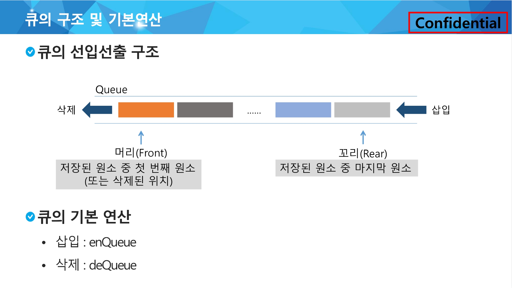

### Queue :

큐(Queue)의 특성 :

스택과 마찬가지로 삽입과 삭제의 위치가 제한적인 자료구조

- 큐의 뒤에서는 삽입만 하고, 큐의 앞에서는 삭제만 이루어지는 구조

선입선출구조(FIFO : First In First Out) :

큐에 삽입한 순서대로 원소가 저장되어, 가장 먼저 삽입(First In)된 원소는 가장 먼저 삭제(First Out) 됨



머리(Front) : 저장된 첫 번째 원소의 인덱스

꼬리(Rear) : 저장된 마지막 원소의 인덱스

<br>

### 선형큐 :

1차원 배열을 이용한 큐 (큐의 크기 = 배열의 크기)

[상태 표현]

초기 상태 : front = rear = -1

공백 상태 : front == rear

포화 상태 : rear == n-1 (n : 배열의 크기, n-1 : 배열의 마지막 인덱스)

[disadvantage]

잘못된 포화상태 인식 :

선형큐를 이용하여 원소의 삽입과 삭제를 계속할 경우, 배열의 앞부분에 활용할 수 있는 공간이 있음에도 불구하고, rear = n - 1인 상태(포화상태)로 인식하여 더 이상의 삽입을 수행하지 않게 됨

→ 매 연산이 이루어질 때마다 저장된 원소들을 배열의 앞부분으로 이동(큐의 효율성 저하)

→ 1차원 배열의 처음과 끝이 연결되는 원형큐의 논리적 구조를 활용 

### 선형큐의 연산 :

- `createQueue()` : 공백 상태의 큐를 생성하는 연산
    
    크기 n인 1차원 배열 생성
    
    front와 rear를 -1로 초기화
    
- `enQueue(item)` : 큐의 뒤쪽(rear 다음)에 원소를 삽입하는 연산
    
    마지막 원소 뒤에 새로운 원소를 삽입하기 위해
    
    1) rear 값을 하나 증가시켜 새로운 원소를 삽입할 자리를 마련
    
    2) 그 인덱스에 해당하는 배열원소 Q[rear]에 item을 저장
    
    ```python
    def enQueue(item):
        global rear
        if isFull() :
            print("Queue_Full")
        else:
            rear <- rear + 1;
            Q[rear] <- item;
    ```
    
- `deQueue()` : 큐의 앞쪽(front)에서 원소를 삭제하고 반환하는 연산
    
    가장 앞에 있는 원소를 삭제하기 위해
    
    1) front 값을 하나 증가시켜 큐에 남아있는 첫 번째 원소 이동
    
    2) 새로운 첫 번째 원소를 리턴 함으로써 삭제와 동일한 기능함
    
    ```python
    def deQueue():
        if (isEmpty()) then Queue_Empty();
        else {
                front <- front + 1;
                return Q[front];
        }
    ```
    
- `isEmpty()` : 큐가 공백상태인지를 확인하는 연산
    
    ```python
    def isEmpty():
        return front == rear
    ```
    
- `isFull()` : 큐가 포화상태인지를 확인하는 연산
    
    ```python
    def isFull():
        return rear == len(Q) - 1
    ```
    
- `Qpeek()` : 큐의 앞쪽(front)에서 원소를 삭제 없이 반환하는 연산
    
    가장 앞에 있는 원소를 검색하여 반환하는 연산
    
    현재 front의 한자리 뒤(front + 1)에 있는 원소, 즉 큐의 첫 번째에 있는 원소를 반환
    
    ```python
    def Qpeek():
        if isEmpty() :
            print("Queue_Empty")
        else:
            return Q[front + 1]
    ```
    
- Queue example in python (during class)
    
    ```python
    # 방법 1
    N = 10
    q = [0]*N
    front = -1
    rear = -1
    
    rear += 1 # enqueue(1)
    q[rear] = 1
    
    rear += 1 # enqueue(2)
    q[rear] = 2
    
    rear += 1 # enqueue(3)
    q[rear] = 3
    
    front += 1 # dequeue()
    print(q[front])
    
    front += 1 # dequeue()
    print(q[front])
    
    front += 1 # dequeue()
    print(q[front])
    
    # 방법 2
    q2 = []
    q2.append(10)
    q2.append(20)
    print(q2.pop(0))
    print(q2.pop(0))
    ```
    
<br>

### 원형큐 :

front와 rear의 위치가 배열의 마지막 인덱스인 n - 1을 가리킨 후, 그 다음에는 논리적 순환을 이루어 배열의 처음 인덱스인 0으로 이동해야 함(나머지 연산자 `mod` 활용)

공백 상태와 포화 상태 구분을 쉽게 하기 위해 front가 있는 자리는 사용하지 않고 항상 빈 자리로 둠

[상태 표현]

초기 공백 상태 : front = rear = 0

[삽입 및 삭제 위치]

|  | 삽입 위치 | 삭제 위치 |
| --- | --- | --- |
| 선형큐 | rear = rear + 1 | front = front + 1 |
| 원형큐 | rear = (rear + 1) mod n | front = (front + 1) mod n |

### 원형큐의 연산 :

- `createQueue()` : 공백 상태의 큐를 생성하는 연산
    
    크기 n인 1차원 배열 생성
    
    front와 rear를 0으로 초기화
    
- `enQueue(item)` : 큐의 뒤쪽(rear 다음)에 원소를 삽입하는 연산
    
    마지막 원소 뒤에 새로운 원소를 삽입하기 위해
    
    1) rear 값을 조정하여 새로운 원소를 삽입합 자리를 마련함 : `rear ← (rear + 1) mod n;`
    
    2) 그 인덱스에 해당하는 배열원소 cQ[rear]에 item을 저장
    
    ```python
    def enQueue(item):
        global rear
        if isFull() :
            print("Queue_Full")
        else:
            rear = (rear + 1) % len(cQ)
            cQ[rear] = item
    ```
    
- `deQueue()`, `delete()` : 큐의 앞쪽(front에서 원소를 삭제하고 반환하는 연산
    
    가장 앞에 있는 원소를 삭제하기 위해
    
    1) front 값을 조정하여 삭제할 자리를 준비함
    
    2) 새로운 front 원소를 리턴 함으로써 삭제와 동일한 기능함
    
    ```python
    def deQueue():
        global front
        if isEmpty():
            prin("Queue_Empty")
        else:
            front = (front + 1) % len(cQ)
            return cQ[front]
    ```
    
- `isEmpty()` : 큐가 공백상태인지를 확인하는 연산
    
    ```python
    def isEmpty():
        return front == rear
    ```
    
- `isFull()` : 큐가 포화상태인지를 확인하는 연산
    
    ```python
    def isFull():
        return (rear+1) % len(cQ) == front
    ```
    
- Circular Queue example in python (during class)
    
    ```python
    Q_SIZE = 4
    cQ = [0]*4
    front = rear = 0
    
    rear = (rear+1)%Q_SIZE # enqueue(1)
    cQ[rear] = 1
    
    rear = (rear+1)%Q_SIZE # enqueue(2)
    cQ[rear] = 2
    
    rear = (rear+1)%Q_SIZE # enqueue(3)
    cQ[rear] = 3
    
    front = (front+1)%Q_SIZE
    print(cQ[front])
    
    front = (front+1)%Q_SIZE
    print(cQ[front])
    
    front = (front+1)%Q_SIZE
    print(cQ[front])
    
    rear = (rear+1)%Q_SIZE # enqueue(10)
    cQ[rear] = 10
    
    rear = (rear+1)%Q_SIZE # enqueue(20)
    cQ[rear] = 20
    
    rear = (rear+1)%Q_SIZE # enqueue(30)
    cQ[rear] = 30
    ```
    
<br>

### 연결큐 :

단순 연결 리스트(Linked List)를 이용한 큐. 메모리 주소(reference)를 기억하여 다음번 위치를 저장

큐의 원소 : 단순 연결 리스트의 노드

큐의 원소 순서 : 노드의 연결 순서. 링크로 연결되어 있음

[상태 표현]

`# null` : 주소값을 가지고 있지 않은 상태

초기 상태 : front = rear = null

공백 상태 : front = rear = null

<br>

### 덱(Deque) :

양쪽 끝에서 빠르게 추가와 삭제를 할 수 있는 리스트류 컨테이너

### 덱의 연산 :

- `append(x)` : 오른쪽에 x 추가
- `popleft()` : 왼쪽에서 요소를 제거하고 반환. 요소가 없으면 IndexError

```python
from collections import deque

q = deque()
q.append(1)     # enqueue()
t = q.popleft() # dequeue()
```

- Deque example in python code (during class)
    
    ```python
    from collections import deque
    
    # list_q = []
    # for i in range(1000000):
    #     list_q.append(i)
    # for _ in range(1000000):
    #     list_q.pop(0)
    # print('end')
    
    deque_q = deque()
    for i in range(1000000):
        deque_q.append(i)
    for _ in range(1000000):
        deque_q.popleft()
    print('end')
    ```

<br>

### 우선순위 큐(Priority Queue) :

우선순위를 가진 항목들을 저장하는 큐

FIFO 순서가 아니라 우선순위가 높은 순서대로 먼저 나가게 됨

ex. 시뮬레이션 시스템, 네트워크 트래픽 제어, 운영체제의 테스크 스케줄링

[우선순위 큐의 구현]

- 배열을 이용한 우선순위 큐
    
    원소를 삽입하는 과정에서 우선순위를 비교하여 적절한 위치에 삽입하는 구조
    
    가장 앞에 최고 우선순위의 원소가 위치하게 됨
    
    [disadvantage]
    
    배열을 사용하므로, 삽입이나 삭제 연산이 일어날 때 원소의 재배치가 발생함
    
    애에 소요되는 시간이나 메모리 낭비가 큼
    
- 리스트를 이용한 우선순위 큐

<br>

### 버퍼(Buffer)

데이터를 한 곳에서 다른 한 곳으로 전송하는 동안 일시적으로 그 데이터를 보관하는 메모리의 영역

버퍼링 : 버퍼를 활용하는 방식 또는 버퍼를 채우는 동작을 의미

[버퍼의 자료구조]

버퍼는 일반적으로 입출력 및 네트워크와 관련된 기능에서 이용

순서대로 입력/출력/전달되어야 하므로 FIFO 방식의 자료구조인 큐가 활용됨

<br>

### 너비 우선 탐색 (BFS, Breadth First Search) :

cf) 깊이 우선 탐색(DFS, Depth First Search)

탐색 시작점의 인접한 정점들을 먼저 모두 차례로 방문한 후에, 방문했던 정점을 시작점으로 하여 다시 인접한 정점들을 차례로 방문하는 방식

인접한 정점들에 대해 탐색을 한 후, 차례로 다시 너비우선탐색을 진행해야 하므로, 선입선출 형태의 자료구조인 큐를 활용함

- BFS algorithm 1 in python code
    
    ```python
    def BFS(G, v): # 그래프 G, 탐색 시작점 v
        visited = [0]*(n+1)             # n : 정점의 개수
        queue = []                      # 큐 생성
        queue.append(v)                 # 시작점 v를 큐에 삽입
        while queue:                    # queue가 비어있지 않은 경우
            t = queue.pop(0)            # 큐의 첫 번째 원소 반환
            if not visited[t]:          # 방문되지 않은 곳이라면
                visited[t] = True       # 방문한 것으로 표시
                visit(t)                # 정점 t에서 할 일
                for i in G[t]:          # t와 연결된 모든 정점에 대해
                    if not visited[i]:  # 방문되지 않은 곳이라면
                        queue.append(i) # 큐에 넣기
    ```
    
- BFS algorithm 1 in python code
    
    ```python
    def BFS(G, v, n):                           # 그래프 G, 탐색 시작점 v
        visited = [0]*(n+1)                     # n : 정점의 개수
        queue = []                              # 큐 생성
        queue.append(v)                         # 시작점 v를 큐에 삽입
        visited[v] = 1
        while queue:                            # 큐가 비어있지 않은 경우
            t = queue.pop(0)                    # 큐의 첫번째 원소 반환
            visit(t)
            for i in G[t]:                      # t와 연결된 모든 정점에 대해
                if not visited[i]:              # 방문되지 않은 곳이라면
                    queue.append(i)             # 큐에 넣기
                    visited[i] = visited[t] + 1 # n으로부터 1만큼 이동
    ```
    

초기 상태 :

- visited 배열 초기화
- Q 생성
- 시작점 enqueue

[연습문제 1]

```python
'''
7 8
1 2 1 3 2 4 2 5 4 6 5 6 6 7 3 7
'''

def bfs(s, V):  # s : 시작점, V : 마지막 정점
    # 준비
    visited = [0]*(V+1)    # visited 생성
    q = []                 # queue 생성
    q.append(s)            # 시작점 enqueue
    visited[s] = 1         # 시작점 방문(enqueue 표시)
    # 탐색
    while q:               # 탐색할 정점이 남아 있으면
        t = q.pop(0)       # t <- dequeue
        print(t)           # 처리
        for w in adj_l[t]:    # t에 인접이고, enqueue된 적이 없으면,
            if visited[w] == 0:
                q.append(w)      # enqueue하고
                visited[w] = 1   # enqueue 표시
                # visited[w] = visited[t] + 1     # 이렇게 표현하면 탐색 중 거리정보를 알 수 있음

V, E = map(int, input().split()) # V : 정점의 수, E : 간선의 수
arr = list(map(int, input().split()))

adj_l = [[] for _ in range(V+1)]
for i in range(E):
    v1, v2 = arr[i*2], arr[i*2+1]
    adj_l[v1].append(v2)    # 무방향인 경우
    adj_l[v2].append(v1)    # 무방향인 경우

bfs(1, V)   # 출발점, 정점수
```

[연습문제 2]

```python
def bfs(i, j, N):
    # 준비
    visited = [[0]*N for _ in range(N)] # visited 생성
    q = []                              # queue 생성
    q.append([i, j])                    # 시작점 enqueue
    visited[i][j] = 1                   # 시작점 enqueue 표시
    # 탐색
    while q:
        ti, tj = q.pop(0)               # dequeue
        if maze[ti][tj] == 3:           # visit(t)
            return visited[ti][tj] - 1 - 1  # 경로의 빈칸 수
        for di, dj in [[0, 1], [1, 0], [0, -1], [-1, 0]]:  # 미로 내부에서 인접이고, 벽이 아니면,
            wi, wj = ti+di, tj+dj
            if 0 <= wi < N and 0 <= wj < N and maze[wi][wj] != 1 and visited[wi][wj] == 0:
                q.append([wi, wj])        # enqueue
                visited[wi][wj] = visited[ti][tj] + 1   # enqueue 표시
    return 0

def find_start(N):
    for i in range(N):
        for j in range(N):
            if maze[i][j] == 2:
                return i, j

T = int(input())

for tc in range(T):
    N = int(input())
    maze = [list(map(int, input())) for _ in range(N)]
    sti, stj = find_start(N)
    print('#%d %d' %(tc+1, bfs(sti, stj, N)))
```