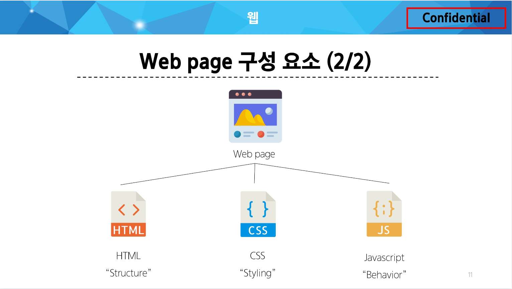

### HTML & CSS

### 웹 :

World Wide Web : 인터넷으로 연결된 컴퓨터들이 정보를 공유하는 거대한 정보 공간

Web : Web site, Web application 등을 통해 사용자들이 정보를 검색하고 상호 작용하는 기술

Web site : 인터넷에서 여러 개의 Web page가 모인 것으로, 사용자들이게 정보나 서비스를 제공하는 공간

Web page : HTML, CSS 등의 웹 기술을 이용하여 만들어진, “Web site”를 구성하는 하나의 요소



### 웹 구조화:

HTML(HyperText Markup Language) : 웹 페이지의 의미와 구조를 정의하는 언어

Hypertext :
웹페이지를 다른 페이지로 연결하는 링크.
참조를 통해 사용자가 한 문서에서 다른 문서로 즉시 접근할 수 있는 텍스트
[Hypertext 특징]

비선형성 : cf) 책, 필름, 연설 의 선형적(일렬로 나열되어 있는 것) 과정과 상이함

상호연결성 : 노드와 링크를 통해 정보를 구조화 하고 있음(노드연결형)

사용자 주도적 탐색 : 사용자가 문서 내 링크를 통해 정보를 자유롭게 선택하고 탐색(비선형성과 유관)

Markup Language : 태그 등을 이용하여 문서나 데이터의 구조를 명시하는 언어
<데이터의 논리구조를 명시하기 위한 규칙들을 정의한 언어의 일종>
[Ex] HTML, Markdown

Markdown : <Markup 언어의 일종으로, 읽기도 쓰기도 쉬운 문서 양식을 지향하기 때문에, 복잡한 태그 구조가 사라지고 간단한 텍스트들과 몇 가지 문법만 알면 작성 가능함>

HTML 구조

.png)

- `<!DOCTYPE html>`
해당 문서가 html로 문서라는 것을 나타냄
- `<html></html>`
전체 페이지의 컨텐츠를 포함
- `<title></title>`
브라우저 탭 및 즐겨찾기 시 표시되는 제목으로 사용
- `<head></head>`
HTML 문서에 관련된 설명, 설정 등 컴퓨터가 식별하는 메타데이터를 작성
사용자에게 보이지 않음
- `<body></body>`
HTML 문서의 내용을 나타냄
페이지에 표시되는 모든 컨텐츠를 작성 (사용자에게는 body의 내용만 열람됨)
한 문서에 하나의 body 요소만 존재

open in browser 단축키 : `alt` + `B`

HTML Element(요소) :

하나의 요소는 여는 태그와 닫는 태그 그리고 그 안의 내용으로 구성됨

닫는 태그는 태그 이름 앞에 슬래시가 포함됨

- 닫는 태그가 없는 태그도 존재

.png)

HTML Attributes(속성) :

사용자가 원하는 기준에 맞도록 요소를 설정하거나 다양한 방식으로 요소의 동작을 조절하기 위한 값

- 나타내고 싶지 않지만 추가적인 기능, 내용을 담고 싶을 때 사용
- CSS에서 스타일 적용을 위해 해당 요소를 선택하기 위한 값으로 활용됨

.png)

HTML Attributes(속성) 작성 규칙 :

1. 속성은 요소의 이름과 속성 사이에 공백이 있어야 함
2. 하나 이상의 속성들이 있는 경우엔 속성 사이에 공백으로 구분함
3. 속성 값은 열고 닫는 따옴표로 감싸야 함

---

HTML Text structure

HTML의 주요 목적 중 하나는 텍스트 구조와 의미를 제공하는 것

ex. h1 tag는 단순히 텍스트를 크게만 만드는 것이 아닌 현재 문서의 최상위 제목이라는 의미를 부여함

Heading & Paragraphs : `<h1>Heading</h1>` : `h1~6`, `p`

Lists : 

`ol` : ordered list (numbers : 1, 2, 3)

`ul` : unordered list (bullet point : - )

`li` : 하위 리스트

Emphasis & Importance : `em`, `strong`

---

### CSS(Cascading Style Sheet) :

웹 페이지의 디자인과 레이아웃을 구성하는 언어

CSS 구문 :

```css
h1 {
  color: red;
  font-size: 30px;
}
```

선택자(Selector) : `h1`

선언(Declaration) : `color: red;`

속성(Property) : `font-size`

값(Value) : `30px`

### CSS 적용 방법 :

- ~~인라인(Inline) 스타일 :~~
    
    HTML 요소 안에 style 속성 값으로 작성
    
    .png)
    
- **⭐**내부(Internal) 스타일 시트**⭐**
    
    head 태그 안에 style 태그에 작성
    
    .png)
    
- 외부(External) 스타일 시트
    
    별도 CSS 파일 생성 후 HTML link 태그를 사용해 불러오기
    
    .png)
    

### CSS 선택자(Selectors) :

HTML 요소를 선택하여 스타일을 적용할 수 있도록 하는 선택자

[기본 선택자]

- 전체(*) 선택자 : HTML 모든 요소를 선택 `* { … }`
- 요소(tag) 선택자 : 지정한 모든 태그를 선택 `h2 { … }`
- 클래스(class) 선택자 (’.’ (dot)) : 주어진 클래스 속성을 가진  모든 요소를 선택 `.green { … }`
- 아이디(id) 선택자 (’#’) : `#purple { … }`
주어진 아이디 속성을 가진 요소 선택 
문서에는 주어진 아이디를 가진 요소가 하나만 있어야 함
- 속성(attr) 선택자 등

[결합자 (Combinators)]

- 자손 결합자 (” “ (space)) :
첫 번째 요소의 자손 요소들 선택
ex) `p span`은 `<p>` 안에 있는 모든 `<span>`를 선택 (하위 레벨 상관 없이)
- 자식 결합자 (”>”) :
첫 번째 요소의 직계 자식만 선택
ex) `ul > li`는 `<ul>` 안에 있는 모든 `<li>`를 선택 (한단계 아래 자식들만)

<br>

### Specificity(명시도) :

결과적으로 요소에 적용할 CSS 선언을 결정하기 위한 알고리즘

CSS Selector에 가중치를 계산하여 어떤 스타일을 적용할 지 결정

동일한 요소를 가리키는 2개 이상의 CSS 규칙이 있는 경우 가장 높은 명시도를 가진 Selector가 승리하여 스타일이 적용됨

CSS 中 Cascade(계단식) :

한 요소에 동일한 가중치를 가진 선택자가 적용될 때, CSS에서 마지막에 나오는 선언이 사용됨

[명시도 순서]

1. Importance (`!importance`)
2. Inline 스타일
3. 선택자 : id 선택자 > class 선택자 > 요소 선택자
4. 소스 코드 선언 순서

### `!important` :

다른 우선순위 규칙보다 우선하여 적용하는 키워드

Cascade의 구조를 무시하고 강제로 스타일을 적용하는 방식이므로 사용을 권장하지 않음

<br>

### CSS 상속 :

기본적으로 CSS는 상속을 통해 부모 요소의 속성을 자식에게 상속해 재사용성을 높임

[상속되는 속성]

- Text 관련 요소(`font`, `color`, `text-align`)
- `opacity`
- `visibility` 등

[상속되지 않는 속성]

- Box model 관련 요소(`width`, `height`, `border`, `box-sizing`, …)
- position 관련 요소(`position`, `top/right/bottom/left`, `z-index` 등

→ CSS 상속 여부 확인 : MDN의 각 속성별 문서 하단에서 상속 여부를 확인할 수 있음

### CSS Box Model :

웹 페이지의 모든 HTML 요소를 감싸는 사각형 상자 모델

박스 타입 :

박스 타입에 따라 페이지에서의 배치 흐름 및 다른 박스와 관련하여 박스가 동작하는 방식이 달라짐

박스 표시(Display) 타입 :

.png)

- Outer display type (Block)
    
    항상 새로운 행으로 나뉨
    
    `width`와 `height` 속성 사용 가능
    
    `padding, margin, border`로 인해 다른 요소를 상자로부터 밀어냄
    
    `width` 속성을 지정하지 않으면 박스는 inline 방향으로 사용 가능한 공간을 모두 차지함
    
    - 상위 컨테이너 너비 100%로 채우는 것
    
    대표적인 block 타입 태그 : `h1~6, p, div`
    
- Outer display type (Inline)
    
    새로운 행으로 넘어가지 않음
    
    `width`와 `height` 속성을 사용할 수 없음
    
    수직 방향 : `padding, margin, border`가 적용되지만 다른 요소를 밀어낼 수는 없음
    
    수평 방향 : `padding, margins, borders`가 적용되어 다른 요소를 밀어낼 수 있음
    
    대표적인 inline 타입 태그 : `a, img, span, strong, em`
    
- Inner display type
    
    박스 내부의 요소들이 어떻게 배치될지를 결정
    
    속성 - Flexbox
    
    ```css
    .container {
      display: flex;
    }
    ```
    

---

명시도 관련 문서

그림으로 보는 명시도
https://specifishity.com/

명시도 계산기
https://specificity.keegan.st/

HTML 스타일 가이드

대소문자 구분

- HTML은 대소문자를 구분하지 않지만, 소문자 사용을 강력히 권장
- 태그명과 속성명 모두 소문자로 작성

속성 따옴표

- 속성 값에는 큰 따옴표 (`”`)를 사용하는 것이 일반적

공백 처리

- HTML은 연속된 공백을 하나로 처리
- Enter키로 줄 바꿈을 해도 브라우저에서 인식하지 않음(줄 바꿈 태그를 사용해야 함) `<br>`

에러 출력 없음 (헉 ..)

- HTML은 문법 오류가 있어도 별도의 에러 메시지를 출력하지 않음

코드 구조와 포맷팅

- 일관된 들여쓰기를 사용 (보통 2칸 공백)
- 각 요소는 한 줄에 하나씩 작성
- 중첩된 요소는 한 단계 더 들여쓰기

CSS 스타일 가이드

코드 구조와 포맷팅

- 일관된 들여쓰기를 사용 (보통 2칸 공백)
- 선택자와 속성은 각각 새 줄에 작성
- 중괄호 앞에 공백 넣기
- 속성 뒤에는 콜론(`:`)과 공백 넣기
- 마지막 속성 뒤에는 세미콜론(`;`) 넣기

선택자 사용

- `class` 선택자를 우선적으로 사용
- id, 요소 선택자 등은 가능한 피할 것
- 여러 선택자들과 함께 사용할 경우 우선순위 규칙에 따라 예기치 못한 스타일 규칙이 적용되어 전반적인 유지보수가 어려워지기 때문

속성과 값

- 속성과 값은 소문자로 작성
- 0 값에는 단위를 붙이지 않음

명명 규칙

- 클래스 이름은 의미 있고 목적을 나타내는 이름을 사용
- 케밥 케이스(`kebab-case`)를 사용
- 약어보다는 전체 단어를 사용

CSS 적용 스타일

- 인라인(inline) 스타일은 되도록 사용하지 말 것
- CSS와 HTML 구조 정보가 혼합되어 작성되기 때문에 코드를 이해하기 어렵게 만듦

---

### MDN Web Docs :

Mozilla Developer Network에서 제공하는 온라인 문서로, 웹 개발자와 디자이너를 위한 종합적인 참고 자료
→ HTML, CSS, JavaScript, 웹 API, 개발 도구 등 웹 기술에 대한 정보를 제공

MDN 문서를 활용해야 하는 이유

정확성 및 신뢰성

- Mozilla와 웹 커뮤니티의 전문가들에 의해 작성되고 유지 관리
- 웹 표준을 정확하게 반영하고 있으며, 신뢰할 수 있는 정보 소스를 제공

최신 웹 기술

- 최신 웹 표준과 기술을 다루고 있어, 웹 개발자들이 최신 정보를 쉽게 접할 수 있음

명확한 설명과 예제

- 복잡한 개념을 이해하기 쉽게 설명하고, 실습 가능한 예제 코드를 제공

MDN 문서 결론

- MDN 문서는 웹 개발 학습의 모든 단계에서 중요한 참고 자료
- 개발 과정에서 발생하는 다양한 문제에 대한 솔루션을 찾는 데 유용
- 이 문서를 활용함으로써, 웹 기술에 대한 깊은 이해를 얻고, 실무에 필요한 능력을 갖출 수 있음