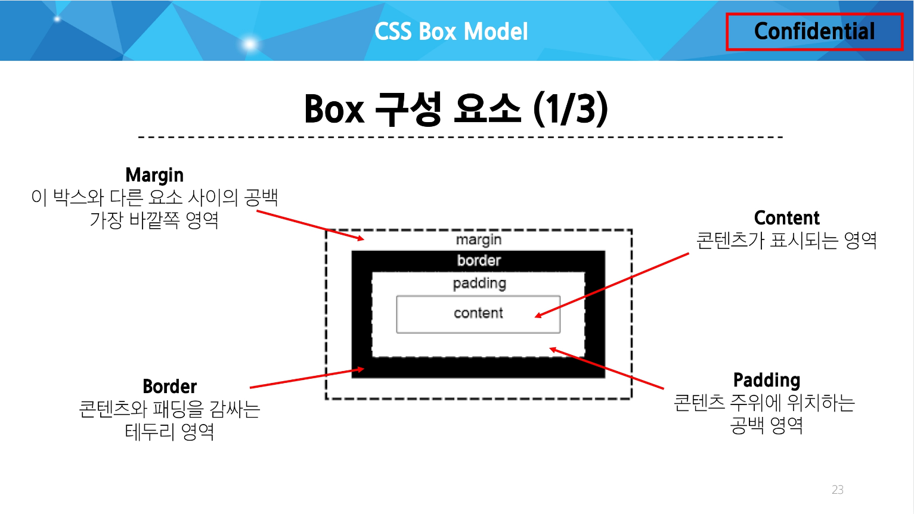

### CSS Box Model :

웹 페이지의 모든 HTML 요소를 감싸는 사각형 상자 모델

내용(content), 안쪽 여백(padding), 테두리(border), 외부 간격(margin)으로 구성되어 요소의 크리와 배치를 결정



.png)

Content box :
- 실제 컨텐츠가 표시되는 영역 크기
- `width` 및 `height` 속성을 사용하여 크기 조정

Padding box :
- 컨텐츠 주위에 공백
- `padding` 관련 속성을 사용하여 크기 조정

Border box :
- 컨텐츠와 패딩을 래핑
- `border` 관련 속성을 사용하여 크기 조정

Margin box :
- 컨텐츠, 패딩 및 테두리를 래핑
- 박스와 다른 요소 사이의 공백
- `margin` 관련 속성을 사용하여 크기 조정

[shorthand 속성]

- `border` : `border-width`, `border-style`, `border-color`
    
    ```css
    border: 2px solid black;
    ```
    
- `margin & padding` : 4방향의 속성을 지정하지 않고 결정
    
    ```css
    /* 4개 - 상우하좌 */
    margin: 10px 20px 30px 40px;
    padding: 10px 20px 30px 40px;
    
    /* 4개 - 상/좌우/하 */
    margin: 10px 20px 30px;
    padding: 10px 20px 30px;
    
    /* 4개 - 상하/좌우 */
    margin: 10px 20px;
    padding: 10px 20px;
    
    /* 4개 - 공통 */
    margin: 10px;
    padding: 10px;
    ```
    

[box-sizing 속성]

- The standard CSS box model(표준 상자 모델)
    
    ```css
     box-sizing: content-box;
    ```
    
    `width`와 `height` 속성 값을 설정하면 이 값은 content box의 크기를 조정하게 됨
    → 실제 박스 크기는 content box의 크기에 테두리, 패딩 값을 모두 더한 값을 가짐
    
- The alternative CSS box model(대체 상자 모델)
    
    ```css
     box-sizing: border-box;
    ```
    
    모든 `width`와 `height`는 실제 상자의 너비
    → 실제 박스 크기를 정하기위해 테두리와 패딩을 조정할 필요 없음
    

[기타 display 속성]

- `inline-block`
    
    `inline`과 `block` 요소 사이의 중간 지점을 제공하는 display 값
    
    `width` 및 `height` 속성 사용 가능
    
    `padding, margin, border`로 인해 다른 요소가 상자에서 밀려남
    
    새로운 행으로 넘어가지 않음
    
    → 요소가 줄 바꿈 되는 것을 원하지 않으면서 너비와 높이를 적용하고 싶은 경우에 사용
    
- `none`
    
    요소를 화면에 표시하지 않고, 공간조차 부여되지 않음
    
<br>

### CSS Position

CSS Layout : 각 요소의 위치와 크기를 조정하여 웹 페이지의 디자인을 결정하는 것
ex) `Display, Position, Flexbox` 등

CSS Position : 요소를 Normal Flow에서 제거하여 다른 위치로 배치하는 것
→ 다른 요소 위에 올리기, 화면의 특정 위치에 고정시키기 등

목적 : 전체 페이지에 대한 레이아웃을 구성하는 것보다는 페이지 특정 항목의 위치를 조정하는 것

[Position 유형]

- `static`
    
    요소를 Normal Flow에 따라 배치
    
    top, right, bottom, left 속성이 적용되지 않음
    
    기본 값
    
- `relative`
    
    요소를 Normal Flow에 따라 배치
    
    자신의 원래 위치(static)을 기준으로 이동
    
    top, right, bottom, left 속성으로 위치를 조정
    
    다른 요소의 레이아웃에 영향을 주지 않음(요소가 차지하는 공간은 `static`일 때와 같음)
    
- `absolute`
    
    요소를 Normal Flow에서 제거
    
    가장 가까운 `relative` 부모 요소를 기준으로 이동
    
    - 만족하는 부모 요소가 없다면 body 태그를 기준으로 함
    
    top, right, bottom, left 속성으로 위치를 조정
    
    문서에서 요소가 차지하는 공간이 없어짐
    
- `fixed`
    
    요소를 Normal Flow에서 제거
    
    현재 화면영역(viewport)을 기준으로 이동
    
    스크롤해도 항상 같은 위치에 유지됨
    
    top, right, bottom, left 속성으로 위치를 조정
    
    문서에서 요소가 차지하는 공간이 없어짐
    
- `sticky`
    
    `relative`와 `fixed`의 특성을 결합한 속성
    
    스크롤 위치가 임계점에 도달하기 전에는 `relative`처럼 동작
    
    스크롤이 특정 임계점에 도달하면 `fixed`처럼 동작하여 화면에 고정됨
    
    만약 다음 `sticky` 요소가 나오면 다음 `sticky` 요소가 이전 `sticky` 요소의 자리를 대체
    
    → 이전 `sticky` 요소가 고정되어 있던 위치와 다음 `sticky` 요소가 고정되어야 할 위치가 겹치게 되기 때문
    
<br>

### z-index :

요소의 쌓임 순서(stack order)를 정의하는 속성

정수 값을 사용해 Z축 순서를 지정

값이 클수록 요소가 위에 쌓이게 됨

static이 아닌 요소에만 적용됨

[z-index 특징]

기본값은 atuo

부모 요소의 z-index 값에 영향을 받음

같은 부모 내에서만 z-index 값을 비교

부모의 z-index가 낮으면 자식의 z-index가 아무리 높아도 부모보다 위로 올라갈 수 없음

z-index 값이 같으면 HTML 문서 순서대로 쌓임

<br>

### CSS Flexbox(Inner display type) :

요소를 행과 열 형태로 배치하는 1차원 레이아웃 방식
→ 공간 배열 & 정렬

.png)

- main axis (주 축)
    
    flex item들이 배치되는 기본 축
    
    main start에서 시작하여 main end 방향으로 배치 (기본 값)
    
- cross axis (교차 축)
    
    main axis에 수직인 축
    cross start에서 시작하여 cross end 방향으로 배치 (기본 값)
    
- Flex Container
    
    `display: flex;` 혹은 `display: inline-flex;`가 설정된 부모 요소
    
    이 컨테이너의 1차 자식 요소들이 Flex Item이 됨
    
    flexbox 속성 값들을 사용하여 자식 요소 Flex Item들을 배치하는 주체
    
- Flex Item
    
    Flex Container 내부에 레이아웃 되는 항목
    

[Flexbox 속성]

Flex Container 관련 속성 :

- `display, flex-direction, flex-wrap, justify-content, align-items, align-content`
- Flex Container 지정
    
    ```css
    .container {
      height: 500px;
      border: 1px solid black;
      display: flex;
    }
    ```
    
    flex item은 기본적으로 행(주 축의 기본값인 가로 방향)으로 나열
    
    flex item은 주 축의 시작 선에서 시작
    
    flex item은 교차 축의 크기를 채우기 위해 늘어남
    
- `flex-direction`
    
    .png)
    
    ```css
    .container {
      flex-direction: row;
      flex-direction: column; */
      flex-direction: row-reverse; */
      flex-direction: column-reverse; */
    }
    ```
    
    flex item이 나열되는 방향을 지정
    
    column으로 지정할 경우 주 축이 변경됨
    
    `"-reverse"`로 지정하면 flex item 배치의 시작 선과 끝 선이 서로 바뀜
    
- `flex-wrap`
    
    .png)
    
    ```css
    .container {
      /* flex-wrap: nowrap; */
      flex-wrap: wrap;
    }
    ```
    
    flex item 목록이 flex container의 한 행에 들어가지 않을 경우 다른 행에 배치할지 여부 설정
    (화면 너비를 줄여서 확인 가능)
    
- `justify-content`
    
    .png)
    
    ```css
    .container {
      /* align-content: flex-start; */
      align-content: center;
      /* align-content: flex-end; */
    }
    ```
    
    주 축을 따라 flex item과 주위에 공간을 분배
    
- `align-content`
    
    .png)
    
    ```css
    .container {
      flex-wrap: wrap;
      
      /* align-content: flex-start; */
      align-content: center;
      /* align-content: flex-end; */
    }
    ```
    
    교차 축을 따라 flex item과 주위에 공간을 분배
    
    - `flex-wrap`이 `wrap` 또는 `wrap-reverse`로 설정된 여러 행에만 적용됨
    - 한 줄 짜리 행에는 효과 없음 (`flex-wrap`이 `nowrap`으로 설정된 경우)
- `align-items`
    
    .png)
    
    ```css
    .container {
      flex-items: center;
    }
    ```
    
    교차 축을 따라 flex item 행을 정렬
    
- `align-self`
    
    .png)
    
    ```css
    .item1 {
      align-self: center;
    }
    
    .item2 {
      align-self: flex-end;
    }
    ```
    
    교차 축을 따라 개별 flex item을 정렬
    

[목적에 따른 속성 분류]

배치 : `flex-direction, flex-wrap`

공간 분배 : `justify-content, align-content`

정렬 : `align-items, align-self`

→ `justify` : 주축 / `align` : 교차 축

Flex Item 관련 속성 :

- `align-self, flex-grow, flex-basis, order`
- `flex-grow` (cf. `flex-shrink`)
    
    남는 행 여백을 비율에 따라 각 flex item에 분배
    
    - 아이템이 컨테이너 내에서 확장하는 비율을 지정
    
    ```html
    <div class="container">
      <div class="post item-1">1</div>
      <div class="post item-1">2</div>
      <div class="post item-1">3</div>
    </div>
    ```
    
    ```css
    .container {
      display: flex;
      width: 100%;
    }
    
    .item {
      height: 100px;
      color: white;
      font-size: 3rem;
    }
    ```
    
    ```css
    .item-1 {
      background-color: red;
      flex-grow: 1;
    }
    
    .item-2 {
      background-color: green;
      flex-grow: 2;
    }
    
    .item-3 {
      background-color: blue;
      flex-grow: 3;
    }
    ```
    
    .png)
    
- `flex-basis`
    
    flex item의 초기 크기 값을 지정
    
    `flex-basis`와 `width` 값을 동시에 적용된 경우 `flex-basis`가 우선
    
    ```css
    .item-1 {
      background-color: red;
      flex-grow: 300px;
    }
    
    .item-2 {
      background-color: green;
      flex-grow: 600px;
    }
    
    .item-3 {
      background-color: blue;
      flex-grow: 300px;
    }
    ```
    
<br>

### flex-wrap 응용

반응형 레이아웃 :

다양한 디바이스와 화면 크기에 자동으로 적응하여 컨텐츠를 최적으로 표시하는 웹 레이아웃 방식

`justify-items` 및 `justify-self` 속성이 없는 이유 :
“필요 없기 때문”
→ `margin auto`를 통해 정렬 및 배치가 가능

<br>

### Margin Collapsing(마진 상쇄) :

두 block 타입 요소의 martin top과 bottom이 만나 더 큰 margin으로 결합되는 현상

- 복잡한 레이아웃에서 요소 간 간격을 일관 되게 유지하기 위함
- 요소 간의 간격을 더 예측 가능하고 관리하기 쉽게 만듦
- 일관성, 단순화

<br>

### 박스 타입 별 수평 정렬 :

- Block 요소의 수평 정렬
    
    `margin: auto` 사용 : 블록 요소의 너비를 지정하고 좌우 마진을 `auto`로 설정
    
    ```css
    .box {
      width: 100px;
      height: 100px;
      background-color: crimson;
      border: 1px solid black;
    }
    
    .margin-auto {
      margin: 0 auto;
    }
    ```
    
    ```css
    <div class="box margin-auto">
    </div>
    ```
    
- Inline 요소의 수평 정렬
    
    `text-align` 사용 : 부모 요소에 적용
    
    ```css
    .text-center {
      text-align: center;
    }
    ```
    
    ```css
    <div class="text-center">
      <span>inline 요소</span>
    </div>
    ```
    
- Inline-block 요소의 수평 정렬
    
    `text-align` 사용 : 부모 요소에 적용
    
    ```css
    .text-center {
      text-align: center;
    }
    
    .inline-block {
      display: inline-block;
    }
    ```
    
    ```css
    <div class="text-center">
      <div class="box inline-block"></div>
    </div>
    ```
    
<br>

### Flexbox Shorthand 속성

- `flex-flow`
    
    ```css
    .container {
      flex-flow: flex-direction flex-wrap;
    }
    ```
    
- `flex`
    
    ```css
    /* One value, unitless number: flex-grow */
    flex: 2;
    
    /* ONe value, length or percentage: flex-basis */
    flex: 10rem;
    flex: 30%
    
    /* Two values: flex-grow | flex-basis */
    flex: 1 30px;
    
    /* Two values: flex-grow | flex-shrink */
    flex: 2 2;
    
    /* Three values: flex-grow | flex-shrink | flex-basis */
    flex: 2 2 10%
    ```