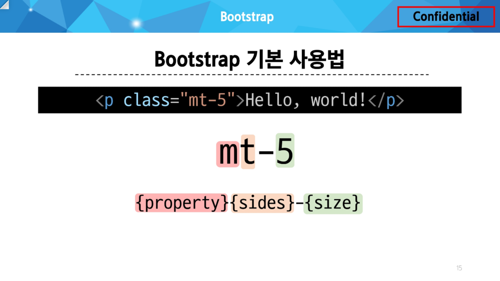

### Bootstrap :

CSS 프론트엔드 프레임워크(Toolkit)
→ 미리 만들어진 다양한 디자인 요소들을 제공하여 웹 사이트를 빠르고 쉽게 개발할 수 있도록 함

가장 많이 사용되는 CSS 프레임워크

사전에 디자인된 다양한 컴포넌트 및 기능(빠른 개발과 유지보수)

손쉬운 반응형 웹 디자인 구현

커스터마이징(customizing)이 용이

크로스 브라우징(Cross browsing) 지원(모든 주요 브라우저에서 작동하도록 설계되어 있음)

Bootstrap 사용 :

1. Bootstrap 공식 문서 접속
- https://getbootstrap.com
2. Docs → Introduction → Quick start
3. “Include Bootstrap’s CSS and JS” 코드 확인 및 가져오기
- Head(CSS file)
    
    ```html
    <link href="https://cdn.jsdelivr.net/npm/bootstrap@5.3.3/dist/css/bootstrap.min.css" rel="stylesheet" integrity="sha384-QWTKZyjpPEjISv5WaRU9OFeRpok6YctnYmDr5pNlyT2bRjXh0JMhjY6hW+ALEwIH" crossorigin="anonymous">
    ```
    
- Body(JavaScript file)
    
    ```html
    <script src="https://cdn.jsdelivr.net/npm/bootstrap@5.3.3/dist/js/bootstrap.bundle.min.js" integrity="sha384-YvpcrYf0tY3lHB60NNkmXc5s9fDVZLESaAA55NDzOxhy9GkcIdslK1eN7N6jIeHz" crossorigin="anonymous"></script>
    ```
    
<br>

### CDN(Content Delivery Network) :

지리적 제약 없이 빠르고 안전하게 컨텐츠를 전송할 수 있는 전송 기술

서버와 사용자 사이의 물리적인 거리를 줄여 컨텐츠 로딩에 소요되는 시간을 최소화(웹 페이지 로드 속도를 높임)

지리적으로 사용자와 가까운 CDN 서버에 컨텐츠를 저장해서 사용자에게 전달

Bootstrap 사용법 :

Bootstrap에는 특정한 규칙이 있는 클래스 이름으로 스타일 및 레이아웃이 미리 작성되어 있음



.png)

<br>

### Reset CSS :

모든 HTML 요소 스타일을 일관된 기준으로 재설정하는 간결하고 압축된 규칙 세트

→ HTML Element, Table, List 등의 요소들에 일관성 있게 스타일을 적용 시키는 기본 단계

→ a.k.a user agent stylesheet

Normalize CSS :

Reset CSS 방법 중 대표적인 방법

웹 표준 기준으로 브라우저 중 하나가 불일치 한다면 차이가 있는 브라우저를 수정하는 방법

→ 경우에 따라 IE 또는 EDGE 브라우저는 표준에 따라 수정할 수 없는 경우도 있는데, 이 경우 IE 또는 EDGE의 스타일을 나머지 브라우저에 적용시킴

<Bootstrap은 `bootstrap-reboot.css` 파일을 통해 `normalize.css`를 지원함>

[Bootstrap Docs]

https://getbootstrap.com/docs/5.3/getting-started/introduction/

<br>

### Typography :

제목, 본문 텍스트, 목록 등

https://getbootstrap.com/docs/5.3/content/typography/#display-headings

Display headings : 기존 Heading보다 더 눈에 띄는 제목이 필요한 경우

Inline text elements : HTML inline 요소에 대한 스타일

Lists : HTML list 요소에 대한 스타일

### Colors :

Text, Border, Background 및 다양한 요소에 사용하는 Bootstrap의 색상 키워드

https://getbootstrap.com/docs/5.3/utilities/colors/#colors

Text colors, Background colors

### Component :

Bootstrap에서 제공하는 UI 관련 요소

일관된 디자인을 제공하여 웹 사이트의 구성 요소를 구축하는 데 유용하게 활용

<br>

### Semantic Web :

웹 데이터를 의미론적으로 구조화된 형태로 표현하는 방식

### HTML Semantic Element (Div와 동일):

기본적인 모양과 기능 이외에 의미를 가지는 HTML 요소

→ 검색엔진 및 개발자가 웹 페이지 컨텐츠를 이해하기 쉽도록

.png)

ex) header, nav, main, article, section, aside, footer

### Semantic in CSS :

CSS 방법론 : CSS를 효율적이고 유지 보수가 용이하게 작성하기 위한 일련의 가이드라인

<br>

### OOCSS(Object Oriented CSS) :

객체 지향적 접근법을 적용하여 CSS를 구성하는 방법론

[OOCSS 기본 원칙]

- 구조와 스킨을 분리(재사용성을 높임)
    
    모든 버튼의 공통 구조를 정의 + 각각의 스킨(배경색과 폰트 색상)을 정의
    
- 컨테이너와 컨텐츠를 분리
    
    객체에 직접 적용하는 대신 객체를 둘러싸는 컨테이너에 스타일을 적용
    
    스타일을 정의할 때 위치에 의존적인 스타일을 사용하지 않도록 함
    
    컨텐츠를 다른 컨테이너로 이동시키거나 재배치할 때 스타일이 깨지는 것을 방지
    
<br>

---

HTML : 컨텐츠와 구조의 의미

CSS : 레이아웃과 디자인

[의미론적인 마크업이 필요한 이유]

1. 검색엔진 최적화(SEO)
- 검색 엔진이 해당 웹 사이트를 분석하기 쉽게 만들어 검색 순위에 영향을 줌
2. 웹 접근성(Web Accessibility)
- 웹 사이트, 도구, 기술이 고령자나 장애를 가진 사용자들이 사용할 수 있도록 설계 및 개발하는 것

[Size]

px : pixel을 기준으로 하는 절대적인 크기 단위

rem : 적용되는 브라우저 내 size를 기준으로 하는 상대적인 크기 단위