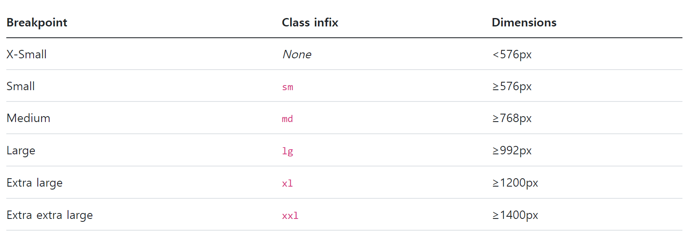

### Bootstrap Grid System :

웹 페이지의 레이아웃을 조정하는 데 사용되는 12개의 컬럼으로 구성된 시스템

→ 12는 약수가 많은 숫자(1, 2, 3, 4, 6, 12)이기 떄문에 칸을 나누기에 용이함

→ 12는 적당히 큰 수(cf. 24, 36, …)

반응형 디자인을 지원해 웹 페이지를 모바일, 태블릿, 데스크탑 등 다양한 기기에서 적절하게 표시할 수 있도록 도움

반응형 웹 디자인(Responsive Web Design) :

디바이스 종류나 화면 크기에 상관없이, 어디서든 일관된 레이아웃 및 사용자 경험을 제공하는 디자인 기술

### Grid System 구조 :

1. Container : Column들을 담고 있는 공간
2. Column : 실제 컨텐츠를 포함하는 부분
3. Gutter : 컬럼과 컬럼 사이의 여백 영역
4. Row : 1개의 row 안에 12개의 column 영역이 구성

### Grid System 실습 :

- 기본(Basic)
    
    ```css
    <h2 class="text-center">Basic</h2>
    <div class="container">
      <div class="row">
        <div class="box col">col</div>
        <div class="box col">col</div>
        <div class="box col">col</div>
      </div>
      <div class="row">
        <div class="box col-4">col-4</div>
        <div class="box col-4">col-4</div>
        <div class="box col-4">col-4</div>
      </div>
      <div class="row">
        <div class="box col-2">col-2</div>
        <div class="box col-8">col-8</div>
        <div class="box col-2">col-2</div>
      </div>
    </div>
    ```
    
- 중첩(Nesting)
    
    ```css
    <h2 class="text-center">Nesting</h2>
    <div class="container">
      <div class="row">
        <div class="box col-4">col-4</div>
        <div class="box col-8">
          <div class="row">
            <div class="box col-6">col-6</div>
            <div class="box col-6">col-6</div>
            <div class="box col-6">col-6</div>
            <div class="box col-6">col-6</div>
          </div>
        </div>
      </div>
    </div>
    ```
    
- 상쇄(Offset)
    
    ```css
    <h2 class="text-center">Offset</h2>
    <div class="container">
      <div class="row">
        <div class="box col-4">col-4</div>
        <div class="box col-4 offset-4">col-4 offset-4</div>
      </div>
      <div class="row">
        <div class="box col-3 offset-3">col-3 offset-3</div>
        <div class="box col-3 offset-3">col-3 offset-3</div>
      </div>
      <div class="row">
        <div class="box col-6 offset-3">col-6 offset-3</div>
      </div>
    </div>
    ```
    
- 여백(Gutters) :
    
    Grid system에서 column 사이에 여백 영역, 행(row)에 대한 class value
    x 축은 `padding`, y 축은 `margin`으로 여백 생성
    
    ```css
    <h2 class="text-center">Gutters(gx-0)</h2>
    <div class="container">
      <div class="row gx-0">
        <div class="col-6">
          <div class="box">col</div>
        </div>
        <div class="col-6">
          <div class="box">col</div>
        </div>
      </div>
    </div>
    ```
    
    ```css
    <h2 class="text-center">Gutters(gy-5)</h2>
    <div class="container">
      <div class="row gy-5">
        <div class="col-6">
          <div class="box">col</div>
        </div>
        <div class="col-6">
          <div class="box">col</div>
        </div>
        <div class="col-6">
          <div class="box">col</div>
        </div>
        <div class="col-6">
          <div class="box">col</div>
        </div>
      </div>
    </div>
    ```
    
    ```css
    <h2 class="text-center">Gutters(g-5)</h2>
    <div class="container">
      <div class="row g-5">
        <div class="col-6">
          <div class="box">col</div>
        </div>
        <div class="col-6">
          <div class="box">col</div>
        </div>
        <div class="col-6">
          <div class="box">col</div>
        </div>
        <div class="col-6">
          <div class="box">col</div>
        </div>
      </div>
    </div>
    ```

<br>

### Grid system for responsive web :

Bootstrap grid system에는 12개 column과 6개 breakpoints를 사용하여 반응형 웹 디자인을 구현

### Grid system Breakpoints :

웹 페이지를 다양한 화면 크기에서 적절하게 배치하기 위한 분기점

→ 화면 너비에 따라 6개의 분기점 제공(`xs, sm, md, lg, xl, xxl`)



각 breakpoints 마다 설정된 최대 너비 값 “이상으로” 화면이 커지면 grid system 동작이 변경됨

### Breakpoints 실습 :

- Breakpoints
    
    ```css
    <h2 class="text-center">Breakpoints</h2>
    <div class="row">
      <div class="box col-12 col-sm-6 col-md-2 col-lg-3 col-xl-4">
        col
      </div>
      <div class="box col-12 col-sm-6 col-md-8 col-lg-3 col-xl-4">
        col
      </div>
      <div class="box col-12 col-sm-6 col-md-2 col-lg-3 col-xl-4">
        col
      </div>
      <div class="box col-12 col-sm-6 col-md-12 col-lg-3 col-xl-12">
        col
      </div>
    </div>
    ```
    
- Breakpoints + offset
    
    ```css
    <h2 class="text-center">Breakpoints + offset</h2>
    <div class="row g-4">
      <div class="box col-12 col-sm-4 col-md-6">
        col
      </div>
      <div class="box col-12 col-sm-4 col-md-6">
        col
      </div>
      <div class="box col-12 col-sm-4 col-md-6">
        col
      </div>
      <div class="box col-12 col-sm-4 offset-sm-4 col-md-6 offset-md-0">
        col
      </div>
    </div>
    ```
    
<br>

### CSS Layout 종합 정리 :

CSS 레이아웃 기술들은 각각 고유한 특성과 장단점을 가지고 있음

이들은 상호 보완적이며, 특정 상황에 따라 적합한 도구가 달라짐

최적의 기술을 선택하고 효과적으로 활용하기 위해서는 다양한 실제 개발 경험이 필수적

### UX & UI :

UX(User Experience) :

제품이나 서비스를 사용하는 사람들이 느끼는 전체적인 경험과 만족도를 개선하고 최적화하기 위한 디자인과 개발 분야

- 사람들의 마음과 생각을 이해하고 정리해서 제품에 녹여내는 과정
- 유저 리서치, 데이터 설계 및 정제, 유저 시나리오, 프로토타입 설계

UI(User Interface) :

서비스와 사용자 간의 상호작용을 가능하게 하는 디자인 요소들을 개발하고 구현하는 분야

- 예쁜 디자인보다는 사용자가 더 쉽고 편리하게 사용할 수 있도록 고려
- 이를 위해서는 디자인 시스템, 중간 산출물, 프로토타입 등이 필요

<br>

### The Grid System :

CSS가 아닌 편집 디자인에서 나온 개념으로, 구성 요소를 잘 배치해서 시각적으로 좋은 결과물을 만들기 위함

기본적으로 안쪽에 있는 요소들의 오와 열을 맞추는 것에서 기인

정보 구조와 배열을 체계적으로 작성하여 정보의 질서를 부여하는 시스템

- ex. Grid cards :
    
    `row-cols` 클래스를 사용하여 행당 표시할 열(카드) 수를 손쉽게 제어할 수 있음
    
    row-cols-1 : “row 내 1개의 card를 출력함”
    
    ```css
    <div class="row row-cols-1 row-cols-md-2">
      <div class="col">
        <div class="card">
          <div class="card-body">
            <h5 class="card-title">Card title</h5>
            <p class="card-text">This is a longer card with supporting text below as a natural lead-in to additional
              content. This content is a little bit longer.</p>
          </div>
        </div>
      </div>
    </div>
    ```
    
<br>

### UI Design Guidelines :

Samsumg - One UI Design Guidelines

Apple - Apple UI

<br>

---

emmet 문법 : VS code CSS 작성을 용이하게 하기 위한 단축어

https://docs.emmet.io/cheat-sheet/

```html
  div.container (=.container)
  div#main
  ul>li*3
  ul>li.item$*5
  nav>ul.menu>li*5>a[href='#']{메뉴 $}
```