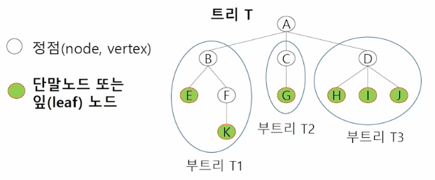

트리의 개념(그래프 카테고리 중 특수한 경우)

비선형 구조

원소들 간에 1 : N 관계를 가지는 자료구조

원소들 간에 계층관계를 가지는 계층형 자료구조

상위 원소에서 하위 원소로 내려가면서 확장되는 트리(나무)모양의 구조

트리의 정의

한 개 이상의 노드로 이루어진 유한 집합이며 다음의 조건을 만족

- 노드 중 최상위 노드를 루트(root)라고 함
- 나머지 노드들은 n(≥ 0)개의 분리 집합 T1, …, TN으로 분리될 수 있음

이들 T1, …, TN은 각각 하나의 트리가 되며(재귀적 정의) 루트의 부 트리(subtree)라고 함



노드(node) : 트리의 원소

간선(edge) : 노드를 연결하는 선. 부모 노드와 자식 노드를 연결

루트 노드(root node) : 트리의 시작 노드t

형제 노드(sibling node) : 같은 부모 노드의 자식 노드들

조상 노드 : 간선을 따라 루트 노드까지 이르는 경로에 있는 모든 노드들

서브 트리(subtree) : 부모 노드와 연결된 간선을 끊었을 때 생성되는 트리

자손 노드 : 서브 트리에 있는 하위 레벨의 노드들

차수 :

- 노드의 차수 : 노드에 연결된 자식 노드의 수
- 트리의 차수 : 트리에 있는 노드의 차수 중에서 가장 큰 값

단말 노드(리프 노드) : 차수가 0인 노드. 자식 노드가 없는 노드

높이 :

- 노드의 높이 : 루트에서 노드에 이르는 간선의 수. 노드의 레벨
- 트리의 높이 : 트리에 있는 노드의 높이 중에서 가장 큰 값. 최대 레벨

### 이진 트리 :

모든 노드들이 최대 2개의 서브트리를 갖는 특별한 형태의 트리

각 노드가 자식 노드를 최대한 2개까지만 가질 수 있는 트리

- 왼쪽 자식 노드(left child node) & 오른쪽 자식 노드(right child node)

레벨 i에서 노드의 최대 개수는 2^i개

높이가 h인 이진 트리가 가질 수 있는 노드에서,

- 노드의 최소 개수는 (h+1)개 : 편향 이진 트리인 경우
- 노드의 최대 개수는 (2^(h+1)-1)개 : 포화 이진 트리인 경우

- 포화 이진 트리(Full Binary Tree) :
    
    .png)

    
    모든 레벨에 노드가 포화상태로 차 있는 이진 트리
    
    높이가 h일 때, 최대의 노드 개수인 2^(h+1)-1의 노드를 가진 이진 트리
    
    - 높이 3일 때 2^(3+1)-1 = 15개의 노드
    
    루트를 1번으로 하여 2^(h+1)-1까지 정해진 위치에 대한 노드 번호를 가짐
    
- 완전 이진 트리(Complete Binary Tree)
    
    .png)
    
    높이가 h이고 노드 수가 n개일 때 (단, 2^h ≤ n ≤ 2^(h+1)-1), 포화 이진 트리의 노드 번호 1번부터 n번까지 빈 자리가 없는 이진 트리
    
- 편향 이진 트리(Skewed Binary Tree)
    
    .png)
    
    높이 h에 대한 최소 개수의 노드를 가지면서 한쪽 방향의 자식 노드만을 가진 이진 트리
    
    ex1. 왼쪽 편향 이진 트리
    
    ex2. 오른쪽 편향 이진 트리
    

### 순회(traversal) :

트리의 각 노드를 중복되지 않게 전부 방문(visit) 하는 것

트리는 비선형 구조이기 때문에 선형구조에서와 같이 선후 연결관계를 알 수 없음 → 특별한 방법이 필요

- 전위순회(preorder traversal) : VLR
    
    부모노드 방문 후, 자식노드를 좌, 우 순서로 방문
    
    1. 현재 노드 n을 방문하여 처리 (V)
    2. 현재 노드 n의 왼쪽 서브트리로 이동 (L)
    3. 현재 노드 n의 오른쪽 서브트리로 이동 (R)
    
    ```python
    def preorder_traverse(T):
        if T:           # T is not None
            visit(T)    # print(T.item)
            preorder_traverse(T.left)
            preorder_traverse(T.right)
    ```
    
- 중위순회(inorder traversal) : LVR
    
    왼쪽 자식노드, 부모노드, 오른쪽 자식노드 순으로 방문
    
    1. 현재 노드 n의 왼쪽 서브트리로 이동 (L)
    2. 현재 노드 n을 방문하여 처리 (V)
    3. 현재 노드 n의 오른쪽 서브트리로 이동 (R)
    
    ```python
    def inorder_traverse(T):
        if T:           # T is not None
            inorder_traverse(T.left)
            visit(T)    # print(T.item)
            inorder_traverse(T.right)
    ```
    
- 후위순회(postorder traversal) : LRV
    
    자식노드를 좌우 순서로 방문한 후, 부모노드로 방문
    
    1. 현재 노드 n의 왼쪽 서브트리로 이동 (L)
    2. 현재 노드 n의 오른쪽 서브트리로 이동 (R)
    3. 현재 노드 n을 방문하여 처리 (V)
    
    ```python
    def postorder_traverse(T):
        if T:           # T is not None
            postorder_traverse(T.left)
            postorder_traverse(T.right)
            visit(T)    # print(T.item)
    ```
    

### 이진 트리 표현 :

- 배열을 이용한 이진 트리의 표현
    
    이진 트리에 각 노드 번호를 다음과 같이 부여
    
    .png)
    
    (루트의 번호를 1로 하는 경우)
    
    노드 번호를 배열의 인덱스로 사용
    
    레벨 n에 있는 노드에 대하여 왼쪽부터 오른쪽으로 2^n부터 2^(n+1)-1까지 번호를 차례로 부여
    
    dis) 낭비가 많기 때문에 실제로는 잘 사용되지 않음. 최악의 경우 배열의 크기가 2^n를 가짐
    
- 부모 번호를 인덱스로 자식 번호를 저장
    
    부모를 인덱스로 가지는 left & right 배열을 생성
    
    root를 탐색하기 위한 parent 배열을 생성해야 함(자식 배열에 부모의 여부를 저장)
    
    ```python
    for i : 1 -> N
        read p, c
        if (c1[p] == 0):
            c1[p] = c
        else:
            c2[p] = c
    ```
    
- ~~연결 리스트를 통해 이진 트리를 표현(실무)~~
    
    “내가 어디에 들어가야 하는지” 위치를 탐색하는 과정을 구현하기 어려움
    
- 인접 리스트를 통해 이진 트리를 표현(코테)
    
    갈 수 있는 위치만 저장해서 자식 노드를 확인


### 이진 탐색 트리

BST(Binary Search Tree) 자료구조 :

Data들을 빠르게 검색할 수 있도록 체계적으로 저장을 하여 빠른 속도로 값을 검색할 수 있는 자료구조

key(왼쪽 서브트리) < key(루트 노드) < key(오른쪽 서브트리)

비교할 노드 보다, target 값이 더 큰 경우 우측 자식 노드로 배정되고, 그렇지 않으면 왼쪽 자식 노드로 배정된다

시간 복잡도 : O(log n)

### 이진 탐색 트리 - 성능

탐색(searching), 삽입(insertion), 삭제(deletion) 시간은 트리의 높이만큼 시간이 걸림

- O(h), h : BST의 깊이(height)

평균의 경우(이진 트리가 균형적으로 생성되어 있는 경우)

- O(log n)

최악의 경우(한쪽으로 치우친 경사 이진트리의 경우)

- O(n)
- 순차탐색과 시간복잡도가 동일

### 리스트 vs BST :

BST는 리스트보다 더 빠른 삽입 / 삭제 / 탐색이 가능

|  | 리스트 | BST(평균) |
| --- | --- | --- |
| 삽입 | O(n), 맨 끝 삽입은 O(1) | O(logN) |
| 삭제 | O(n), 맨 끝 삭제는 O(1) | O(logN) |
| 탐색 | O(n) | O(logN) |

완벽하게 균형 잡힌 이진트리의 경우, 탐색 시간복잡도는 O(logN)이다.

BST에서 DFS 중위순회를 하게 되면 Key 값이 작은 순서대로 탐색이 가능하다(오름차순 정렬).

### 힙(Heap) :

완전 이진 트리로 구현된 자료구조로서, 키값이 가장 큰 노드나 가장 작은 노드를 찾기에 적합한 자료구조

힙의 키를 우선순위로 활용하여 우선순위 큐를 구현할 수 있다.

시간 복잡도 : O(logN)

.png)

- 최대 힙(max heap)
    
    키값이 가장 큰 노드를 찾기 위한 완전 이진 트리
    
    {부모노드의 키값 > 자식노드의 키값}
    
    루트 노드 : 키값이 가장 큰 노드
    
- 최소 힙(min heap)
    
    키값이 가장 작은 노드를 찾기 위한 완전 이진 트리
    
    {부모노드의 키값 < 자식노드의 키값}
    
    로트 노드 : 키값이 가장 작은 노드
    

- 힙 연산 - 삽입
    1. 삽입할 자리 확장(맨 끝자리)
    2. 확장한 자리에 삽입할 원소 저장
    3. while True:
        
        if 삽입 노드 > 부모 노드:
        
        자리 바꾸기(swap)
        
    4. 비교할 부모 노드가 없으므로 자리 확정
- 힙 연산 - 삭제
    1. 루트 노드의 원소 삭제
    2. 마지막 노드 삭제(맨 끝자리)
    3. while True:
        
        if 삽입 노드 < 자식 노드:
        
        자리 바꾸기(swap)
        
    4. 자리 확정

---

완전 이진 트리 보장 → 일차원 리스트 구현

N 노드의 자식 : N*2 & N*2+1

+ Red-Black tree

https://yeongjaekong.tistory.com/37