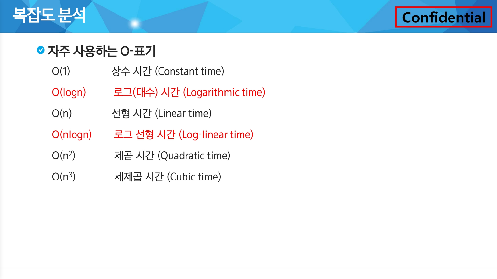

### 복잡도 분석

알고리즘 : 유한한 단계를 통해 문제를 해결하기 위한 절차나 방법

알고리즘의 효율 :

- 공간적 효율성 : 연산량 대비 얼마나 적은 메모리 공간을 요하는 가를 말함
- 시간적 효율성 : 연산량 대비 얼마나 적은 시간을 요하는 가를 말함
- 효율성 ↔ 복잡도(Complexity). 복잡도가 높을수록 효율성은 저하됨

복잡도의 점근적 표기(Asymptotic Notation) :

시간(또는 시간) 복잡도를 단순한 입력 크기에 대한 함수(주로 다항식)로 표기하는 방법

입력 크기 n이 무한대로 커질 때의 복잡도를 간단히 표현하기 위해 사용하는 표기법

- O(Big-Oh) - 표기
    
    복잡도의 점근적 상한을 의미
    
    복잡도가 f(n) = 2n^2 - 7n + 4 이라면, O(n^2)이다.
    
- Ω(Big-Omega) - 표기
- θ(Big-Theta) - 표기

배수를 강조하기 위해서 O(N) 대신 O(5N)으로 표현하기도 함 - ex. 논문 등




### 진수 :

10진수(DEC) : 사람이 사용하는 진수, 수 하나를 0~9로 표현

2진수(BIN) : 컴퓨터가 사용하는 진수, 수 하나를 0, 1로 표현

8진수(OCT) : 2진수를 더 가독성 있게 사용

16진수(HEX) : 2진수를 더 가독성 있게 사용, 수 하나를 0, 1, …, 8, 9, A, B, C, D, E, F로 표현

- 16진수는 인간이 이해하기 어렵지만, 연산 속도가 매우 빠름

### 진법 변환 :

10진수 → 타 진수로 변환

- 원하는 타진법의 수로 나눈 뒤 나머지를 거꾸로 읽는다

16진수 ↔ 2진수 변환

- 2진수, 16진수간 변환은 연산이 없음

.png)

### 비트 연산 :

컴퓨터의 CPU는 0과 1로 다루어 동작되며, 내부적으로 비트 연산을 사용하여 덧셈, 뺄셈, 곱셈 등을 계산

1 bit : 0과 1을 표현하는 정보의 단위

1 Byte : 8 bit를 묶어 1 Byte라고 함

AND와 OR 비트연산자 :

a AND b : a, b 둘 다 1일때만 결과가 1이다. 그 외에는 0

a OR b : a, b 둘 중 하나만 1이면 결과가 1이다. 그 외에는 0

| 연산자 | 연산자의 기능 |
| --- | --- |
| & | 비트 단위로 AND 연산을 한다.
예) num1 & num2 |
| | | 비트 단위로 OR 연산을 한다.
예) num1 | num2 |
- 7 & 5 : 이진수로 표현하면 0b111 & 0b101
    
    print(7 & 5) >> 5
    
    print(7 | 5) >> 7
    

파이썬 內 2진수, 16진수, 10진수 변환 :

2진수는 숫자 0과 소문자 b → 0b를 접두사로 붙여 표현

16진수는 숫자 0과 소문자 x → 0x를 접두사로 붙여 표현

- 10진수 → 2진수 & 16진수
    
    ```python
    print(bin(10)) # 0b1010
    print(hex(10)) # 0xa
    ```
    
- 2진수 & 16진수 → 10진수
    
    ```python
    print(int('1011', 2)) # 2진수, 11
    print(int('b', 16)) # 16진수, 11
    ```
    

XOR와 NOT 연산자 :

^ : XOR(엑스오어) 연산자, OR처럼 동작되는데 둘다 1인 경우는 0

| 연산자 | 연산자의 기능 |
| --- | --- |
| ^ | 비트 단위로 XOR 연산을 한다. (같으면 0, 다르면 1)
예) num1 ^ num2 |
- 어떤 값이던 특정 수로 2회 XOR를 하면 원래 수로 돌아온다.

비트 연산자 :

Left Shift << : 특정 수만큼 비트를 왼쪽으로 밀어낸다

Right Shift >> : 특정 수만큼 비트를 오른쪽으로 밀어낸다(우측 비트는 삭제)

| 연산자 | 연산자의 기능 |
| --- | --- |
| << | 피연산자의 비트 열을 왼쪽으로 이동시킨다.
예) num << 2 # 2회 이동 |
| >> | 피연산자의 비트 열을 오른쪽으로 이동시킨다.
예) num >> 2 # 2회 이동 |
- ex1) 1 << n :
    
    2 ** n의 값을 가짐
    
- ex2) i & (i << n) :
    
    i의 n번째 비트가 1인지 아닌지를 확인할 수 있음
    
- 부분집합 through 비트 연산자
    
    ```python
    # i 의미 : i번째 부분집합
    for i in range(1 << len(arr)):
        for idx in range(len(arr)):
            # i & (i << idx)
            # - i번째 부분집합에 idx 요소가 포함되어 있나요 ?
            if i & (1 << idx):
                print(arr[idx], end = ' ')
        print()
    ```
    

음수 표현 방법 :

컴퓨터는 음수를 “2의 보수”로 관리함

맨 앞자리 bit (MSB, Most Significant Bit)는 음수 or 양수를 구분하는 비트임

컴퓨터가 2의 보수를 사용하여 음수를 관리하는 이유 :

뺄셈의 연산 속도를 올릴 수 있으며, +0과 -0을 따로 취급하지 않기 위해 사용함.

- ex1) 10001의 2의 보수
    1. 수를 모두 뒤집고 +1을 한다
    2. 01110 + 1 = 01111
- ex2) 1111000의 2의 보수
    1. 수를 뒤집으면 0000111이고 +1을 한다
    2. 0000111 + 1 = 0001000

NOT 연산자 :

(~) NOT 연산자 : 모든 비트를 반전시킨다

- ex1) ~(0001 1111) → 1110 0000
- 2의 보수를 취한 수에, 한번 더 2의 보수를 취하면 원래의 값으로 돌아온다

.png)

### 실수(IEEE 754) :

파이썬은 f-string 문법을 지향

`{t2:.2f}` : t2 값을 소수점 둘째자리에서 반올림하여 표현 

```python
print(f'변수 값은 {t1} 입니다'}
print(f'변수 값은 {t2:.2f} 입니다'}
```

파이썬에서 최대로 표현할 수 있는 값은 약 1.8 x 10**308이고, 이 이상은 inf로 표현

파이썬에서 최소로 표현할 수 있는 값은 약 5.0 x 10**(-324)이고, 이 이하는 0으로 표현

컴퓨터는 실수를 내부적으로 근사한 값으로 관리함

→ 이 때 생기는 작은 오차가 계산 과정에서 다른 결과를 가져올 수 있음

컴퓨터는 실수의 표현하기 위해 부동소수점 국제 표준(IEEE 754)에 따른 표기법을 사용

부동 소수점 표기방법 :

- 소수점의 위치를 고정시켜 표현하는 방식
- 소수점의 위치를 왼쪽의 가장 유효한 숫자 다음으로 고정시키고 밑수의 지수승으로 표현

$$
1001.0011 == 1.0010011 * 2^3
$$

실수를 저장하기 위한 형식(32 bit 구조)

.png)

부호 1비트 : 0이면 양수, 1이면 음수

지수부(exponent) : 부동소수점의 크기 + bias값

가수부(mantissa) : 실질적 수