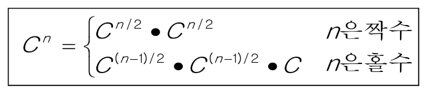

### 분할 정복(Divide & Conquer) :

1805년 12월 2일 아우스터리츠 전투에서 나폴레옹이 사용한 전략

전력이 우세한 연합군을 공격하기 위해 나폴레옹은 연합군의 중앙부로 쳐들어가 연합군을 둘로 나눔

둘로 나뉜 연합군을 한 부분씩 격파함

설계 전략 :

분할(Divide) : 해결할 문제를 여러 개의 작은 부분으로 나눈다

정복(Conquer) : 나눈 작은 문제를 각각 해결한다

통합(Combine) : (필요하다면) 해결된 해답을 모은다

- 거듭 제곱 알고리즘
    
    ```python
    # 반복(Iterative) 알고리즘 : O(n)
    Iterative_Power(x, n)
        result <- 1
        
        FOR i in 1 -> n
            result <- result * x
        
        RETURN result
    ```
    
    ```python
    # 분할 정복 기반 알고리즘 : O(log2n)
    Recursive_Power(x, n)
        IF n == 1 : RETURN x
        IF n is even
            y <- Recursive_Power(x, n/2)
            RETURN y * y
        ELSE
            y <- Recursive_Power(x, (n-1)/2)
            RETURN y * y * x
    ```
    
  
    

### 병합 정렬(Merge Sort) :

여러 개의 정렬된 집합을 병합하여 한 개의 정렬된 집합으로 만드는 방식

분할 정복 알고리즘 활용 → 자료를 최소 단위의 문제까지 나눈 후에 차례대로 정렬(top-down 방식)

시간 복잡도 : O(N*logN)

- 병합 정렬 알고리즘
    
    ```python
    # 알고리즘 : 분할 과정
    
    merge_sort(LIST m)
        IF length(m) == 1 : RETURN m
    
        LIST left, right
        middle <- length(m) / 2
        FOR x in m before middle
            add x to left
        FOR x in m after or equal middle
            add x to right
    
        left <- merge_sort(left)
        right <- merge_sort(right)
        
        RETURN merge(left, right)
    ```
    
    ```python
    # 알고리즘 : 병합 과정
    
    merge(LIST left, LIST right)
        LIST result
    
        WHILE length(left) > 0 OR length(right) > 0
            IF length(left) > 0 AND length(right) > 0
                IF first(left) <= first(right)
                    append popfirst(left) to result
                ELSE
                    append popfirst(right) to result
            ELIF length(left) > 0
                append posfirst(left) to result
            ELIF length(right) > 0
                append popfirst(right) to result
        RETURN result
    ```
    

### 퀵 정렬(Quick Sort) :

주어진 배열을 기준 아이템(pivot item) 중심으로 분할하고, 기준보다 작은 것은 왼편, 큰 것은 오른쪽에 위치시킴

각 부분 정렬이 끝난 후, 병합정렬은 “병합”이란 후처리 작업이 필요하나, 퀵 정렬은 필요로 하지 않음

Partitioning이라는 과정을 반복하면서, 평균 시간복잡도 O(NlogN) 속도라는 빠른 속도로 정렬이 됨

1. 작업 영역을 정한다
2. 작업영역 중 가장 왼쪽에 있는 수를 Pivot이라고 하자(Pivot을 “기준”으로)
3. Pivot을 기준으로 왼쪽에는 Pivot보다 작은 수를 배치(정렬 안됨)
오른쪽에는 Pivot보다 큰 수를 배치(정렬 안됨)
- 퀵 정렬 알고리즘
    
    ```python
    # 퀵 정렬 알고리즘
    quickSort(A[], l, r)
        if l < r
            s <- partition(a, l, r)
            quickSort(A[], l, s - 1)
            quickSort(A[], s + 1, r)
    ```
    
- Hoare-Partition 알고리즘
    
    ```python
    # Hoare-Partition 알고리즘
    partition(A[], l, r)
        p <- A[l]               // p : pivot
        i <- l, j <- r
        WHILE i <= j
            WHILE i <= j and A[i] <= p : i++
            WHILE i <= j and A[i] >= p : j--
            IF i < j : swap(A[i], A[j])
    
        swap(A[l], A[j])
        RETURN j
    ```
    
    - P(피봇)값들보다 큰 값은 오른쪽, 작은 값들은 왼쪽 집합에 위치하도록 함
    - 이후, 피봇을 두 집합의 가운데에 위치시킴
- Lomuto-Partition 알고리즘
    
    ```python
    # Lomuto-Partition 알고리즘
    partition(A[], p, r)
        x <- A[r]
        i <- p - 1
        FOR j in p -> r - 1
            IF A[j] <= x
                i++, swap(A[i], A[j])
        swap(A[i+1], A[r])
        RETURN i + 1
    ```
    
    - Pivot보다 큰 수를 만나면 i 정지, Pivot보다 작은 수를 만나면 j 정지
    - 이후, i + 1과 j 위치의 원소를 swap
    - 같은 수가 많을 때, 역순 정렬된 데이터일 때 비효율적

### 이진 검색(Binary Search) :

자료의 가운데에 있는 항목의 키 값과 비교하여 다음 검색의 위치를 결정하고 검색을 계속 진행하는 방법

목적 키를 찾을 때까지 이진 검색을 순환적으로 반복 수행함으로써 검색 범위를 반으로 줄여가면서 보다 빠르게 검색을 수행

이진 검색을 하기 위해서는 자료가 정렬된 상태여야 함

1. 자료의 중앙에 있는 원소를 고름
2. 중앙 원소의 값과 찾고자 하는 목표 값을 비교
3. 목표 값이 중앙 원소의 값보다 작으면 자료의 왼쪽 반에 대해서 새로 검색을 수행,
크다면 자료의 오른쪽 반에 대해서 새로 검색을 수행
4. 찾고자 하는 값을 찾을 때까지 1~3의 과정을 반복

- 이진 검색 알고리즘(반복 구조)
    
    ```python
    binarySearch(n, S[], key)
    low <- 0
    high <- n - 1
    
    WHILE low <= high
        mid <- low + (high - low) / 2
        
        IF S[mid] == key
            RETURN mid
        ELIF S[mid] > key
            high <- mid - 1
        ELSE
            low <- mid + 1
    
    RETURN -1
    ```
    
- 이진 검색 알고리즘(재귀 구조)
    
    ```python
    binarySearch(a[], low, high, key)
        IF low > high
            RETURN -1
        ELSE
            mid <- (low + high) / 2
            IF key == a[mid]
                RETURN mid
            ELIF key < a[mid]
                RETURN binarySearch(a[], low, mid - 1, key)
            ELSE
                RETURN binarySearch(a[], mid + 1, high, key)
    ```
    

추가 : 정렬된 데이터를 기준으로 특정 값이나 범위를 검색하는 데 사용

Parametric Search(Lower Bound, Upper Bound) : 정렬된 배열에서 특정 값 이상(이하)가 처음으로 나타나는 위치를 찾는 알고리즘