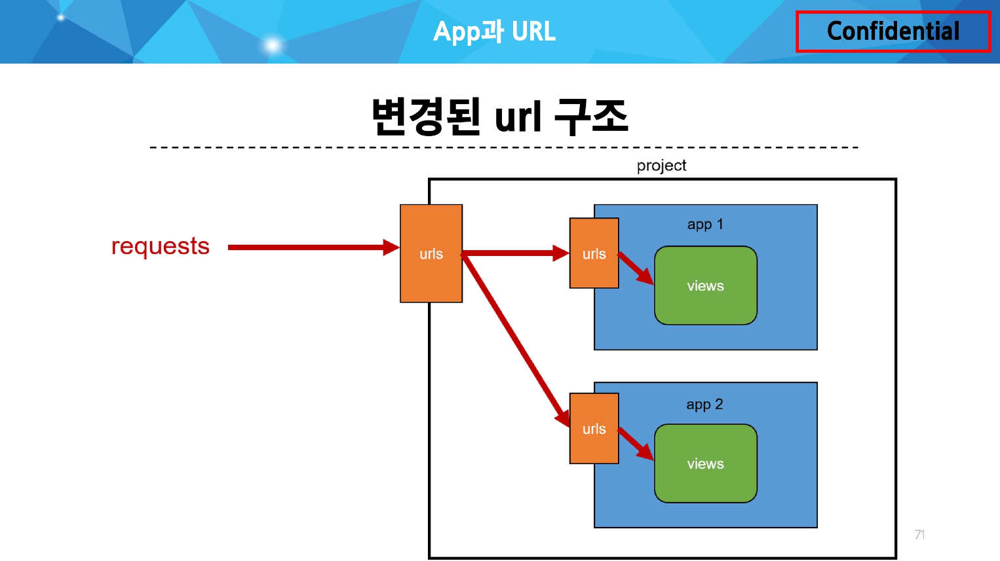

### Django Template System :

데이터 표현을 제어하면서, 표현과 관련된 부분을 담당

- HTML의 컨텐츠를 변수 값에 따라 변경하기

### Django Template Language(DTL) :

Template에서 조건, 반복, 변수 등의 프로그래밍적 기능을 제공하는 시스템

DTL Syntax :

- Variable
    
    `render` 함수의 세 번째 인자로 딕셔너리 데이터를 사용
    
    딕셔너리 key에 해당하는 문자열이 template에서 사용 가능한 변수명이 됨
    
    dot(’.’)를 사용하여 변수 속성에 접근할 수 있음
    
    ```python
    {{ variable }}
    {{ variable.attribute }}
    ```
    
- Filters
    
    표시할 변수를 수정할 때 사용 (변수 + ‘|’ + 필터)
    
    chained(연결)이 가능하며 일부 필터는 인자를 받기도 함
    
    약 60개의 built-in template filters를 제공
    
    ```python
    {{ variable|filter }}
    {{ name|truncatewords:30 }}
    ```
    
- Tags
    
    반복 또는 논리를 수행하여 제어 흐름을 만듦
    
    일부 태그는 시작과 종료 태그가 필요
    
    약 24개의 built-in template tagf를 제공
    
    ```python
    
     
    ```
    
- Comments
    
    DTL에서의 주석
    
    ```python
    <h1>Hello, {# name #}</h1>
    
    ...
    
    ```
    

### Tempalte Inheritance(템플릿 상속) :

페이지의 공통요소를 포함하고,

하위 템플릿이 재정의 할 수 있는 공간을 정의하는

기본 ‘skeleton’ 템플릿을 작성하여 상속 구조를 구축

- skeleton 역할을 하게 되는 상위 템플릿(base.html) 작성 및 하위 템플릿에 적용

### 상속 관련 DTL 태그 :

- `extends`
    
    ```python
    
    ```
    
    자식(하위) 템플릿이 부모 템플릿을 확장한다는 것을 알림
    
    반드시 자식 템플릿 최상단에 작성되어야 함(2개 이상 사용 불가)
    
- `block`
    
    ```python
    
    ```
    
    하위 템플릿에서 재정의 할 수 있는 블록을 정의
    
    (상위 템플릿에 작성하며 하위 템플릿이 작성할 수 있는 공간을 지정하는 것)
    

### HTML form(요청과 응답) :

데이터를 보내고 가져오기(Sending and Retrieving form data)

- `form` element :
    
    사용자로부터 할당된 데이터를 서버로 전송
    
    웹에서 사용자 정보를 입력하는 여러 방식(`text`, `password`, `checkbox` 등)을 제공
    
    ```python
    http://127.0.0.1:8000/search/?query=hello
    # query : 네이버 검색을 위해 필요한 variable
    # hello : input에 입력한 데이터
    ```
    
    `action` :
    
    입력 데이터가 전송될 URl을 지정(목적지)
    
    만약 이 속성을 지정하지 않으면 데이터는 현재 form이 있는 페이지의 URL로 보내짐
    
    `method` :
    
    데이터를 어떤 방식으로 보낼 것인지 정의
    
    데이터의 HTTP request methods (GET, POST)를 지정
    
- `input` element :
    
    사용자의 데이터를 입력 받을 수 있는 요소
    
    (`type` 속성 값에 다라 다양한 유형의 입력 데이터를 받음)
    
    `‘name’` attribute :
    
    input의 핵심 속성
    
    사용자가 입력한 데이터에 붙이는 이름(key)
    
    데이터를 제출했을 때 서버는 name 속성에 설정된 값을 통해서만 사용자가 입력한 데이터에 접근할 수 있음
    
- Query String Parameters :
    
    사용자의 입력 데이터를 URL 주소에 파라미터를 통해 서버로 보내는 방법
    
    문자열은 앰퍼샌드(’&’)로 연결된 key=value 쌍으로 구성되며, 기본 URL과는 물음표(’?’)로 구분됨
    
    ```python
    http://host:port/path?key=value&key=value
    ```
    

### Form 활용 :

- Throw 로직 작성
- Catch 로직 작성

HTTP request 객체 :

form으로 전송한 데이터 뿐만 아니라 Django로 들어오는 모든 요청 관련 데이터가 담겨 있음

(view 함수의 첫번째 인자로 전달됨)

```python
request.GET.get('message')
# request.GET == <QueryDict: {'message': ['안녕!]}>
# 딕셔너리의 get 메서드를 사용해 키의 값을 조회
```

### Django URLs :

- URL Dispatcher
    
    URL 패턴을 정의하고 해당 패턴이 일치하는 요청을 처리할 view 함수를 연결(매핑)
    
- Variable Routing
    
    URL 일부에 변수를 포함시키는 것
    
    (변수는 view 함수의 인자로 전달할 수 있음)
    
    ```python
    <path_converter:variable_name>
    
    #ex.
    path('articles/<int:num>/', views.detail)
    path('hello/<str:name>/', views.greeting)
    ```
    
    Path converters : URL 변수의 타입을 지정
    

### App과 URL :

- App URL mapping
    
    각 앱에 URL을 정의하는 것
    
    프로젝트와 각 앱이 URL을 나누어 관리를 편하게 하기 위함
    
    
    
- `include()`
    
    프로젝트 내부 앱들의 URL을 참조할 수 있도록 매핑하는 함수
    
    URL의 일치하는 부분까지 잘라내고, 남은 문자열 부분은 후속 처리를 위해 include된 URL로 전달
    
    ```python
    from django.urls import path, include
    
    urlpatterns = [
    		path('admin/', admin.site.urls),
    		path('articles/', include('articles.urls')),
    		path('pages/', include('pages.urls')),
    ]
    ```
    

### URL 이름 지정 :

- Naming URL patterns
    
    URL에 이름을 지정하는 것
    
    `path` 함수의 `name` 인자를 정의해서 사용
    
    `url`을 작성하는 모든 곳에서 변경
    
    (`a` 태그의 `href` 속성 값 분만 아니라 `form`의 `action` 속성 등도 포함)
    
    `‘url’` tag :
    
    주어진 URL 패턴의 이름과 일치하는 절대 경로 주소를 반환
    
    `‘app_name’` 속성 지정 :
    
    `app_name` 변수 값 설정
    
    ```python
    # for articles application
    app_name = 'articles'
    
    # for pages application
    app_name = 'pages'
    ```
    
    URL tag의 최종 변화 :
    
    ```python
    #  ->
    
    ```
    

---

### 추가 템플릿 경로 :

템플릿 기본 경로 외 커스텀 경로 추가하기

```python
# BASE_DIR : settings에서 경로지정을 편하게 하기 위해 최상단 지점을 지정해 둔 변수
TEMPLATES = [
    {
        "BACKEND": "django.template.backends.django.DjangoTemplates",
        "DIRS": [
            BASE_DIR / 'my-templates',
            ],
        "APP_DIRS": True,
        "OPTIONS": {
        ...
        },
    },
]
```

```python
# 각 하위 템플릿에서 extends 태그를 통해 경로를 추가

```

### DTL 주의사항 :

Python처럼 일부 프로그래밍 구조(if, for 등)를 사용할 수 있지만 명칭을 그렇게 설계 했을 뿐이지 Python 코드로 실행되는 것이 아니며 Python과는 관련 없음

프로그래밍적 로직이 아니라 표현을 위한 것임을 명심하기

프로그래밍적 로직은 되도록 view 함수에서 작성 및 처리할 것

공식문서를 참고해 다양한 태그와 필터 사용해보기

https://docs.djangoproject.com/en/4.2/ref/templates/builtins/

### Trailing Slahses :

Django는 URL 끝에 ‘/’가 없다면 자동으로 붙임

기술적인 측면에서, `foo.com/bar`와 `foo.com/bar/`는 서로 다른 URL

따라서 Django는 검색 엔진이 혼동하지 않게 하기 위해 무조건 붙이는 것을 선택한 것

그러나 모든 프레임워크가 이렇게 동작하는 것은 아니니 주의