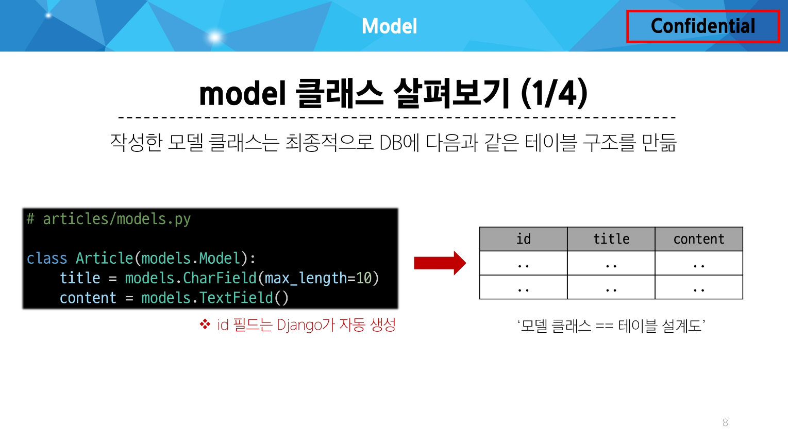

### Django Model :

DB의 테이블을 정의하고 데이터를 조작할 수 있는 기능들을 제공

→ 테이블 구조를 설계하는 청사진(blueprint)

- model 클래스
    
    `django.db.models` 모듈의 `Model`이라는 부모 클래스를 상속받음
    
    
    
    필드 : 테이블의 열(column), 레코드 : 테이블의 행(row)
    

### Model Field :

DB 테이블의 필드(열)을 정의하며, 해당 필드에 저장되는 “데이터 타입”과 “제약조건”을 정의

- Field types(필드 유형)
    
    데이터베이스에 저장될 “데이터의 종류”를 정의(models 모듈의 클래스로 정의됨)
    
    ```python
    class Article(models.Model):
        title = models.CharField(max_length=10)
        content = models.TextField()
    ```
    
    - 문자열 필드
        - `CharField` : 제한된 길이의 문자열을 저장(필드의 최대 길이를 결정하는 `max_length`는 필수 옵션)
        - `TextField` : 길이 제한이 없는 대용량 텍스트를 저장(길이는 사용하는 시스템에 따라 상이)
    - 숫자 필드
        - `IntegerField`, `FloatField`
    - 날짜/시간 필드
        - `DataField`, `TimeField`, `DateTimeField`
    - 파일 관련 필드
        - `FileField`, `ImageField`
- Field options(필드 옵션)
    
    필드의 “동작”과 “제약 조건”을 정의
    
    ```python
    class Article(models.Model):
        title = models.CharField(max_length=10)
        content = models.TextField()
    ```
    
    - `null` : 데이터베이스에서 NULL 값을 허용할지 여부를 결정 (기본값 : False)
    - `blank` : `form`에서 빈 값을 허용할지 여부를 결정 (기본값 : False)
    - `default` : 필드의 기본값을 설정

제약 조건(Constraint) :

특정 규칙을 강제하기 위해 테이블의 열이나 행에 적용되는 규칙이나 제한사항

ex) 숫자만 저장되도록, 문자가 100자까지만 저장되도록 하는 등

### Migrations :

model 클래스의 변경사항(필드 생성, 수정 삭제 등)을 DB에 최종 반영하는 방법

.png)

```python
# model class를 기반으로 최종 설계도(migration) 작성
$ python manage.py makemigrations

# 최종 설계도를 DB에 전달하여 반영
$ python manage.py migrate
```

### 추가 Migrations :

- 이미 생성된 테이블에 필드를 추가하는 경우
- DateTimeField의 필드 옵션(optional)
    
    ```python
    class Article(models.Model):
        title = models.CharField(max_length=10)
        content = models.TextField()
        created_at = models.DateTimeField(auto_now_add=True)
        updated_at = models.DateTimeField(auto_now=True)
    ```
    
    `auto_now` : 데이터가 저장될 때마다 자동으로 현재 날짜시간을 저장
    
    `auto_now_add` : 데이터가 처음 생성될 때만 자동으로 현재 날짜시간을 저장
    
- model class에 변경사항 적용 방법
    
    1. `model class` 변경 → 2. `makemigrations` → 3. `migrate`
    
    ```python
    $ python manage.py makemigrations
    ```
    
    이미 기존 테이블이 존재하기 때문에 필드를 추가 할 때 필드의 기본 값 설정이 필요
    
    ```python
    It is impossible to add the field 'created_at' with 'auto_now_add=True' to article without providing a default. This is because the database needs something to populate existing rows.
     1) Provide a one-off default now which will be set on all existing rows
     2) Quit and manually define a default value in models.py.
    Select an option:
    ```
    
    1번은 현재 대화를 유지하면서 직접 기본 값을 입력하는 방법 ← 해당 방법을 사용하기
    
    2번은 현재 대화에서 나간 후 models.py에 기본 값 관련 설정을 하는 방법
    
    ```python
    Please enter the default value as valid Python.
    Accept the default 'timezone.now' by pressing 'Enter' or provide another value.
    The datetime and django.utils.timezone modules are available, so it is possible to provide e.g. 
    timezone.now as a value.
    Type 'exit' to exit this prompt
    [default: timezone.now] >>>
    ```
    
    날짜 데이터이기 때문에 직접 입력하기보다 Django가 제안하는 기본 값을 사용하는 것을 권장
    
    아무것도 입력하지 않고 enter를 누르면 Django가 제안하는 기본 값으로 설정됨
    
    ```python
    Migrations for 'articles':
      articles\migrations\0002_article_created_at_article_updated_at.py
        - Add field created_at to article
        - Add field updated_at to article
    ```
    
    migrations 과정 종료 후 2번째 migration 파일이 생성됨을 확인
    
    ```python
    $ python manage.py migrate
    ```
    
    migrate 후 테이블 필드 변화 확인
    

### Admin site :

Automatic admin interface :

Django가 추가 설치 및 설정 없이 자동으로 제공하는 관리자 인터페이스

→ 데이터 확인 및 테스트 등을 진행하는데 매우 유용

- Admin 계정 관련
    
    1. Admin 계정 생성
    
    ```python
    $ python manage.py createsuperuser
    ```
    
    email은 선택사항이기 때문에 입력하지 않고 진행 가능
    
    비밀번호 입력 시 보안상 터미널에 출력되지 않으니 무시하고 입력 이어가기
    
    2. DB에 생성된 admin 계정 확인
    
    .png)
    

3. admin에 모델 클래스 등록

`admin.py`에 작성한 모델 클래스를 등록해야만 admin site에서 확인 가능

```python
from django.contrib import admin
from .models import Article

admin.site.register(Article)
```

---

### 데이터베이스 초기화 :

- migration 파일 삭제
- db.sqlite3 파일 삭제
- 다음의 파일과 폴더를 지우지 않도록 주의 : `__init__.py` & `migration 폴더`

### Migration 관련 :

```python
$ python manage.py showmigrations
```

migrations 파일들이 migrate 됐는지 안됐는지 여부를 확인하는 명령어

[X] 표시가 있으면 migrate가 완료되었음을 의미

```python
$ python manage.py sqlmigrate articles 0001
```

해당 migrations 파일이 SQL 언어(DB에서 사용하는 언어)로 어떻게 번역 되어 DB에 전달되는지 확인하는 명령어

### SQLite :

데이터베이스 관리 시스템 중 하나이며 Django의 기본 데이터베이스로 사용됨

(파일로 존재하며 가볍고 호환성이 좋음)