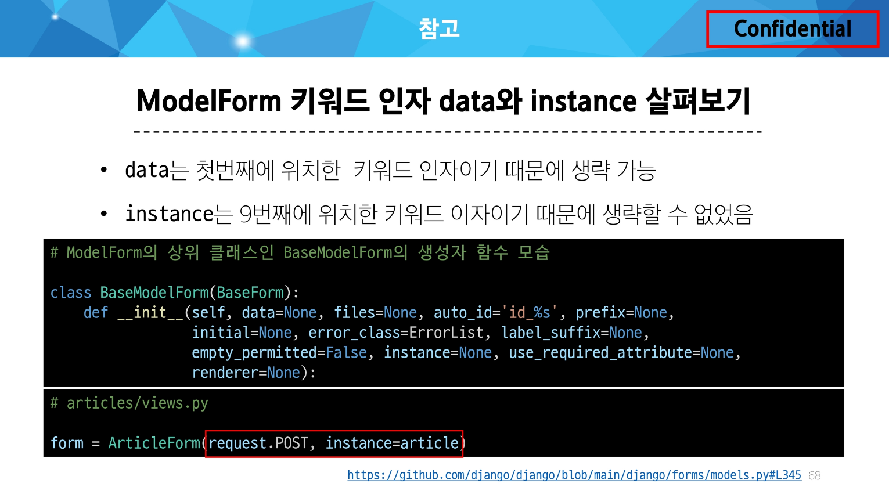

HTML `‘form’` :

지금까지 사용자로부터 데이터를 제출 받기 위해 활용한 방법

그러나, 비정상적 혹은 악의적인 요청을 필터링 할 수 없음

→ 유효한 데이터인지에 대한 확인이 필요

유효성 검사 :

수집한 데이터가 정확하고 유효한지 확인하는 과정

유효성 검사를 구현하기 위해서는 입력 값, 형식, 중복, 범위, 보안 등 많은 것들을 고려해야 함

### Form Class

Django Form :

사용자 입력 데이터를 수집하고, 처리 및 유효성 검사를 수행하기 위한 도구

→ 유효성 검사를 단순화하고 자동화 할 수 있는 기능을 제공

```python
# articles/forms.py

from django import forms

class ArticleForm(forms.Form):
    title = forms.CharField(max_length=10)
    content = forms.CharField()
```

- view 함수 변경
- form 인스턴스 출력 `{{ form }}`

Form rendering options :

- label, input 쌍을 특정 HTML 태그로 감싸는 옵션
    
    ```python
      <h1>New</h1>
      <form action="" method="POST">
        
        {{ form.as_p }}
        <input type="submit">
      </form>
    ```
    

### Widgets

HTML `‘input’` element의 표현을 담당

input 요소의 속성 및 출력되는 부분을 변경

```python
from django import forms

class ArticleForm(forms.Form):
    title = forms.CharField(max_length=10)
    content = forms.CharField(widget=forms.Textarea)
```

### Django ModelForm

Form : 사용자 입력 데이터를 DB에 저장하지 않을 때(ex. 검색, 로그인)

ModelForm : 사용자 입력 데이터를 DB에 저장해야 할 때(ex. 게시글 작성, 회원가입)

https://docs.djangoproject.com/en/5.1/topics/forms/modelforms/

https://docs.djangoproject.com/en/5.1/ref/forms/fields/

ModelForm :

Model과 연결된 Form을 자동으로 생성해주는 기능을 제공(`Form` + `Model`)

```python
# articles/forms.py

from django import forms
from .models import Article

class ArticleForm(forms.ModelForm):
    class Meta:
        model = Article
        fields = '__all__'
```

### Meta class

Meta class :

ModelForm의 정보를 작성하는 곳

Django에서 `ModelForm`에 대한 추가 정보나 속성을 작성하는 클래스 구조를 `Meta` 클래스로 작성 했을 뿐이며, 파이썬의 inner class와 같은 문법적인 관점으로 접근하지 말 것

`‘fields’` 및 `‘exclude’` 속성 :

`exclude` 속성을 사용하여 모델에서 포함하지 않을 필드를 지정할 수도 있음

```python
# articles/forms.py

class ArticleForm(forms.ModelForm):
    class Meta:
        model = Article
        exclude = ('title',)
```

### ModelForm 작성

- ModelForm을 적용한 create 로직
    
    ```python
    def create(request):
        # 1. 모델폼 인스턴스 생성 (+ 사용자 입력 데이터를 통째로 인자로 작성)
        form = ArticleForm(request.POST)
    
        # 2. 유효성 검사 및 저장
        if form.is_valid():
            article = form.save()
            return redirect('articles:detail', article.pk)
        context = {
            'form' : form,
        }
        return render(request, 'articles/new.html', context)
    ```
    

`is_valid()`

여러 유효성 검사를 실행하고 데이터가 유효한지 여부를 `Boolean`으로 반환

[공백 데이터가 유효하지 않은 이유와 에러메시지가 출력되는 과정]

- 별도로 명시하지 않았지만 모델 필드에는 기본적으로 빈 값은 허용하지 않는 제약조건이 설정 되어있음
- 빈 값은 `is_valid()`에 의해 `False`로 평가되고 `form` 객체에는 그에 맞는 에러 메시지가 포함되어 다음 코드로 진행됨

### save 메서드

`save()` :

데이터베이스 객체를 만들고 저장하는 `ModelForm`의 인스턴스 메서드

키워드 인자 `instance` 여부를 통해 생성할 지, 수정할 지를 결정

### HTTP 요청 다루기

HTTP request method 차이점을 활용해 동일한 목적을 가지는 2개의 view 함수를 하나로 구조화

ex) new & create, edit & update

### new & create 함수 결합

[new & create view 함수간 공통점과 차이점]

공통점 : 데이터 생성을 구현하기 위함

차이점 : new는 `GET` method 요청만을, create는 `POST` method 요청만을 처리

```python
def create(request):
    # 요청 메서드가 POST일 때
    if request.method == 'POST':
        form = ArticleForm(request.POST)
        if form.is_valid():
            article = form.save()
            return redirect('articles:detail', article.pk)
    # 요청 메서드가 POST가 아닐 때(GET, PUT, DELETE 등 다른 메서드)
    else:  # if request.method != 'POST':
        form = ArticleForm()
    context = {
        'form' : form,
    }
    return render(request, 'articles/create.html', context)
```

### edit & update 함수 결합

```python
def update(request, pk):
    article = Article.objects.get(pk=pk)
    if request.method == 'POST':
        form = ArticleForm(request.POST, instance=article)
        if form.is_valid():
            article = form.save()
            return redirect('articles:detail', article.pk)
    else:
        form = ArticleForm(instance=article)
    context = {
        'article': article,
        'form' : form,
    }
    return render(request, 'articles/update.html', context)
```

---

### 참고

ModelForm의 키워드 인자 구성



- `data`는 첫번째 위치한 키워드 인자이기 때문에 생략 가능
- `instance`는 9번째 위치한 키워드 인자이기 때문에 생략할 수 없음

Widgets 응용

https://docs.djangoproject.com/en/5.1/ref/forms/widgets/

```python
class ArticleForm(forms.ModelForm):
    title=forms.CharField(
        label='제목',
        widget=forms.TextInput(
            attrs={
                'class': 'my-title',
                'placeholder': 'Enter the title',
            }
        ),
    )
```

필드를 수동으로 렌더링(widget 사용 대신)

.png)