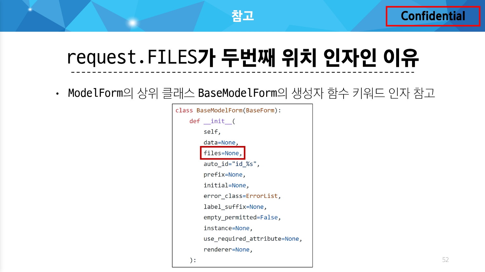

### Static files 제공하기

Static file(정적파일) :

서버 측에서 변경되지 않고 고정적으로 제공되는 파일(이미지, JS, CSS 파일 등)

웹 서버의 기본동작은

- 특정위치(URL)에 있는 자원을
- 요청(HTTP request) 받아서
- 응답(HTTP response)을 처리하고 제공하는 것

→ 정적 파일을 제공하기 위한 경로(URL)가 있어야 함

### Static files 기본 경로

`app폴더/static/`

```python



```

static files 경로는 DTL의 `static tag`를 사용해야 함

built-in tag가 아니기 때문에 `load tag`를 사용해 import 후 사용 가능

STATIC_URL : 기본 경로 및 추가 경로에 위치한 정적 파일을 참조하기 위한 URL

→ 실제 파일이나 디렉토리 경로가 아니며, URL로만 존재

URL + STATIC_URL + 정적파일 경로

```python
# settings.py

STATIC_URL = 'static/'
```

### Static files 추가 경로

`STATICFILES_DIRS`에 문자열 값으로 추가 경로 설정

정적 파일의 기본 경로 외에 추가적인 경로 목록을 정의하는 리스트

```python
# settings.py

STATICFILES_DIRS = [
    # Python 객체지향 경로 시스템
    BASE_DIR / 'static',
]
```

### Media files

사용자가 웹에서 업로드하는 정적 파일(user-uploaded)

### 이미지 업로드

`ImageField()` : 이미지 업로드에 사용하는 모델 필드

→ 이미지 객체가 직접 DB에 저장되는 것이 아닌 ‘이미지 파일의 경로’ 문자열이 저장됨

- `settings.py`에 `MEDIA_ROOT`, `MEDIA_URL` 설정
- 작성한 `MEDIA_ROOT`와 `MEDIA_URL`에 대한 URL 지정

`MEDIA_ROOT` : 미디어 파일들이 위치하는 디렉토리의 절대 경로

```python
# settings.py

MEDIA_ROOT = BASE_DIR / 'media'
```

`MEDIA_URL` : `MEDIA_ROOT`에서 제공되는 미디어 파일에 대한 주소를 생성
(`STATIC_URL`과 동일한 역할)

```python
# settings.py

MEDIA_URL = 'media/'
```

`MEDIA_ROOT`와 `MEDIA_URL`에 대한 URL 지정

업로드 된 파일의 URL == `settings.MEDIA_URL`

MEDIA_URL을 통해 참조하는 파일의 실제 위치 == `settings.MEDIA_ROOT`

```python
# crud/urls.py

from django.conf import settings
from django.conf.urls.static import static

urlpatterns = [
		...
] + static(settings.MEDIA_URL, document_root=settings.MEDIA_ROOT)
```

[이미지 업로드]

- blank=True 속성을 작성해 빈 문자열이 저장될 수 있도록 제약 조건 설정
    
    게시글 작성 시 이미지 업로드 없이도 작성 할 수 있도록 하기 위함
    
    ```python
    # articles/models.py
    
    class Article(models.Model):
        ...
        image = models.ImageField(blank=True, upload_to='%Y/%m/%d/')
        ...
    ```
    
    기존 필드 사이에 작성해도 실제 테이블 생성 시에는 가장 우측(뒤)에 추가됨
    
- migration 진행
    
    ```python
    $ pip install pillow
    
    $ python manage.py makemigrations
    $ python manage.py migrate
    
    $ pip freeze > requirements.txt
    ```
    
    `ImageField`를 사용하려면 반드시 Pillow 라이브러리가 필요
    
- `form`요소의 `enctype` 속성 추가
    
    https://developer.mozilla.org/ko/docs/Web/HTML/Element/form
    
    ```python
    <!-- articles/create.html -->
    
    <h1>Create</h1>
    <form action="" method="POST" enctype="multipart/form-data">
      
      {{ form.as_p }}
      <input type="submit">
    </form>
    ```
    
    `enctype`은 데이터 전송방식을 결정하는 속성
    
- `ModelForm`의 2번째 인자로 요청 받은 파일 데이터 작성
    
    ModelForm의 상위 클래스 BaseModelForm의 생성자 함수의 2번째 위치 인자로 파일을 받도록 설정되어 있음
    
    ```python
    # articles/views.py
    
    def create(request):
        if request.method == 'POST':
            form = ArticleForm(request.POST, request.FILES)
    		...
    ```
    

### 이미지 업로드 제공

`‘url’` 속성을 통해 업로드 파일의 경로 값을 얻을 수 있음

`article.image.url` : 업로드 파일의 경로

`article.image` : 업로드 파일의 파일 이름

```python
<!-- articles/detail.html -->


```

이미지가 데이터가 있는 경우만 이미지를 출력할 수 있도록 처리하기

```python
<!-- articles/detail.html -->


  

```

### 업로드 이미지 수정

- 수정 페이지 `form` 요소에 `enctype` 속성 추가
    
    ```python
    <!-- articles/update.html -->
    
    <h1>Update</h1>
    <form action="" method="POST" enctype="multipart/form-data">
      
      {{ form.as_p }}
      <input type="submit" value="수정">
    </form>
    ```
    
- update view 함수에서 업로드 파일에 대한 추가 코드 작성
    
    ```python
    # articles/views.py
    
    def update(request, pk):
        article = Article.objects.get(pk=pk)
        if request.method == 'POST':
            form = ArticleForm(request.POST, request.FILES, instance=article)
    		...
    ```
    

---

미디어 파일 추가 경로

`‘upload_to’` argument

`ImageField()`의 `upload_to` 속성을 사용해 다양한 추가 경로 설정

```python
# 1. 기본 경로 설정
image = models.ImageField(blank=True, upload_to='images/')

# 2. 업로드 날짜로 경로 설정
image = models.ImageField(blank=True, upload_to='%Y/%m/%d/')

# 3. 함수 형식으로 경로 설정
def articles_image_path(instance, filename):
		return f'images/{instance.user.username}/{filename}'

image = models.ImageField(blank=True, upload_to=articles_image_path)
```

BaseModelForm

