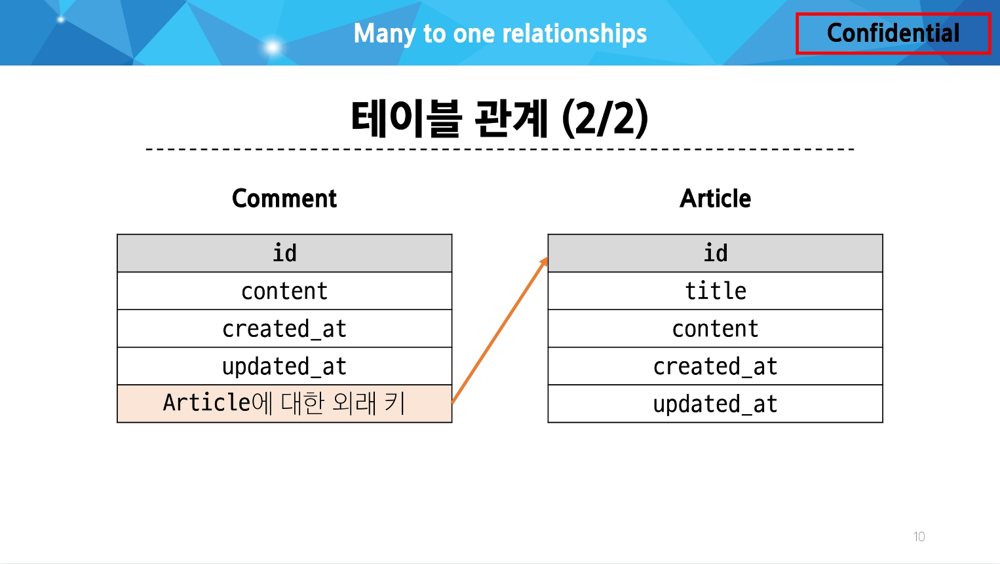

### 모델 관계

Many to one relationships(N:1 or 1:N) :

한 테이블의 0개 이상의 레코드가 다른 테이블의 레코드 한 개와 관련된 단계



### 댓글 모델 정의

```python
# articles/models.py

class Comment(models.Model):
    article = models.ForeignKey(Article, on_delete=models.CASCADE)
    content = models.CharField(max_length=200)
    created_at = models.DateTimeField(auto_now_add=True)
    updated_at = models.DateTimeField(auto_now=True)
```

`ForeignKey()` : 한 모델이 다른 모델을 참조하는 관계를 설정하는 필드(N:1 관계 표현)

- `ForeignKey` 클래스의 인스턴스 이름은 참조하는 모델 클래스 이름의 단수형으로 작성하는 것을 권장
- 외래 키는 `ForeignKey` 클래스를 작성하는 위치와 관계없이 테이블의 마지막 필드로 생성됨
- Migration 이후 만들어 지는 필드 이름 : `‘참조 대상 클래스 이름’` + `‘_’` + `‘클래스 이름’`

`ForeignKey(to, on_delete)`

`to` : 참조하는 모델 class 이름

`on_delete` : 외래 키가 참조하는 객체(1)가 사라졌을 때, 외래 키를 가진 객체(N)를 어떻게 처리할 지를 정의하는 설정(데이터 무결성)

`on_delete = models.CASCADE` : 참조 된 객체(부모 객체)가 삭제 될 때 이를 참조하는 모든 객체도 삭제되도록 지정

### 댓글 생성

```python
$ python manage.py shell_plus

...
```

### 역참조

- N:1 관계에서 1에서 N을 참조하거나 조회하는 것 (1 → N)
- 모델 간의 관계에서 관계를 정의한 모델이 아닌, 관계의 대상이 되는 모델에서 연결된 객체들에 접근하는 방식
- N은 외래 키를 가지고 있어 물리적으로 참조가 가능하지만, 1은 N에 대한 참조 방법이 존재하지 않아 별도의 역참조 키워드가 필요

`article.comment_set.all()` : 특정 게시글에 작성된 댓글 전체를 조회하는 요청

- article : 모델 인스턴스
- comment_set : related manager(역참조 이름)
- all() : QuerySet API

Related manager

- N:1 혹은 M:N 관계에서 역참조 시에 사용하는 매니저
- `‘objects’` 매니저를 통해 QuerySet API를 사용했던 것처럼 related manager를 통해 QuerySet API를 사용할 수 있게 됨
- N:1 관계에서 생성되는 Related manager의 이름은 `“모델명_set”` 형태로 자동 생성됨
- `comment.article` : 특정 댓글의 게시글 참조(Comment → Article)
- `article.comment_set.all()` : 특정 게시글의 댓글 목록 참조(Article → Comment)

### 댓글 구현

```python
# articles/forms.py

from .models import Article, Comment

class CommentForm(forms.ModelForm):
    class Meta:
        model = Comment
        fields = ('content',)
```

- 사용자로부터 댓글 데이터를 입력 받기 위한 `CommentForm` 정의
- `CommentForm`의 출력 필드를 조정하여 외래 키 필드가 출력되지 않도록 함

```python
# articles/views.py

from .forms import ArticleForm, CommentForm

def detail(request, pk):
    article = Article.objects.get(pk=pk)
    comment_form = CommentForm()
    context = {
        'article': article,
        'comment_form': comment_form,
    }
    return render(request, 'articles/detail.html', context)
```

```python
# articles/detail.html

<form action="" method="POST">
  
  {{ comment_form }}
  <input type="submit" value="삭제">
</form>
```

- detail view 함수에서 `CommentForm`을 사용하여 detail 페이지에 렌더링

```python
# articles/urls.py

urlpatterns = [
		...,
    path('<int:pk>/comments/', views.comments_create, name='comments_create'),
]
```

```python
# articles/detail.html

<form action="" method="POST">
  
  {{ comment_form }}
	<input type="submit">
</form>
```

- url 작성 및 action 값 작성

```python
# articles/views.py

def comments_create(request, pk):
    article = Article.objects.get(pk=pk)
    comment_form = CommentForm(request.POST)
    if comment_form.is_valid():
        comment = comment_form.save(commit=False)
        comment.article = article
        comment.save()
        return redirect('articles:detail', article.pk)
    context = {
        'article': article,
        'comment_form': comment_form,
    }
    return render(request, 'articles/detail.html', context)
```

- `comments_create` view 함수 정의
- url로 받은 pk 인자를 게시글을 조회하는 데 사용
- `save(commit=False)` : DB에 저장 요청을 보내지 않고 인스턴스만 반환

### 댓글 READ

```python
# articles/views.py

from .forms import ArticleForm, CommentForm

def detail(request, pk):
    article = Article.objects.get(pk=pk)
    comment_form = CommentForm()
    comments = article.comment_set.all()
    context = {
        'article': article,
        'comment_form': comment_form,
        'comments': comments,
    }
    return render(request, 'articles/detail.html', context)
```

- detail view 함수에서 전체 댓글 데이터를 조회

```python
# articles/detail.html

<h4>댓글 목록</h4>
<ul>
  
    <li>{{ comment.content }}</li>
  
</ul>
```

- 전체 댓글 출력 및 확인

### 댓글 DELETE

```python
# articles.urls/py

urlpatterns = [
		...,
    path(
        '<int:pk>/comments/<int:comment_pk>/delete/',
        views.comments_delete,
        name='comments_delete'
    ),
]
```

- 댓글 삭제 url 작성

```python
# articles/views.py

from .models import Article, Comment

def comments_delete(request, article_pk, comment_pk):
    comment = Comment.objects.get(pk=comment_pk)
    comment.delete()
    return redirect('articles:detail', article_pk)
```

---

### 데이터 무결성

- 데이터의 신뢰성 확보, 시스템 안정성, 보안 강화
- 데이터베이스에 저장된 데이터의 정확성, 일관성, 유효성을 유지하는 것
- 데이터베이스에 저장된 데이터 값의 정확성을 보장하는 것

### admin site 댓글 등록

`Comment` 모델을 admin site에 등록해 CRUD 동작 확인하기

```python
# articles/admin.py

from .models import Article, Comment

admin.site.register(Article)
admin.site.register(Comment)
```

### 댓글 추가 구현

- 댓글이 없는 경우 대체 컨텐츠 출력
    
    DTL의 `‘for empty’` 태그 활용
    
    ```python
    # articles/detail.html
    
    
      <li>
        {{ comment.content }}
        <form action="" method="POST">
          
          <input type="submit" value="DELETE">
        </form>
      </li>
    
      <p>댓글이 없어요..</p>
    
    ```
    
- 댓글 개수 출력하기
    
    DTL filter - ‘length’ 사용
    
    ```python
    {{ comments|length }}
    
    {{ article.comment_set.all|length }}
    ```
    
    QuerySetAPI - `‘count()’` 사용
    
    ```python
    {{ article.comment_set.count }}
    ```
    

### 모델 관계 설정 - Article & User

```python
from django.conf import settings

class Article(models.Model):
    user = models.ForeignKey(settings.AUTH_USER_MODEL, on_delete=models.CASCADE)
    title = models.CharField(max_length=10)
    content = models.TextField()
    created_at = models.DateTimeField(auto_now_add=True)
    updated_at = models.DateTimeField(auto_now=True)
```

- User 외래 키 정의
    
    
    |  | `get_user_model()` | `settings.AUTH_USER_MODEL` |
    | --- | --- | --- |
    | 반환 값 | `User Object` (객체) | `‘accounts.User’` (문자열) |
    | 사용 위치 | `models.py`가 아닌 다른 모든 위치 | `models.py` |

### 게시글 CREATE

```python
# articles/forms.py

class ArticleForm(forms.ModelForm):
    class Meta:
        model = Article
        fields = ('title', 'content',)
```

- User 모델에 대한 외래 키 데이터 입력을 받지 않도록 ArticleForm 출력 필드 설정

```python
# articles/views.py

@login_required
def create(request):
    if request.method == 'POST':
        form = ArticleForm(request.POST)
        if form.is_valid():
            article = form.save(commit=False)
            article.user = request.user
            article.save()
            return redirect('articles:detail', article.pk)
    else:
        ...
```

- 게시글 작성 시 작성자 정보가 함께 저장될 수 있도록 `save`의 `commit` 옵션 활용

### 게시글 READ

```python
# articles/index.html


  <p>작성자 : {{ article.user }}</p>
  <p>글 번호: {{ article.pk }}</p>
  <a href="">
    <p>글 제목: {{ article.title }}</p>
  </a>
  <p>글 내용: {{ article.content }}</p>
  <hr>

```

```python
# articles/detail.html

<h1>Detail</h1>
<h3>{{ article.pk }}번째 글</h3>
<hr>
<p>작성자 : {{ article.user }}</p>
<p>제목: {{ article.title }}</p>
<p>내용: {{ article.content }}</p>
<p>작성일: {{ article.created_at }}</p>
<p>수정일: {{ article.updated_at }}</p>
```

- 각 게시글의 작성자 이름 출력

### 게시글 UPDATE

```python
# articles/views.py

@login_required
def update(request, pk):
    article = Article.objects.get(pk=pk)
    if request.user == article.user:
        if request.method == 'POST':
            form = ArticleForm(request.POST, instance=article)
            if form.is_valid():
                form.save()
                return redirect('articles:detail', article.pk)
        else:
            form = ArticleForm(instance=article)
    else:
        return redirect('articles:index')
    context = {
        'article': article,
        'form': form,
    }
    return render(request, 'articles/update.html', context)
```

- 게시글 수정 요청 사용자와 게시글 작성 사용자를 비교하여 본인의 게시글만 수정 할 수 있도록 하기

```python
# articles/detail.html


  <a href="">UPDATE</a><br>
  <form action="" method="POST">
    
    <input type="submit" value="DELETE">
  </form>

```

- 해당 게시글의 작성자가 아니라면, 수정/삭제 버튼을 출력하지 않도록 하기

### 게시글 DELETE

```python
# articles/views.py

@login_required
def delete(request, pk):
    article = Article.objects.get(pk=pk)
    if request.user == article.user:
        article.delete()
    return redirect('articles:index')
```

- 삭제를 요청하려는 사람과 게시글을 작성한 사람을 비교하여 본인의 게시글만 삭제 할 수 있도록 하기

### 모델 관계 설정 - Comment & User

```python
# articles/models.py

class Comment(models.Model):
    article = models.ForeignKey(Article, on_delete=models.CASCADE)
    user = models.ForeignKey(settings.AUTH_USER_MODEL, on_delete=models.CASCADE)
    content = models.CharField(max_length=200)
    created_at = models.DateTimeField(auto_now_add=True)
    updated_at = models.DateTimeField(auto_now=True)
```

- User 외래 키 정의

### 댓글 CREATE

```python
# articles/views.py

def comments_create(request, pk):
    article = Article.objects.get(pk=pk)
    comment_form = CommentForm(request.POST)
    if comment_form.is_valid():
        comment = comment_form.save(commit=False)
        comment.article = article
        comment.user = request.user
        comment.save()
        return redirect('articles:detail', article.pk)
    ...
```

- 댓글 작성 시 작성자 정보가 함께 저장할 수 있도록 작성

### 댓글 READ

```python
# articles/detail.html


  <li>
    {{ comment.user}} - {{ comment.content }}
		...
	</li>

```

- 댓글 출력 시 댓글 작성자와 함께 출력

### 댓글 DELETE

```python
# articles/views.py

def comments_delete(request, article_pk, comment_pk):
    comment = Comment.objects.get(pk=comment_pk)
    if request.user == comment.user:
        comment.delete()
    return redirect('articles:detail', article_pk)
```

- 댓글 삭제 요청 사용자와 댓글 작성 사용자를 비교하여 본인의 댓글만 삭제할 수 있도록 하기

```python
# articles/detail.html


  <li>
    {{ comment.user}} - {{ comment.content }}
    
      <form action="" method="POST">
        
        <input type="submit" value="DELETE">
      </form>
    
  </li>

  <p>댓글이 없어요..</p>

```

- 해당 댓글의 작성자가 아니라면, 댓글 삭제 버튼을 출력하지 않도록 함

### View decorators

View 함수의 동작을 수정하거나 추가 기능을 제공하는 데 사용되는 Python 데코레이터

→ 코드의 재사용성을 높이고 뷰 로직을 간결하게 유지

### Allowed HTTP methods

특정 HTTP method로만 View 함수에 접근할 수 있도록 제한하는 데코레이터

- 지정되지 않은 HTTP method로 요청이 들어오면 `HttpResponseNotAllowed (405)`를 반환
- 대문자로 HTTP method를 지정

`require_http_methods([”METHOD1”, “METHOD2”, …])` : 지정된 HTTP method만 허용

```python
from django.views.decorators.http import require_http_methods

@require_http_methods(['GET', 'POST'])
def func(request):
	pass
```

`require_safe()` : GET과 HEAD method만 허용

```python
from django.views.decorators.http import require_safe

@require_safe
def func(request):
	pass
```

`require_POST()` : POST method만 허용

```python
from django.views.decorators.http import require_POST

@require_POST
def func(request):
	pass
```

[`require_GET` 대신 `require_safe`를 권장하는 주요 이유]

웹 표준을 준수하고,

더 넓은 범위의 클라이언트와 호환되며,

안전한 HTTP 메소드만을 허용하는 view 함수를 구현할 수 있음

### ERD(Entity-Relationship Diagram)

데이터베이스의 구조를 시각적으로 표현하는 도구

Entity(개체), 속성, 그리고 엔티티 간의 관계를 그래픽 형태로 나타내어 시스템의 논리적 구조를 모델링하는 다이어그램

.png)

- 데이터베이스 설계의 핵심 도구
- 시각적 모델링으로 효과적인 의사소통 지원
- 실제 시스템 개발 전 데이터 구조 최적화에 중요

### ERD 구성 요소

엔티티(Entity) : 데이터베이스에 저장되는 객체나 개념

- ex) 고객, 주문, 제품

속성(Attribute) : 엔티티의 특성이나 성질

- ex) 고객(이름, 주소, 전화번호)

관계(Relationship) : 엔티티 간의 연관성

- ex) 고객이 ‘주문’한 제품

Cardinality : 한 엔티티와 다른 엔티티 간의 수적 관계를 나타내는 표현

- 일대일 (one-to-one, 1:1)
- 다대일 (many-to-one, N:1)
- 다대다 (many-to-many, M:N)

.png)

### ERD 제작 사이트

https://app.diagrams.net/

https://www.erdcloud.com/

---

### 추가 기능 구현

[인증된 사용자만 댓글 작성 및 삭제]

```python
# articles/views.py

@login_required
def comments_create(request, pk):
	pass

@login_required
def comments_delete(request, article_pk, comment_pk):
	pass
```