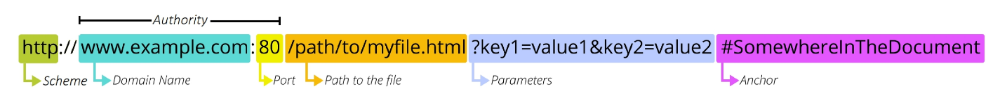

### API(Application Programming Interface)

- 두 소프트웨어가 서로 통신할 수 있게 하는 메커니즘
- 클라이언트-서버처럼 서로 다른 프로그램에서 요청과 응답을 받을 수 있도록 만든 체계
- “이렇게 요청을 보내면, 이렇게 정보를 제공 해 줄 것이다”라는 매뉴얼

ex) Web API : 웹 서버 또는 웹 브라우저를 위한 API

### REST(Representational State Transfer)

- API Server를 개발하기 위한 일종의 소프트웨어 설계 방법론. 규칙이 아님
- REST 원리를 따르는 시스템을 `RESTful` 하다고 부름
- “자원을 정의”하고 “자원에 대한 주소를 지정”하는 전반적인 방법을 서술

### 자원의 “식별”

`URI`(Uniform Resource Identifier, 통합 자원 식별자) : 인터넷에서 리소스(자원)를 식별하는 문자열

`URL`(Uniform Resource Locator, 통합 자원 위치) : 웹에서 주어진 리소스의 주소



- Schema (or Protocol)
    
    브라우저가 리소스를 요청하는 데 사용해야 하는 규약
    
    URL의 첫 부분은 브라우저가 어떤 규약을 사용하는지를 나타냄
    
    웹 `http(s)` /  메일 열기 `mailto:` / 메일 전송 `ftp:` / …
    
- Domain Name
    
    요청 중인 웹 서버를 나타냄
    
    어떤 웹 서버가 요구되는 지를 가리키며 직접 IP 주소를 사용하는 것도 가능하지만, 사람이 외우기 어렵기 때문에 주소 Domain Name으로 사용
    
- Port
    
    웹 서버의 리소스에 접근하는데 사용되는 기술적인 문(Gate)
    
    HTTP 프로토콜의 표준 포트(`HTTP - 80` / `HTTPS - 443`)
    
    표준 포트만 작성 시 생략 가능
    
- Path
    
    웹 서버의 리소스 경로
    
    초기에는 실제 파일이 위치한 물리적 위치를 나타냈지만, 오늘날은 실제 위치가 아닌 추상화된 형태의 구조를 표현
    
- Parameters
    
    웹 서버에 제공하는 추가적인 데이터(`if HTTP methods == “GET”`)
    
    `‘&’` 기호로 구분되는 `key-value` 쌍 목록
    
    서버는 리소스를 응답하기 전에 이러한 파라미터를 사용하여 추가 작업을 수행할 수 있음
    
- Anchor
    
    일종의 “북마크”를 나타내며 브라우저에 해당 지점이 있는 콘텐츠를 표시
    
    `‘#’` (fragment identifier, 부분 식별자) 이후 부분은 서버에 전송되지 않음
    

### 자원의 “행위”

`HTTP Request Methods(HTTP verb)` : 리소스에 대한 행위(수행하고자 하는 동작)를 정의

- `GET` - R
    
    서버에 리소스의 표현을 요청
    
    GET을 사용하는 요청은 데이터만 검색해야 함
    
- `POST` - C
    
    데이터를 지정된 리소스에 제출
    
    서버의 상태를 변경
    
- `PUT` - U
    
    요청한 주소의 리소스를 수정
    
- `DELETE` - D
    
    지정된 리소스를 삭제
    

`HTTP response status codes` : 특정 HTTP 요청이 성공적으로 완료 되었는지 여부를 나타냄

- `(100-199) Informational responses`
- `(200-299) Successful responses`
- `(300-399) Redirection messages`
- `(400-499) Client error responses`
- `(500-599) Server error responses`

### 자원의 “표현”

REST API는 서버가 응답할 수 있는 다양한 데이터 타입 중에 `JSON` 타입으로 응답하는 것을 권장 

### DRF(Django REST Framework)

Django에서 Restful API 서버를 쉽게 구축할 수 있도록 도와주는 오픈소스 라이브러리

### Serialization

- “직렬화”
- 데이터 구조나 객체 상태를 나중에 재구성할 수 있는 포맷으로 변환하는 과정
- 어떠한 언어나 환경에서도 나중에 다시 쉽게 사용할 수 있는 포맷으로 변환하는 과정

Serializer :

- Serialization을 진행하여 Serialized data를 반환해주는 클래스

ModelSerializer :

- Django 모델과 연결된 Serializer 클래스
- 일반 Serializer와 달리 사용자 입력 데이터를 받아 자동으로 모델 필드에 맞추어 Serialization을 진행
- `serializers.py`의 위치나 파일명은 자유롭게 작성 가능하나, 유지보수를 위해 통일함

### CRUD with ModelSerializer

[URL과 HTTP requests methods 설계]

|  | GET | POST | PUT | DELETE |
| --- | --- | --- | --- | --- |
| articles/ | 전체 글 조회 | 글 작성 |  |  |
| articles/1/ | 1번 글 조회 |  | 1번 글 수정 | 1번 글 삭제 |
- GET method - 조회(List)
    - 게시글 데이터 목록을 제공하는 `ArticleListSerializer` 정의
    
    ```python
    # articles/serializers.py
    
    from rest_framework import serializers
    from .models import Article
    
    class ArticleListSerializer(serializers.ModelSerializer):
        class Meta:
            model = Article
            fields = ('id', 'title', 'content')
    ```
    
    - url 작성
    
    ```python
    # articles/urls.py
    
    urlpatterns = [
        path('articles/', views.article_list),
    ]
    ```
    
    - view 함수 작성
    
    ```python
    # articles/views.py
    
    from rest_framework.response import Response
    from rest_framework.decorators import api_view
    
    from .models import Article
    from .serializers import ArticleListSerializer
    
    @api_view(['GET'])
    def article_list(request):
        # 전체 게시글 조회 (타입: 쿼리셋, 그런데 쿼리셋은 장고에서 사용하는 데이터 타입)
        articles = Article.objects.all()
        # 변화하기 쉬운 포맷으로 변환 (직렬화)
        serializer = ArticleListSerializer(articles, many=True)
        return Response(serializer.data)
    ```
    
    - `many` 옵션 : Serialize 대상이 QuerySet인 경우 입력
    - `data` 옵션 : Serialized data 객체에서 실제 데이터를 추출
    - `‘api_view’` decorator : DRF view 함수에서는 필수로 작성되며 view 함수를 실행하기 전 HTTP 메서드를 확인
- GET method - 조회(Detail)
    - 게시글 데이터 목록을 제공하는 `ArticleListSerializer` 정의
    
    ```python
    from rest_framework import serializers
    from .models import Article
    
    class ArticleSerializer(serializers.ModelSerializer):
        class Meta:
            model = Article
            fields = ('id', 'title', 'content')
    ```
    
    - url 작성
    
    ```python
    # articles/urls.py
    
    urlpatterns = [
        path('articles/<int:article_pk>/', views.article_detail),
    ]
    ```
    
    - view 함수 작성
    
    ```python
    # articles/views.py
    
    from .serializers import ArticleListSerializer, ArticleSerializer
    
    @api_view(['GET'])
    def article_detail(request, article_pk):
        # 단일 게시글 조회
        articles = Article.objects.get(pk=article_pk)
        # 직렬화 진행
        serializer = ArticleSerializer(articles)
        return Response(serializer.data)
    ```
    
- POST method - 생성
    - article_list view 함수 구조 변경(method에 따른 분기처리)
    
    ```python
    # articles/views.py
    
    from rest_framework import status
    
    @api_view(['GET', 'POST'])
    def article_list(request):
        if request.method == 'GET':
    				...
        
        elif request.method == 'POST':
            # 모델시리얼라이저를 사용해서 사용자 입력 데이터를 받아 직렬화를 진행
            serializer = ArticleSerializer(data=request.data)
            # 유효성 검사
            if serializer.is_valid():
                serializer.save()
                # 저장 성공 후 201 응답 상태코드를 반환
                return Response(serializer.data, status=status.HTTP_201_CREATED)
            # 유효성 검사 실패 후 400 응답 상태코드를 반환
            return Response(serializer.errors, status=status.HTTP_400_BAD_REQUEST)
    
    ```
    
- DELETE method - 삭제
    - 게시글 데이터 삭제하기
    
    ```python
    # articles/views.py
    
    @api_view(['GET', 'DELETE'])
    def article_detail(request, article_pk):
        # 단일 게시글 조회
        article = Article.objects.get(pk=article_pk)
        if request.method == 'GET':
            ...
        
        elif request.method == 'DELETE':
            article.delete()
            return Response(status=status.HTTP_204_NO_CONTENT)
    ```
    
- PUT method - 수정
    - 게시글 데이터 수정하기
    
    ```python
    # articles/views.py
    
    @api_view(['GET', 'DELETE', 'PUT'])
    def article_detail(request, article_pk):
    		...
    
        elif request.method == 'PUT':
            serializer = ArticleSerializer(article, data=request.data, partial=True)
            
            if serializer.is_valid():
                serializer.save()
                return Response(serializer.data)
            return Response(serializer.errors, status=status.HTTP_400_BAD_REQUEST)
    ```
    
    - `‘partial’` argument : 부분 업데이트를 허용하기 위한 인자

---

### 참고

Postman :

- API 개발 및 테스트를 위한 서비스
- 요청 데이터 구성, 응답 확인, 환경 설정, 자동화 테스트 등 다양한 기능을 제공

.png)

`raise_exception` : is_valid()의 선택 인자

유효성 검사를 통과하지 못할 경우 `ValidationError` 예외를 발생시킴

DRF에서 제공하는 기본 예외 처리기에 의해 자동으로 처리되며 기본적으로 `HTTP 400` 응답을 반환

```python
# articles/views.py

@api_view(['GET', 'POST'])
def article_list(request):
		...
    elif request.method == 'POST':
        # 모델시리얼라이저를 사용해서 사용자 입력 데이터를 받아 직렬화를 진행
        serializer = ArticleSerializer(data=request.data)
        # 유효성 검사
        if serializer.is_valid(raise_exception=True):
            serializer.save()
            # 저장 성공 후 201 응답 상태코드를 반환
            return Response(serializer.data, status=status.HTTP_201_CREATED)
        # 유효성 검사 실패 후 400 응답 상태코드를 반환
        # return Response(serializer.errors, status=status.HTTP_400_BAD_REQUEST)
```