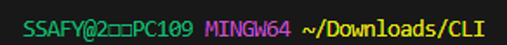

# [트랙특화] ChatGPT 챗봇 Programming

## CLI(Command Line Interface) - 리눅스

- 효율성 : 키보드만으로 모든 작업을 수행할 수 있으며 메모리와 CPU 사용량이 적어 저사양 시스템에서도 효율적으로 동작
- 정밀한 제어 : 특정 프로그램이나 시스템의 세부 설정을 보다 정밀하게 제어할 수 있음
- 표준성 : CLI 명령어는 대부분의 Unix 운영체제 기반 시스템에서 동일하게 작동하여 여러 환경에서 적용할 수 있음 → <U>윈도우는 해당 표준성을 따르지 않음</U>

Bash(Unix 계열의 터미널) vs. CMD(Windows 계열의 터미널)
- CLI에서 ‘.’ (점)의 역할
    - . : 현재 디렉토리(폴더)
    - .. : 현재의 상위 디렉토리(부모 폴더)

절대 경로 : Root 디렉토리부터 목적 지점까지 거치는 모든 경로를 전부 작성한 것

⭐상대 경로 : 현재 작업하고 있는 디렉토리를 기준으로 계산된 상대적 위치를 작성한 것

## CLI 기초 문법

[[Linux] 리눅스 CLI 기본 개념과 명령어 정리](https://ittrue.tistory.com/79)

⭐CLI를 사용할 때에는 현재 작업 중인 디렉토리의 확인이 중요함.

~ : 홈 디렉토리

Downloads : 상위 디렉토리

CLI : 현재 디렉토리

`touch` : 파일 생성하기

    touch [-옵션] [이름]
    
`mkdir` : 새로운 디렉토리 생성 (make directories)
       
    mkdir name
    
`ls` : 현재 위치 디렉토리의 리스트 출력 (list)
        
    ls [이름]

`cd` : 터미널의 현재 위치 변경 (change directory)
        
    cd
    
`start` : 폴더/파일을 열기
        
    start [이름]
    
`rm` : 디렉토리 또는 파일 삭제 (remove)
        
    rm [-옵션] [이름]
    
ctrl + l : Terminal에서 보이는 line들을 clear