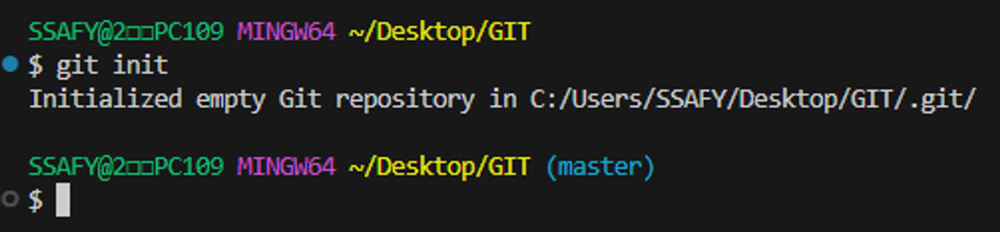

# [트랙특화] ChatGPT 챗봇 Programming

## ⭐GIT : 분산 버전 관리 시스템

리누스 토르발스 : git와 분산 버전 관리 시스템인 Git의 창시자

Git 자체는 Github, Gitlab과 관계 없음. 단순 정보 업로드를 위한 공간임

버전 관리 : 변화를 기록하고 추적하는 것, 마지막 파일과 변경 사항만 남기기

ex) Google docs 內 Words

중앙 집중식 : 버전은 중앙 서버에 저장되고 중앙 서버에서 파일을 가져와 다시 중앙에 업로드

분산식 : 버전을 여러 개의 복제된 저장소에 저장 및 관리

- 중앙 서버에 의존하지 않고도 동시에 다양한 작업을 수행할 수 있음
    - 개발자들 간의 작업 충돌을 줄여주고 개발 생산성을 향상
- 중앙 서버의 장애나 손실에 대비하여 백업과 복구가 용이
- 인터넷에 연결되지 않은 환경에서도 작업을 계속할 수 있음
    - 변경 이력과 코드를 로컬 저장소에 기록하고, 나중에 중앙 서버와 동기화

## GIT 영역

지역 저장소 (local repository) : 작업하는 컴퓨터의 저장소

원격 저장소 (remote repository) : 로컬이 아닌 컴퓨터 혹은 서버의 저장소

- Working Directory : 실제 작업 중인 파일들이 위치하는 영역
- Staging Area : Working Directory에서 변경된 파일 중, 다음 버전에 포함시킬 파일들을 선택적으로 추가하거나 제외할 수 있는 준비 영역
- Repository : 버전 이력과 파일들이 영구적으로 저장되는 영역. 모든 버전과 변경 이력이 기록됨
- 로컬 : 현재 사용자가 직접 접속하고 있는 기기 또는 시스템. 개인 컴퓨터, 노트북, 태블릿 등 사용자가 직접 조작하는 환경 (cf. 온라인)

## 다양한 원격 저장소 서비스

- [GitLab](https://about.gitlab.com/)
- [GitHub](https://github.com/)
- Bitbucket

## GIT 명령어

- `git init` : 로컬 저장소 설정(초기화). git의 버전 관리를 시작할 디렉토리에서 진행
    ```
    git init
    ```
  

    
(master)가 보이는 경우 git의 영역 내에 있다는 뜻임.
    
올바르지 않은 위치에서 git init 명령을 내린 경우, git init 명령을 내린 디렉토리에서 .git (숨긴 항목) 폴더를 삭제
  
- git 로컬 저장소 내에 또 다른 git 로컬 저장소를 만들지 말 것
  - 즉, 이미 git 로컬 저장소인 디렉토리 내부 하단에서 git init 명령어를 다시 입력하지 말 것
  - git 저장소 안에 git 저장소가 있을 경우 가장 바깥 쪽의 git 저장소가 안쪽의 git 저장소의 변경사항을 추적할 수 없기 때문
  
- `git add` : 변경사항이 있는 파일을 staging area에 추가
     ```git
    git add [이름]
    ```
    
- `git add .` : 현재 디렉토리 내 변경사항이 있는 모든 파일을 staging area에 추가
    ```git
    git add .
    ```
    
- `git commit` : staging area에 있는 파일들을 저장소에 기록. 해당 시점의 버전을 생성하고 변경 이력을 남기는 것
    ```git
    git commit [-m] "메세지"
    ```
    
    - 해당 명령 실행 전, author identity unknown 문제를 해결해야 함. (Gitlab에 설정한 정보와 동일하게)
        - `git config --global user.email "[you@example.com](mailto:you@example.com)"`
        - `git config --global [user.name](http://user.name/) "Your Name"`
- Commit : 변경된 파일들을 저장하는 행위.
- `git status`: master, commits 관련 현재 상태에 대한 정보를 출력함
    ```git
    git status
    ```
    
    
    
    - a.py라는 파일에 staging area에 버전이 기록되지 않은 변경 사항이 있는 경우, “Untracked files”라는 status를 출력함.(working directory)
        
        
        
        - a.py라는 파일을 `add` 시키면 파일명이 초록색으로 변경함(staging area)
  
- `git log` : 현재까지 저장된 commit(version)을 출력함
    ```git
    git log
    ```
    
    
    
- `git log —oneline` : commit 목록 한 줄로 보기
    ```git
    git log --oneline
    ```

- `git remote` : 로컬 저장소에 원격 저장소 추가
    ```git
    git remote add origin remote_repo_url
    ```
    
    origin : 추가하는 원격 저장소 별칭.
    
    - 별칭을 사용해 로컬 저장소 한 개에 여러 원격 저장소를 추가 할 수 있음(개발자들 간의 암묵적인 약속)
    
    remote_repo_url : 추가하는 원격 저장소 주소
    
    ex) https://github.com/nonamed19/git-practice
    
- `git push` : 원격 저장소에 commit 목록을 업로드
    ```git
    git push origin master
    ```
    - git push는 기존 대비 변경사항(commit)만 원격 저장소에 올라감
    - commit 이력이 없다면 push 할 수 없음
- `git pull` : 원격 저장소에 있는 변경사항(commit)만을 다운로드
    ```git
    git pull
    ```
    
- `git clone` : 원격 저장소 전체를 복제(다운로드)
    ```git
    git clone remote_repo_url
    ```
    
    `git clone`으로 받은 프로젝트는 이미 `git init`이 되어 있음
    
- `git remote -v` : 연결되어 있는 원격 저장소의 리스트를 출력
    ```git
    git remote -v
    ```
    
- .gitignore : git에 연관되지 않는 파일을 설정하기 위해 사용
    
    
    
    [gitignore.io](https://www.toptal.com/developers/gitignore/)
    
    - Windows, Python, VisualStuodioCode는 PJT 초반에 세팅하기
    
    주의사항 : 이미 git의 관리를 받은 이력이 있는 파일이나 디렉토리는 나중에 gitignore에 작성해도 적용되지 않음 (git rm —cached 명령어를 통해 git 캐시에서 삭제 필요)