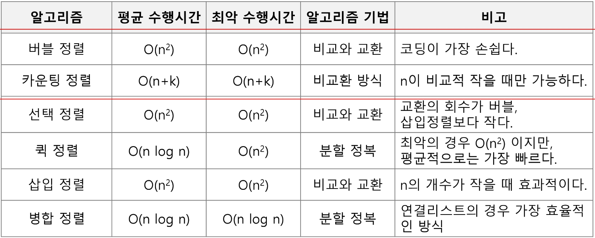

### APS(Algorithm Problem Solving) 기본 학습 :

입출력을 제외한 내장함수 사용하지 않기

기본적인 내장함수의 동작원리 이해

⭐보다 좋은 알고리즘을 이해하고 활용하기

- 정확성  : 얼마나 정확하게 동작하는가
- 작업량 : 얼마나 적은 연산으로 원하는 결과를 얻어내는가
- 메모리 사용량 : 얼마나 적은 메모리를 사용하는가
- 단순성 : 얼마나 단순한가
- 최적성 : 더 이상 개선할 여지없이 최적화되었는가

<br></br>

### 알고리즘(Algorithm) :

유한한 단계를 통해 문제를 해결하기 위한 절차나 방법

주로 컴퓨터 용어로 쓰이며, 컴퓨터가 어떤 일을 수행하기 위한 단계적 방법

컴퓨터 분야에서 알고리즘을 표현 하는 방법:

1. 의사코드(수도코드, Pseudo Code)
2. 순서도

<br></br>

### 시간 복잡도(Time Complexity) :

**⭐**알고리즘의 작업량을 표현

실제 걸리는 시간을 측정

실행되는 명령문의 개수를 계산

### 빅-오 표기법(Big-O Notation)

시간 복잡도 함수 중에서 가장 큰 영향력을 주는 n에 대한 항만을 표시

계수(Coefficient)는 생략하여 표시

ex1) O(3n + 2) → O(3n) → O(n)

ex2) O(2n^2 + 10n + 100) = O(n^2)

ex3) O(4) = O(1)

<br></br>

### 배열 :

일정한 자료형의 변수들을 하나의 이름으로 열거하여 사용하는 자료구조

프로그램 내에서 여러 개의 변수가 필요할 때, 일일이 다른 변수명을 이용하여 자료에 접근하는 것은 매우 비효율적일 수 있음

→ 배열을 사용하면 하나의 선언을 통해서 둘 이상의 변수를 선언할 수 있음

1차원 배열의 선언 :

ex. `Arr = list()` / `Arr = []` / `Arr = [1, 2, 3]` \ `Arr = [0]*10`

1차원 배열의 접근 :

ex. `Arr[0] = 10` / `Arr[idx] = 20`

### 정렬 :

2개 이상의 자료를 특정 기준에 의해 작은 값부터 큰 값(오름차순: ascending), 혹은 그 반대의 순서대로(내림차순: descending) 재배열하는 것

### 키 :

자료를 정렬하는 기준이 되는 특정 값

정렬 방식의 종류 :



- 버블 정렬(Bubble Sort) :
    
    인접한 두 개의 원소를 비교하며 자리를 계속 교환하는 방식
    
    교환하며 자리를 이동하는 모습이 물 위에 올라오는 거품 모양과 같다고 하여 버블 정렬이라고 한다.
    
    시간 복잡도 : O(n^2)
    
    .png)
    
    첫 번째 원소부터 인접한 원소까지 계속 자리를 교환하면서 맨 마지막 자리까지 이동한다.
    
    한 단계가 끝나면 가장 큰 원소가 마지막 자리로 정렬된다.
    
    - 버블 정렬 알고리즘 in pseudo code
        
        ```jsx
        # 정렬할 배열과 배열의 크기
        BubbleSort(a, N)
            # 정렬할 구간의 끝
            for i : N-1 -> 1
                # 비교할 원소 중 왼쪽 원소의 인덱스
                for j : 0 -> i-1
                    # 왼쪽 원소가 더 크면
                    if a[j] > a[j+1]
                        # 오른쪽 원소와 교환
                        a[j] <-> a[j+1]
        ```
        
    - 버블 정렬 알고리즘 in Python code
        
        ```python
        # 정렬할 List, N 원소 수
        def BubbleSort(a, N):
            # 범위의 끝 위치
            for i in range(N-1, 0, -1):
                # 비교할 왼쪽 원소
                for j in range(0, i):
                    if a[j] > a[j+1]:
                        a[j], a[j+1] = a[j+1], a[j]
        ```
        
- 카운팅 정렬(Counting Sort) :
    
    항목들의 순서를 결정하기 위해 집합에 각 항목이 몇 개씩 있는지 세는 작업을 하여, 선형 시간에 정렬하는 효율적인 알고리즘
    
    정수나 정수로 표현할 수 있는 자료에 대해서만 적용 가능 → 각 항목의 발생 횟수를 기록하기 위해, 정수 항목으로 인덱스 되는 카운트들의 배열을 사용하기 때문
    
    카운트들을 위한 충분한 공간을 할당하려면 집합 내 가장 큰 정수를 알아야 한다
    
    시간 복잡도 : O(n + k) : n은 리스트 길이, k는 정수의 최대값
    
    .png)
    
    Data에서 각 항목들의 발생 횟수를 세고, 정수 항목들로 직접 인덱스 되는 카운트 배열 counts에 저장한다.
    
    정렬된 집합에서 각 항목의 앞에 위치할 항목의 개수를 반영하기 위해 counts의 원소를 조정한다.
    
    이후, counts[idx]를 감소시키며 Data에 있는 정수를 Temp 리스트에 정렬시킨다.
    → Data의 색인은 뒤에서부터 앞으로 진행한다.
    
    - 카운팅 정렬 알고리즘 in Python code
        
        ```python
        DATA = [0, 4, 1, 3, 1, 2, 4, 1]
        COUNTS = [0] * 5                    # DATA의 최대값 : 4
        
        N = len(DATA)                       # DATA의 크기
        TEMP = [0] * N                      # 정렬 결과 저장을 위한 list
        
        # 1단계 : DATA 원소 별 개수 세기
        for num in DATA:
            COUNTS[num] += 1
        
        # 2단계 : 각 숫자까지의 누적 개수 구하기
        for i in range(len(COUNTS)-1):
            COUNTS[i+1] += COUNTS[i]
        
        # 3단계 : DATA의 맨 뒤부터 TEMP에 자리 잡기
        for i in range(len(DATA)-1, 0, -1):
            COUNTS[DATA[i]] -= 1
            TEMP[COUNTS[DATA[i]]] = DATA[i]
        ```
        

<span>+ </span>선택 정렬(Selection Sort)

<span>+ </span>퀵 정렬(Quick Sort)

<span>+ </span>삽입 정렬(Insertion Sort)

<span>+ </span>병합 정렬(Merge Sort)

<br></br>

### Baby-gin Game

0_9까지의 숫자 카드에서 임의의 카드 6장을 뽑았을 때, 3장의 카드가 연속적인 번호를 갖는 경우를 run이라 하고, 3장의 카드가 동일한 번호를 갖는 경우를 triplet이라 한다.

6장의 카드가 run과 triplet로만 구성된 경우를 baby-gin으로 부른다.

6자리의 숫자를 입력 받아 baby-gin 여부를 판단하는 프로그램을 작성하라.

ex. 667767은 두 개의 triplet이므로 baby-gin이다. (666, 777)

ex. 054060은 한 개의 run과 한 개의 triplet이므로 역시 baby-gin이다. (456, 000)

ex. 101123은 한 개의 triplet가 존재하나, 023이 run이 아니므로 baby-gin이 아니다.
(123을 run으로 사용하더라도 011이 run이나 triplet가 아님)

6자리의 숫자를 입력 받아 어떻게 Baby-gin 여부를 찾을 것인가 ?

```python
num = 456789    # Baby Gin 확인 할 6자리 수
c = [0] * 12    # 6자리 수로부터 각 자리 수를 추출하여 개수를 누적할 리스트

for i in range(6):
    c[num % 10] += 1
    num //= 10

i = 0
tri = run = 0
while i < 10:
    if c[i] >= 3: # triplet 조사 후 데이터 삭제
        c[i] -= 3
        tri += 1
        continue;
    if c[i] >= 1 and c[i+1] >= 1 and c[i+2] >= 1: # run 조사 후 데이터 삭제
        c[i] -= 1
        c[i+1] -= 1
        c[i+2] -= 1
        run += 1
        continue

    i += 1

if run + tri == 2: print('Baby Gin')
else: print('Lose')
```

<br></br>

### 완전 검색(Exaustive Search) :

완전 검색 방법은 문제의 해법으로 생각할 수 있는 모든 경우의 수를 나열해보고 확인하는 기법이다.

a.k.a. Brute force 혹은 generate-and-test 기법

모든 경우의 수를 테스트 한 후, 최종 해법을 도출한다.

일반적으로 경우의 수가 상대적으로 작을 때 유용하다.

→ 모든 경우의 수를 생성하고 테스트하기 때문에 수행 속도는 느리지만, 해답을 찾아내지 못할 확률이 작다.

### 순열(Permutation) :

서로 다른 것들 중 몇 개를 뽑아서 한 줄로 나열하는 것

서로 다른 n개 중 r개를 택하는 순열 :

nPr = n * (n-1) * (n-2) * … * (n-r+1)

nPn = n! = n * (n-1) * (n-2) * … * 2 * 1 # factorial

- {1, 2, 3}을 포함하는 모든 순열을 생성하는 함수
    
    ```
    for i1 in range(1, 4):
        for i2 in range(1, 4):
            if i2 != i1:
                for i3 in range(1, 4):
                    if i3 != i1 and i3 != i2:
                        print(i1, i2, i3)
    ```
    

### 탐욕(Greedy) 알고리즘 :

탐욕 알고리즘은 최적해를 구하는 데 사용되는 근시안적인 방법

여러 경우 중 하나를 결정해야 할 때마다 그 순간에 최적이라고 생각되는 것을 선택해 나가는 방식으로 진행하여 최종적인 해답에 도달한다.

각 선택의 시점에서 이루어지는 결정은 지역적으로는 최적이지만, 그 선택들을 계속 수집하여 최종적인 해답을 만들었다고 하여, 그것이 최적이라는 보장은 없다.

1. 해 선택 : 현재 상태에서 부분 문제의 최적 해를 구한 뒤, 이를 부분해 집합(Solution Set)에 추가한다.
2. 실행 가능성 검사 : 새로운 부분해 집합이 실행 가능한지를 확인한다. 곧, 문제의 제약 조건을 위반하지 않는지를 검사한다.
3. 해 검사 : 새로운 부분해 집합이 문제의 해가 되는지를 확인한다. 아직 전체 문제의 해가 완성되지 않았다면 1)의 해 선택부터 다시 시작한다.