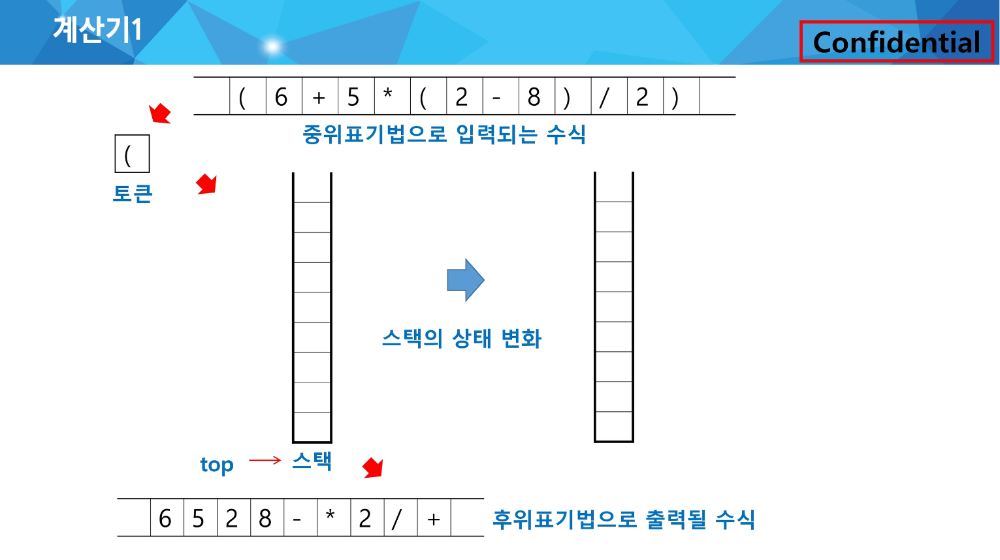

### 문자열 수식 계산의 일반적 방법 :

- 중위표기법(infix notation) : 연산자를 피연산자의 가운데 표기하는 방법 (A+B)
- 후위표기법(postfix notation) : 연산자를 피연산자 뒤에 표기하는 방법 (AB+)

### 중위 표기법의 수식을 후위 표기법으로 변경 (스택 이용)

- 수식의 각 연산자에 대해서 우선순위에 따라 괄호를 사용하여 다시 표현 : `((A*B)-(C/D))`
- 각 연산자를 그에 대응하는 오른쪽 괄호의 뒤로 이동 : `((A B)*(C D)/)-`
- 괄호를 제거 : `AB*CD/-`

<br>

### 계산기 1 :

문자열로 된 계산식이 주어질 때, 스택을 이용하여 이 계산식의 값을 계산할 수 있다.



| 토큰 | isp(in-stack priority) | icp(in-coming priority) |
| --- | --- | --- |
| ) | - | - |
| *, / | 2 | 2 |
| +, - | 1 | 1 |
| ( | 0 | 3 |

```python
icp(in-coming priority)
isp(in-stack priority)

if (icp > isp) push()
else pop()
```

top : 스택에 쌓여 있는 마지막 값

1. 토큰이 연산자인 경우
스택연산 `push()`과 스택 top 비교 → 높거나 같으면 push → top 변경
스택연산 push()과 스택 top 비고 → 낮으면 스택의 우선순위가 더 낮아질때까지 pop → top 변경
2. 토큰이 피연산자인 경우
피연산자 출력
3. 토큰이 `‘)’` 인 경우, 여는 괄호를 만날 때 까지 모두 `pop()`

<br>

### 후위 표기법의 수식을 스택을 이용하여 계산

.png)

1. 피연산자를 만나면 스택에 `push`
2. 연산자를 만나면 필요한 만큼의 피연산자를 스택에서 `pop`하여 연산하고, 연산결과를 다시 스택에 `push`
3. 수식이 끝나면, 마지막으로 스택을 `pop`하여 출력

<br>

### 백트래킹(Back-tracking)

해를 찾는 도중에 ‘막히면’ (or 해가 아니면) 되돌아가서 다시 해를 찾는 기법

최적화(optimization) 문제와 결정(decision) 문제 해결에 사용

결정 문제 : 문제의 조건을 만족하는 해가 존재하는지의 여부를 ‘yes’ 또는 ‘no’로 답하는 문제

ex. 미로 찾기, n-Queen 문제, Map coloring, 부분 집합의 합(subset sum) 문제 등

어떤 노드의 유망성을 점검한 후에 유망(promising)하지 않다고 결정되면 그 노드의 부모로 되돌아가 다음 자식 노드로 감

어떤 노드를 방문하였을 때 그 노드를 포함한 경로가 해답이 될 수 없으면 그 노드는 유망하지 않다고 하며, 반대로 해답의 가능성이 있으면 유망하다고 함

가지치기(pruning) : 유망하지 않은 노드가 포함되는 경로는 더 이상 고려하지 않음

.png)

.png)

1. 상태 공간 트리의 깊이 우선 검색을 실시
2. 각 노드가 유망한지를 점검
3. 노드가 유망하지 않으면, 그 노드의 부모 노드로 돌아가서 검색을 계속함
- Backtracing Algorithm in pseudo code
    
    ```python
    def checknode(v) : # node
        if promising(v):
            if there is a solution at v:
                write the solution
            else:
                for u in each child of v:
                checknode(u)
    ```
    
- Maze Algorithm in python code(during class)
    
    ```python
    def fstart(N):
        for i in range(N):
            for j in range(N):
                if maze[i][j] == 2:
                    return i, j # 위치를 찾은 경우
        return -1, -1 # 위치를 찾지 못한 경우
    
    def dfs2(i, j, N): # 재귀
        visited[i][j] = 1
        if maze[i][j] == 3:
            return 1
        else:
            for di, dj in [[0,1], [1,0], [0,-1], [-1,0]]:
                ni, nj = i+di, j+dj
                # promising check
                if 0<=ni<N and 0<=nj<N and maze[ni][nj]!=1 and visited[ni][nj]==0:
                    if dfs2(ni, nj, N):
                        return 1
            return 0
    T = int(input())
    
    for tc in range(1, T+1):
        N = int(input())
        maze = [list(map(int, input())) for _ in range(N)]
    
        # 출발 위치 찾기
        sti, stj = fstart(N)
    
        visited = [[0]*N for _ in range(N)] # dfs2 용
        print(f'#{tc} {dfs2(sti, stj, N)}')
    ```
    
<br>

### 백트래킹과 깊이우선탐색과의 차이

어떤 노드에서 출발하는 경로가 해결책으로 이어질 것 같지 않으면 더 이상 그 경로를 따라가지 않음으로써 시도의 횟수를 줄임. (가치지기, pruning)

깊이우선탐색이 모든 경로를 추적하는데 비해 백트래킹은 불필요한 경로를 조기에 차단

깊이우선탐색을 가하기에는 경우의 수가 너무나 많음. 즉, N! 가지의 경우의 수를 가진 문제에 대해 깊이우선탐색을 가하면 당연히 처리 불가능함

백트래킹 알고리즘을 적용하면 일반적으로 경우의 수가 줄어들지만 이 역시 최악의 경우에는 여전히 지수함수 시간(exponential time)을 요하므로 처리 불가능함

<br>

### 부분집합

어떤 집합의 공집합과 자기자신을 포함한 모든 부분집합을 powerset이라고 하며, 구하고자 하는 어떤 집합의 원소 개수가 n일 경우 부분집합의 개수는 2^n개임

.png)

- 부분집합 powerset 생성 through python code
    
    ```python
    bit = [0, 0, 0, 0]
    for i in range(2):
        bit[0] = i                  # 0번째 원소
        for j in range(2):
            bit[1] = j              # 1번째 원소
            for k in range(2):
                bit[2] = k          # 2번째 원소
                for l in range(2):
                    bit[3] = l      # 3번째 원소
                    print(bit)      # 생성된 부분집합 출력
    ```
    

### 부분집합 powerset through 백트래킹 기법

n개의 원소가 들어있는 집합의 2^n개의 부분집합을 만들 때는, true 또는 false값을 가지는 항목들로 구성된 n개의 배열을 만드는 방법을 이용

여기서 배열의 i번째 항목은 i번째 원소가 부분집합의 값인지 아닌지를 나타내는 값

.png)

- 부분집합 powerset 생성 through python code
    
    ```python
    def backtrack(a, k, n): # a 주어진 배열, k 결정할 원소, n 원소 개수
        c = [0]*MAXCANDIDATES  # MAXCANDIDATES 크기의 리스트로 초기화하여 인덱스 에러 방지
    
        if k == n:
            process_solution(a, k) # 답이면 원하는 작업을 한다
        else:
            ncandidates = construct_candidates(a, k, n, c)
            for i in range(ncandidates):
                a[k] = c[i]
                backtrack(a, k+1, n)
    
    def construct_candidates(a, k, n, c):
        c[0] = True  # c 리스트에 값을 채워넣음
        c[1] = False
        return 2  # 후보군 개수를 반환
    
    def process_solution(a, k):
        for i in range(k):
            if a[i]:
                print(num[i], end='')  # 같은 줄에 출력
        print()  # 모든 num[i] 출력 후 줄바꿈
    
    MAXCANDIDATES = 2
    NMAX = 4
    a = [0]*NMAX
    num = [1, 2, 3, 4]
    backtrack(a, 0, 4)
    ```
    
<br>

### 순열

ex. 집합 {1, 2, 3}에서 모든 순열을 생성하는 함수

.png)

- Permutation through python code
    
    ```python
    for i1 in range(1, 4):
        for i2 in range(1, 4):
            if i2 != i1:
                for i3 in range(1, 4):
                    if i3 != i1 and i3 != i2:
                        print(i1, i2, i3)
    ```
    

### 순열 through 백트래킹 기법

.png)

- Permutation through python code
    
    ```python
    def backtrack(a, k, n):
        c = [0]*MAXCANDIDATES
    
        if k == n:
            for i in range(0, k):
                print(a[i], end=" ")
            print()
        else:
            ncandidates = construct_candidates(a, k, n, c)
            for i in range(ncandidates):
                a[k] = c[i]
                backtrack(a, k+1, n)
    
    def construct_candidates(a, k, n, c):
        in_perm = [False]*(NMAX + 1)
    
        for i in range(k):
            in_perm[a[i]] = True
    
        ncandidates = 0
        for i in range(1, NMAX + 1):
            if in_perm[i] == False:
                c[ncandidates] = i
                ncandidates += 1
    
        return ncandidates
    
    MAXCANDIDATES = 3
    NMAX = 3
    a = [0]*NMAX
    backtrack(a, 0, 3)
    ```
    
<br>

### 가지치기

집합 {1, 2, 3}의 원소에 대해 각 부분집합에서의 포함 여부를 트리로 표현

.png)

- 부분 집합 구하기 through python code(during class)
    
    ```python
    def f(i, K):    # bit[i]를 결정하는 함수
        if i == K:  # 모든 원소에 대해 결정하면
            for j in range(K):
                if bit[j]:  # bit[j]가 0이 아니면
                    print(a[j], end = ' ')
            print()         # 부분집합을 한 행에 표시
        else:
            bit[i] = 1
            f(i+1, K)
            bit[i] = 0
            f(i+1, K)
    
    N = 3
    a = [1, 2, 3]   # 주어진 원소의 집합
    bit = [0]*N     # 원소의 포함여부를 표시하는 배열
    
    f(0, N)         # N개의 원소에 대해 부분집합을 만드는 함수
    ```
    

i원소의 포함 여부를 결정하면 i까지의 부분 집합의 합 si를 결정할 수 있음

si-1이 찾고자 하는 부분집합의 합보다 크면 남은 원소를 고려할 필요가 없음 - pruning

- A[i] 원소를 부분 집합의 원소로 고려하는 재귀 함수 (A는 서로 다른 자연수의 집합)
    
    ```python
    # i-1 원소까지 고려한 합 s, 찾으려는 합 t
    
    f(i, N, s, t)
        if s == t           # i-1 원소까지의 합이 찾는 값인 경우
            ...
        elif i == N         # 모든 원소에 대한 고려가 끝난 경우
            ...
        elif s > t          # 남은 원소를 고려할 필요가 없는 경우
            ...
        else                # 남은 원소가 있고 s < t인 경우
            subset[i] = 1
            f(i+1, N, s+A[i], t)    # i 원소 포함
            subset[i] = 0
            f(i+1, N, s, t)         # i 원소 미포함
    ```
    

추가 고려 사항

- 고려한 구간의 합 S: S > T이면 중단
- 남은 구간의 합 RS: S + RS < T에서 남은 원소의 합을 다 더해도 찾는 값 T 미만인 경우 중단

```python
def f(i, k, s, t):  # i: 원소, k: 집합의 크기, s: i-1까지 고려된 합, t: 목표
    global cnt
    global fcnt
    fcnt += 1
    # pruning through back-tracking
    if s > t:       # 고려한 원소의 합이 찾는 합보다 큰 경우
        return
    elif s == t:
        cnt += 1
        return      # 남은 원소를 고려할 필요가 없는 경우
    elif i == k:
        return      # 모든 원소 고려
    # # 모든 원소 고려
    # if i == k:
    #     if s == t:
    #         cnt += 1
    else:
        bit[i] = 1
        f(i+1, k, s+A[i], t)    #A[i] 포함
        bit[i] = 0
        f(i+1, k, s, t)         #A[i] 미포함

A = [x for x in range(1, 11)]
N = 10

key = 55
cnt = 0         # 합이 key와 같인 부분집합의 수
bit = [0]*N
fcnt = 0        # 함수의 호출 횟수(확인용)

f(0, N, 0, key)
print(cnt, fcnt)
```