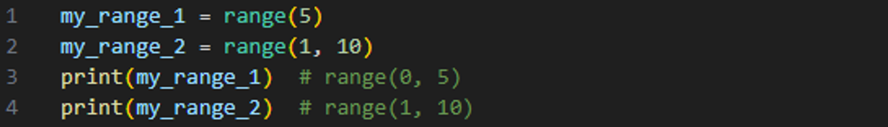
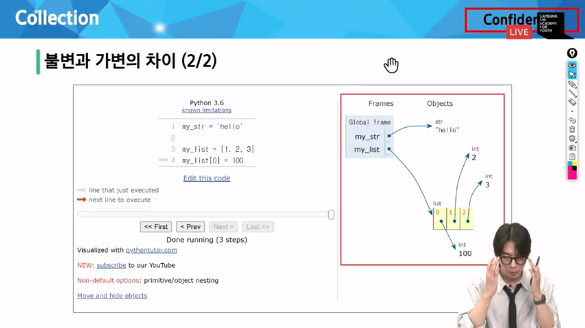
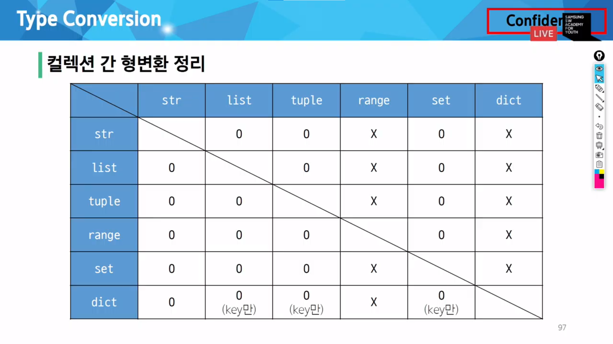
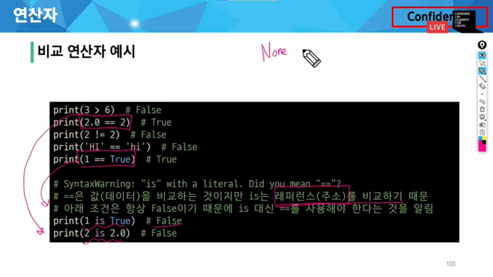
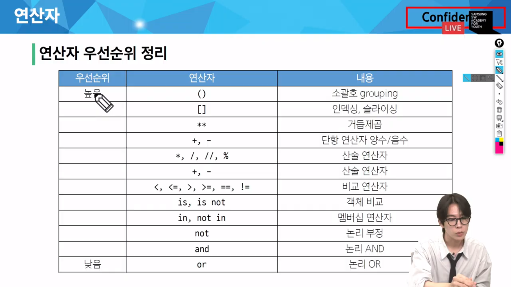

# 기초문법 2

### 리스트(list) :

여러 개의 값을 순서대로 저장하는 변경 가능한 시퀀스 자료형

- 0개 이상의 객체를 포함하며 데이터 목록을 저장
- 대괄호 [ ] 로 표기
- 데이터는 어떤 자료형도 저장할 수 있음

### 튜플(tuple) :

여러 개의 값을 순서대로 저장하는 변경 불가능한 시퀀스 자료형

- 0개 이상의 객체를 포함하며 데이터 목록을 저장
- 소괄호 ( ) 로 표기
- 데이터는 어떤 자료형도 저장할 수 있음
- 튜플은 어디에 쓰일까 ?
    - 튜플의 불변 특성을 사용한 안전하게 여러 개의 값을 전달, 그룹화, 다중 할당 등
    - 개발자가 직접 사용하기 보다 ‘파이썬 내부 동작’에서 주로 사용됨

### range :

연속된 정수 시퀀스를 생성하는 변경 불가능한 자료형

- `range(시작 값, 끝 값, 증가 값)`
- `range(n)` : 0부터 n-1까지의 숫자 시퀀스
- `range(n, m)` : n부터 m-1까지의 숫자 시퀀스
- range 특징 :
    - 증가 값이 없으면 1씩 증가
    - 증가 값이 음수이면 감소 / 증가 값이 양수이면 증가
    - 증가 값이 0이면 에러
    - 증가 값이 양수이면 시작 값이 끝 값보다 작아야 함
    - 증가 값이 음수이면 시작 값이 끝 값보다 커야 함

“range”라는 자료형이 존재함. 반복문에서만 사용되는 것은 아님.

### 딕셔너리(dict) :

key-value 쌍으로 이루어진 순서와 중복이 없는 변경 가능한 자료형

- key는 변경 불가능한 자료형만 사용 가능 (str, int, float, tuple, range …)
- value는 모든 자료형 사용 가능
- 중괄호 { } 로 표기
- 딕셔너리는 키에 접근해 값을 얻어냄

### 세트(set) - 집합 자료형:

순서와 중복이 없는 변경 가능한 자료형

- 수학에서의 집합과 동일한 연산 처리 가능
- 중괄호 { } 로 표기

빈 세트를 생성하기 위해서는 `set()`를 사용해야 함.

- 세트의 집합 연산
    
    `set_1 | set_2` : 합집합
    
    `set_1 - set_2` : 차집합
    
    `set_1 & set_2` : 교집합
    

### None :

파이썬에서 ‘값이 없음’을 표현하는 자료형

### Boolean :

참(True)과 거짓(False)을 표현하는 자료형

- 비교 / 논리 연산의 평가 결과로 사용됨
- 주로 조건 / 반복문과 함께 사용

### Collection :

여러 개의 항목 또는 요소를 담는 자료 구조 (str, list, tuple, set, dict)

| 컬렉션 | 변경 가능 여부 | 순서 여부 |
| --- | --- | --- |
| str | X | O |
| list | O | O |
| tuple | X | O |
| dict | O | X |
| set | O | X |

### 형변환(Type Conversion) :

한 데이터 타입을 다른 데이터 타입으로 변환하는 과정.

- 암시적 형변환(Implicit Type Conversion)
    
    파이썬이 자동으로 수행하는 형변환
    
    ex. 정수와 실수의 연산에서 정수가 실수로 변환됨(Boolean, Numeric type only)
    
- 명시적 형변환(Explicit Type Conversion)
    
    프로그래머가 직접 지정하는 형변환. 암시적 형변환이 아닌 경우를 모두 포함
    
    ex. str → int : 형식에 맞는 숫자만 가능
    
    ex. int → str : 모두 가능
    
    
    

# 연산자

### 1. 산술 연산자

### 2. 복합 연산자 :

연산과 할당이 함께 이뤄짐

| 기호 | 예시 | 의미 |
| --- | --- | --- |
| += | a += b | a = a + b |
| -= | a -= b | a = a - b |
| * | a *= b | a = a * b |
| /= | a /= b | a = a / b |
| //= | a //= b | a = a // b |
| %= | a %= b | a = a % b |
| **= | a **= b | a = a ** b |

### 3. 비교 연산자

| 기호 | 내용 |
| --- | --- |
| < | 미만 |
| ≤ | 이하 |
| > | 초과 |
| ≥ | 이상 |
| == | 같음 |
| ≠ | 같지 않음 |
| is | 같음 |
| is not | 같지 않음 |

is 비교 연산자 : 메모리 내에서 같은 객체를 참조하는 지 확인

- `==` 는 동등성(equality) `is`는 식별성(identity)
    
    
    

`==`는 값을 비교하지만 `is`는 레퍼런스(주소)를 비교하기 때문에 `is` 대신 `==`를 사용해야 함.

### 4. 논리 연산자 :

| 기호 | 연산자 | 내용 |
| --- | --- | --- |
| and | 논리곱 | 두 피연산자 모두 True인 경우에만 전체 표현식을 True로 평가 |
| or | 논리합 | 두 피연산자 중 하나라도 True인 경우 전체 표현식을 True로 평가 |
| not | 논리부정 | 단일 피연산자를 부정 |

단축평가 :

논리 연산에서 두 번째 피연산자를 평가하지 않고 결과를 결정하는 동작

코드 실행을 최적화하고, 불필요한 연산을 피할 수 있도록 함

`and`는 뒤에 있는 값 / `or`는 앞에 있는 값

단축평가 동작 :

`and`

- 첫 번째 피연산자가 False인 경우, 전체 표현식은 False로 결정.
두 번째 피연산자는 평가되지 않고 그 값이 무시
- 첫 번째 피연산자가 True이 경우, 전체 표현식의 결과는 두 번째 피연산자에 의해 결정.
두 번째 피연산자가 평가되고 그 결과가 전체 표현식의 결과로 반환

`or`

- 첫 번째 피연산자가 True인 경우, 전체 표현식은 True로 결정.
두 번째 피연산자는 평가되지 않고 그 값이 무시
- 첫 번째 피연산자가 False인 경우, 전체 표현식의 겨로가는 두 번째 피연산자에 의해 결정.
두 번째 피연산자가 평가되고 그 결과가 전체 표현식의 결과로 반환

### 5. 멤버십 연산자 :

특정 값이 시퀀스나 다른 컬렉션이 속하는지 여부를 확인

| 기호 | 내용 |
| --- | --- |
| in | 왼쪽 피연산자가 오른쪽 피연산자의 시퀀스에 속하는지를 확인 |
| not in | 왼쪽 피연산자가 오른쪽 피연산자의 시퀀스에 속하지 않는지를 확인 |

### 6. 시퀀스형 연산자 :

`+`와 `*`는 시퀀스 간 연산에서 산술 연산자일때와 다른 역할을 가짐

| 연산자 | 내용 |
| --- | --- |
| + | 결합 연산자 |
| * | 반복 연산자 |

연산자 우선순위 :

---

`from copy import deepcopy`