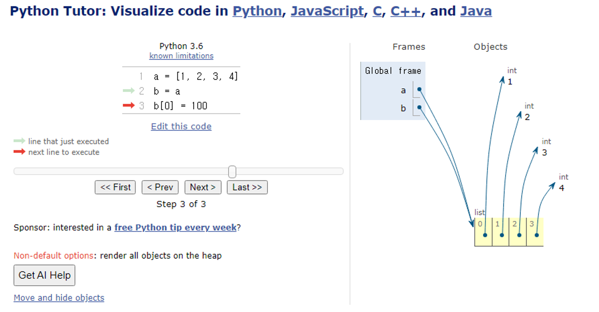

### 데이터 구조(Data Structure) :

여러 데이터를 효과적으로 사용, 관리하기 위한 구조(str, list, dict 등)

자료 구조 <컴퓨터 공학> :

각 데이터의 효율적인 저장, 관리를 위한 구조를 나눠 놓은 것

### 메서드(Method) :

```python
'hello'.capitalize() # 데이터 타입 객체.메서드()
```

객체에 속한 함수. 객체의 상태를 조작하거나 동작을 수행

메서드는 클래스(class) 내부에 정의되는 함수

클래스는 파이썬에서 ‘타입을 표현하는 방법’이며 이미 은연중에 사용해왔음

예를 들어 help 함수를 통해 str을 호출해보면 class였다는 것을 확인 가능

- Method는 class에 속해 있는 함수이며, 각 데이터 타입별로 다양한 기능을 가진 method가 존재

### 시퀀스 데이터 구조

### 문자열 조회/탐색 및 검증 메서드

- `s.find(x)` : x의 첫번째 위치를 반환. 없으면, -1을 반환
    
    ```python
    text = 'banana'
    print(text.find('a')) # 1
    print(text.find('z')) # -1
    ```
    
- `s.index(x)` : x의 첫번째 위치를 반환. 없으면, 오류 발생
    
    ```python
    text = 'banana'
    print(text.index('a')) # 1
    print(text.index('z')) # AttributeError
    ```
    
- `s.isupper()` : 대문자 여부
    
    ```python
    string1 = 'HELLO'
    string2 = 'Hello'
    print(string1.isupper()) # True
    print(string2.isupper()) # False
    ```
    
- `s.islower()` : 소문자 여부
    
    ```python
    string1 = 'HELLO'
    string2 = 'Hello'
    print(string1.islower()) # False
    print(string2.islower()) # False
    ```
    
- `s.isalpha()` : 알파벳 문자 여부, *단순 알파벳이 아닌 유니코드 상 letter (한국어도 포함)
    
    ```python
    string1 = 'Hello'
    string2 = '123hello'
    print(string1.isalpha()) # Trie
    print(string2.isalpha()) # False
    ```
    

### 문자열 조작 메서드(새 문자열 반환)

- `s.replace(old, new[,count])` : 바꿀 대상 글자를 새로운 글자로 바꿔서 변환
    
    ```python
    text = 'Hello, world!'
    new_text = text.replace('world', 'Python')
    print(new_text) # Hello, Python!
    
    text = 'Hello, world! world! world!'
    new_text = text.replace('world', 'Python')
    print(new_text) # Hello, Python! Python! Python!
    
    text = 'Hello, world! world! world!'
    new_text = text.replace('world', 'Python', 1)
    print(new_text) # Hello, Python! world! world!
    ```
    
- `s.strip([chars])` : 공백이나 특정 문자를 제거
    
    ```python
    text = '  Hello, world!  '
    new_text = text.strip()
    print(new_text) # Hello, world!
    ```
    
- `s.split(sep = None, maxsplit = -1)` : 공백이나 특정 문자를 기준으로 분리
    
    ```python
    text = 'Hello, world!'
    words = text.split(',')
    print(words) # ['Hello', ' world!']
    
    text = 'Hello, world!'
    words = text.split()
    print(words) # ['Hello,', 'world!']
    ```
    
- `‘separator’.join(iterable)` : 구분자로 iterable의 문자열을 연결한 문자열을 반환
    
    ```python
    words = ['Hello', 'world!']
    new_text = '-'.join(words)
    print(new_text) # Hello-world!
    ```
    
- `s.capitalize()` : 가장 첫번째 글자를 대문자로 변경
*뒤에 있는 문자열은 모두 소문자로 변경
    
    ```python
    text = 'heLLo, woRld!'
    new_text1 = text.capitalize()
    print(new_text1) # Hello, world!
    ```
    
- `s.title()` : 문자열 내 띄어쓰기 기준으로 각 단어의 첫 글자는 대문자로, 나머지는 소문자로 변환
    
    ```python
    text = 'heLLo, woRld!'
    new_text1 = text.title()
    print(new_text1) # Hello, World!
    ```
    
- `s.upper()` : 모두 대문자로 변경
    
    ```python
    text = 'heLLo, woRld!'
    new_text1 = text.upper()
    print(new_text1) # HELLO, WORLD!
    ```
    
- `s.lower()` : 모두 소문자로 변경
    
    ```python
    text = 'heLLo, woRld!'
    new_text1 = text.lower()
    print(new_text1) # hello, world!
    ```
    
- `s.swapcase()` : 대↔소문자 서로 변경
    
    ```python
    text = 'heLLo, woRld!'
    new_text1 = text.swapcase()
    print(new_text1) # HEllO, WOrLD!
    ```
    
- `s.isdecimal()` : 가장 엄격한 기준을 적용, 오직 일반적인 십진수 숫자(0-9)만 True로 인식
    
    ```python
    print("'12345'.isdecimal():", '12345'.isdecimal()) # True
    print("'123.45'.isdecimal():", '123.45'.isdecimal()) # False
    print("'-123'.isdecimal():", '-123'.isdecimal()) # False
    print("'Ⅳ'.isdecimal():", 'Ⅳ'.isdecimal()) # False
    print("'½'.isdecimal():", '½'.isdecimal()) # False
    print("'²'.isdecimal():", '²'.isdecimal()) # False
    ```
    
- `s.isdigit()` : 일반 숫자뿐만 아니라 지수 표현(²)도 True로 인식
    
    ```python
    print("'12345'.isdigit():", '12345'.isdigit()) # True
    print("'123.45'.isdigit():", '123.45'.isdigit()) # False
    print("'-123'.isdigit():", '-123'.isdigit()) # False
    print("'Ⅳ'.isdigit():", 'Ⅳ'.isdigit()) # False
    print("'½'.isdigit():", '½'.isdigit()) # False
    print("'²'.isdigit():", '²'.isdigit()) # True
    ```
    
- `s.isnumeric()` : 일반 숫자, 로마 숫자, 분수, 지수 등 다양한 형태의 숫자 표현을 True로 인식
    
    ```python
    print("'12345'.isnumeric():", '12345'.isnumeric()) # True
    print("'123.45'.isnumeric():", '123.45'.isnumeric()) # False
    print("'-123'.isnumeric():", '-123'.isnumeric()) # False
    print("'Ⅳ'.isnumeric():", 'Ⅳ'.isnumeric()) # True
    print("'½'.isnumeric():", '½'.isnumeric()) # True
    print("'²'.isnumeric():", '²'.isnumeric()) # True
    ```
    

### 리스트 값 추가 및 삭제 메서드

- `L.append(x)` : 리스트 마지막에 항목 x를 추가
    
    ```python
    my_list = [1, 2, 3]
    my_list.append(4)
    print(my_list) # [1, 2, 3, 4]
    
    my_list = [1, 2, 3]
    my_list.append([4, 5, 6], 7, 8)
    print(my_list) # TypeError
    ```
    
- `L.extend(m)` : Iterable m의 모든 항목들을 리스트 끝에 추가 (+=과 같은 기능)
    
    ```python
    my_list = [1, 2, 3]
    my_list.extend([4, 5, 6])
    print(my_list) # [1, 2, 3, 4, 5, 6]
    
    my_list.extend(5)
    print(my_list) # TypeError
    
    my_list = [1, 2, 3]
    my_list.append([4, 5, 6])
    print(my_list) # [1, 2, 3, [4, 5, 6]]
    ```
    
- `L.insert(i, x)` : 리스트 인덱스 i에 항목 x를 삽입
    
    ```python
    my_list = [1, 2, 3]
    my_list.insert(1, 5)
    print(my_list) # [1, 5, 2, 3]
    ```
    
- `L.remove(x)` : 리스트 가장 왼쪽에 있는 항목(첫 번째) x를 제거. 항목이 존재하지 않을 경우 ValueError
    
    ```python
    my_list = [1, 2, 3, 2, 2, 2]
    my_list.remove(2)
    print(my_list) # [1, 3, 2, 2, 2]
    ```
    
- `L.pop()` : 리스트 가장 오른쪽에 있는 항목(마지막)을 반환 후 제거
    
    ```python
    my_list = [1, 2, 3, 4, 5]
    item1 = my_list.pop()
    print(item1) # 5
    print(my_list) # [1, 2, 3, 4]
    ```
    
- `L.pop(i)` : 리스트의 인덱스 i에 있는 항목을 반환 후 제거
    
    ```python
    my_list = [1, 2, 3, 4, 5]
    item2 = my_list.pop(0)
    print(item2) # 1
    print(my_list) # [2, 3, 4, 5]
    ```
    
- `L.clear()` : 리스트의 모든 항목 삭제
    
    ```python
    my_list = [1, 2, 3]
    my_list.clear()
    print(my_list) # []
    ```
    

### 리스트 탐색 및 정렬 메서드

- `L.index(x)` : 리스트에서 첫 번째로 일치하는 항목 x의 인덱스를 반환
    
    ```python
    my_list = [1, 2, 3]
    index = my_list.index(2)
    print(index) # 1
    ```
    
- `L.count(x)` : 리스트에서 항목 x의 개수를 반환
    
    ```python
    my_list = [1, 2, 2, 3, 3, 3]
    count = my_list.count(3)
    print(count) # 3
    ```
    
- `L.reverse()` : 원본 리스트의 순서를 역순으로 변경 (정렬 X)
    
    ```python
    my_list = [1, 3, 2, 8, 1, 9]
    my_list.reverse()
    print(my_list) # [9, 1, 8, 2, 3, 1]
    ```
    
- `L.sort()` : 원본 리스트를 오름차순으로 정렬 (매개변수 이용가능)
    
    ```python
    my_list = [3, 2, 100, 1]
    my_list.sort()
    print(my_list) # [1, 2, 3, 100]
    
    my_list.sort(reverse=True)
    print(my_list) # [100, 3, 2, 1]
    ```
    

### 데이터 타입과 복사 :

파이썬에서는 데이터의 분류에 따라 복사가 달라짐

### 변경 가능한 데이터 타입의 복사

```python
a = [1, 2, 3, 4]
b = a
b[0] = 100

print(a) # [100, 2, 3, 4]
print(b) # [100, 2, 3, 4]
```



### 변경 불가능한 데이터 타입의 복사

```python
a = 20
b = a
b = 10

print(a) # 20
print(b) # 10
```


### 복사

할당(Assignment) : 할당 연산자(=)를 통한 복사는 해당 객체에 대한 객체 참조를 복사

```python
original_list = [1, 2, 3]
copy_list = original_list
print(original_list, copy_list) # [1, 2, 3] [1, 2, 3]

copy_list[0] = 'hi'
print(original_list, copy_list) # ['hi', 2, 3] ['hi', 2, 3]
```

얕은 복사(Shallow copy)

```python
a = [1, 2, 3]
b = a[:]
print(a, b) # [1, 2, 3] [1, 2, 3]

b[0] = 100
print(a, b) # [1, 2, 3] [100, 2, 3]
```

얕은 복사의 한계 : 2차원 리스트와 같이 변경 가능한 객체 안에 변경 가능한 객체가 있는 경우

```python
a = [1, 2, [1, 2]]
b = a[:]
print(a, b) # [1, 2, [1, 2]] [1, 2, [1, 2]]

b[2][0] = 100
print(a, b) # [1, 2, [100, 2]] [1, 2, [100, 2]]
```

깊은 복사(Deep copy)

```python
import copy

original_list = [1, 2, [1, 2]]
deep_copied_list = copy.deepcopy(original_list)

deep_copied_list[2][0] = 100

print(original_list) # [1, 2, [1, 2]]
print(deep_copied_list) # [1, 2, [100, 2]]
```

---

다양한 리스트 메서드

https://docs.python.org/3.9/tutorial/datastructures.html#data-structures