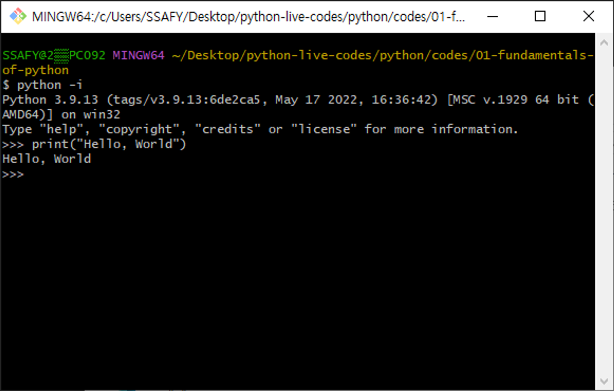
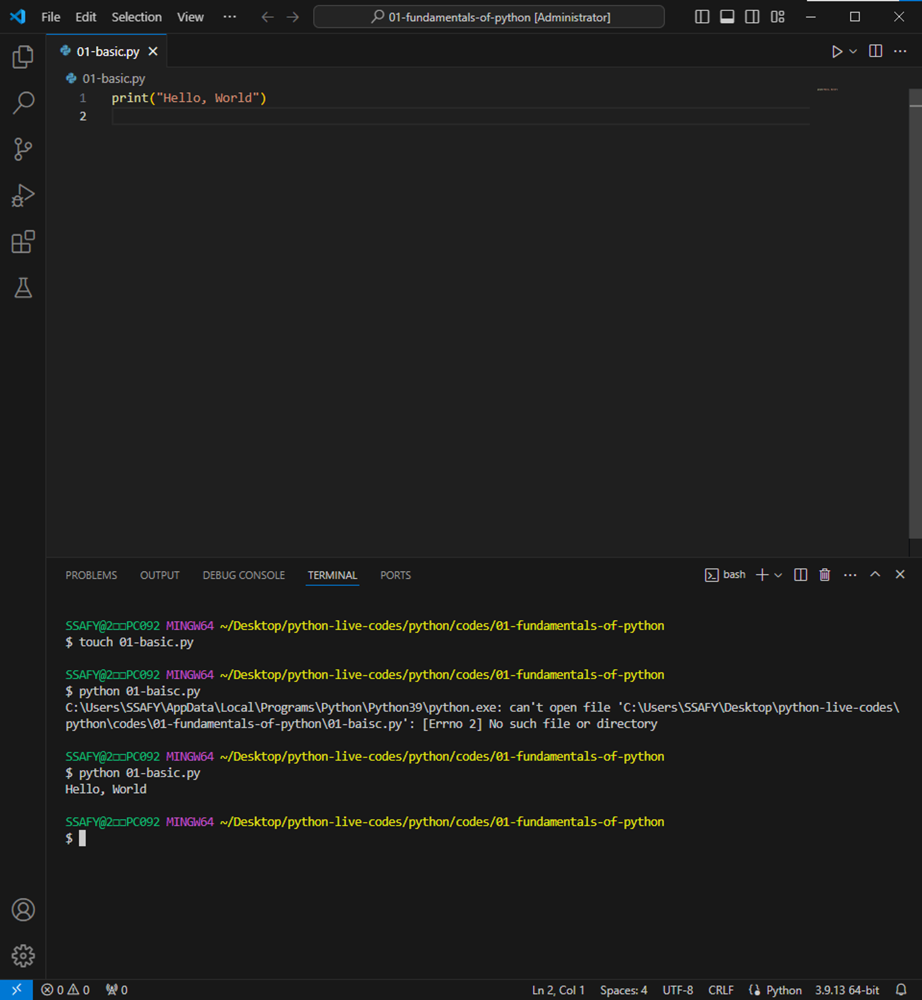
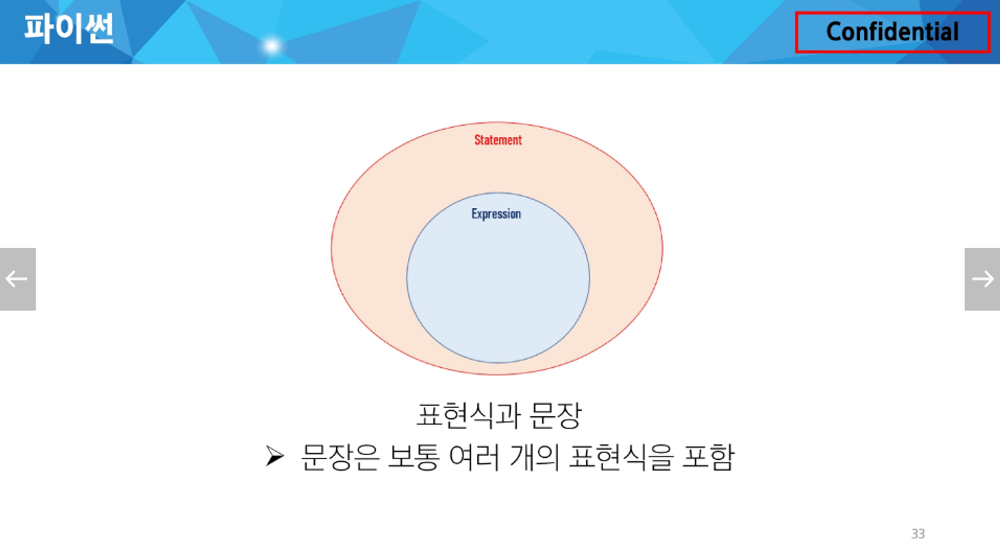
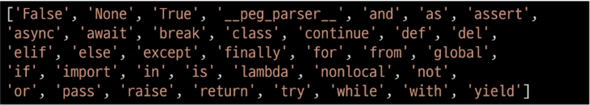
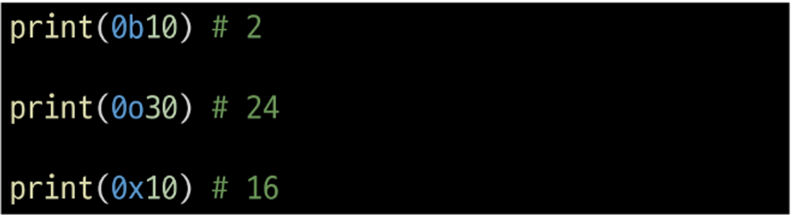
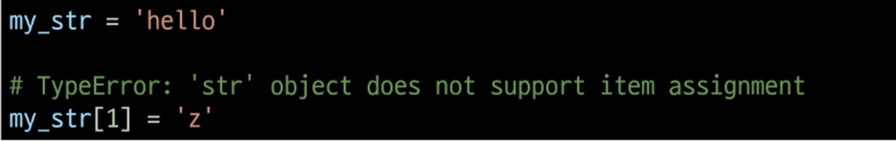
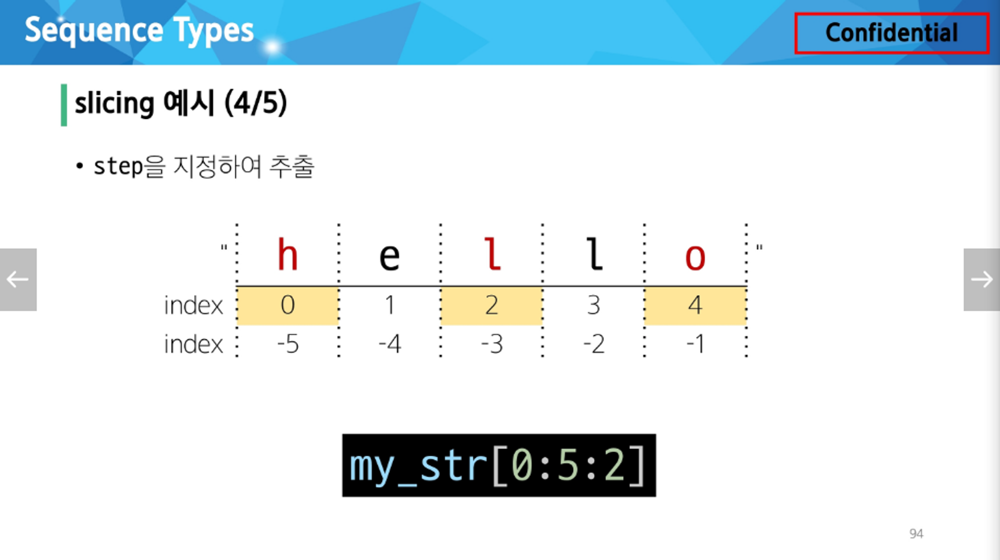
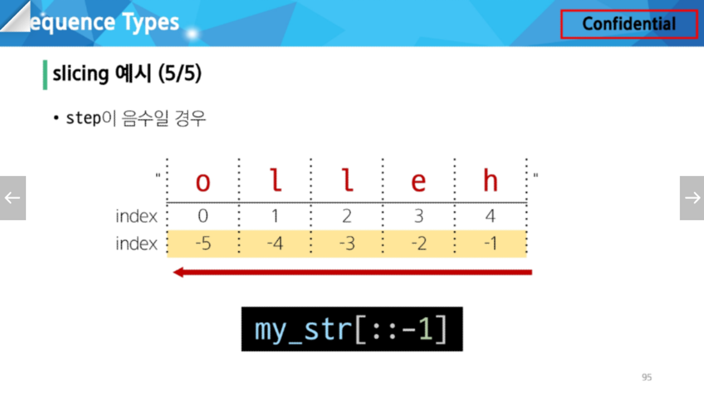
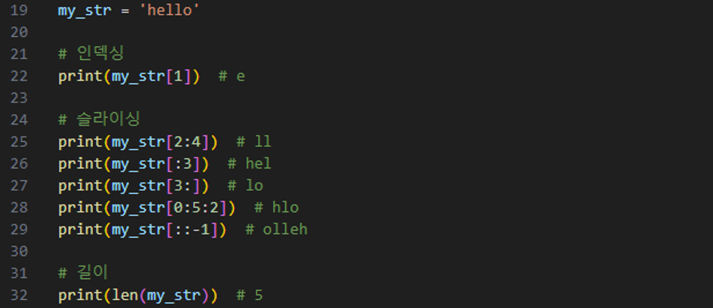
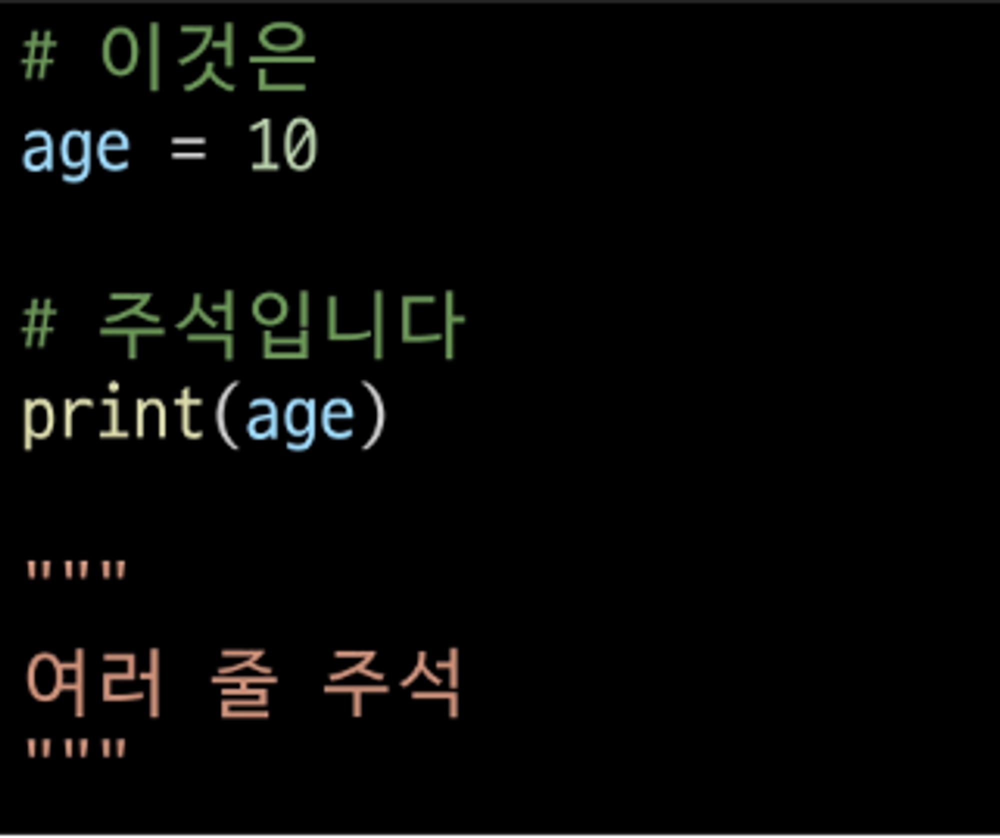

# 기초문법 1

프로그램 : 명령어들의 집합

프로그래밍의 핵심 : 새 연산을 정의하고 조합해 유용한 작업을 수행하는 것 → 문제를 해결하는 매우 강력한 방법

프로그래밍 언어 : 컴퓨터에게 작업을 지시하고 문제를 해결하는 도구

### Python

[파이썬을 배우는 이유]
- 쉽고 간결한 문법 : 읽기 쉽고 쓰기 쉬운 문법을 가지고 있어 쉽게 배우고 활용할 수 있음
- 파이썬 커뮤니티의 지원 : 세계적인 규모의 풍부한 온라인 포럼 및 커뮤니티 생태계
- 광범위한 응용 분야 : 웹 개발, 데이터 분석, 인공지능, 자동화 스크립트 등 다양한 분야에서 사용

[알고리즘 구현에 유리함]
- 직관적인 문법 : 복잡한 논리 구조의 알고리즘을 이해하고 구현하기에 쉬움
- 강력한 표준 라이브러리 : 다양한 알고리즘 구현에 필요한 도구를 제공
- 빠른 프로토타이핑 : 알고리즘을 빠르게 테스트하고 수정할 수 있음

[파이썬 프로그램이 실행되는 과정]
1. 컴퓨터는 기계어로 소통하기 때문에 사람이 기계어를 직접 작성하기 어려움
2. 인터프리터가 사용자의 명령어를 운영체제가 이해하는 언어로 바꿈 (파이썬 인터프리터)
  - shell이라는 프로그램으로 한번에 한 명령어씩 입력해서 실행
  
  - 확장자가 .py인 파일에 작성된 파이썬 프로그램을 실행
  
        
표현식(Expression) : 값으로 평가될 수 있는 코드 조각

값(Value) : 표현식이 평가된 결과

평가(Evaluate) : 표현식을 시행하여 값을 얻는 과정 → 표현식을 순차적으로 평가하여 프로그램의 동작을 결정

문장(Statement) : 실행 가능한 동작을 기술하는 코드(조건문, 반복문, 함수 정의 등)

변수(Variable) : 값을 저장하기 위한 이름 → 값을 참조하기 위한 이름

- 변수명 규칙 :
  - 영문 알파벳, 언더스코어(_), 숫자로 구성
  - 숫자로 시작할 수 없음(중간 위치에는 사용 가능)
  - 대소문자를 구분
  - 아래 키워드는 파이썬의 내부 예약어로 사용할 수 없음
        
    
        
객체(Object) : 타입을 갖는 메모리 주소 내 값

변수 할당 : 표현식을 통해 변수에 값을 저장 → 변수는 그 변수가 참조하는 객체의 메모리 주소를 가짐

- 할당문
 1. 할당 연산자(=) 오른쪽에 있는 표현식을 평가해서 값(메모리 주소)을 생성
 2. 값의 메모리 주소를 ‘=’ 왼쪽에 있는 변수에 저장
 3. (존재하지 않았던 변수라면) 새 변수를 생성
 4. (기존에 존재했던 변수라면) 기존 변수를 재사용해서 변수에 들어있는 메모리 주소를 변경

타입(Type) : 변수나 값이 가질 수 있는 데이터의 종류를 의미 → 어떤 종류의 데이터인지, 어떻게 해석되고 처리되어야 하는지를 정의

- 데이터 타입(Data Type) : 값의 종류와 그 값에 적용 가능한 연산과 동작을 결정하는 속성
  - Numeric Type : int(정수), float(실수), complex(복소수)
  - Text Sequence Type : str(문자열)
  - Sequence Type : list, tuple, range
  - Non-sequence Types : set, dict
  - 기타 : Boolean, None, Functions

- 산술 연산자

    | 기호 | 연산자 |
    | --- | --- |
    | - | 음수 부호 |
    | + | 덧셈 |
    | - | 뺄셈 |
    | * | 곱셈 |
    | / | 나눗셈 |
    | // | 정수 나눗셈(몫) |
    | % | 나머지 |
    | ** | 지수(거듭제곱) |

    | 우선순위 | 연산자 | 연산 |
    | --- | --- | --- |
    | 높음 | ** | 지수 |
    |  | - | 음수 부호 |
    |  | *, /, //, % | 곱셈, 나눗셈, 정수 나눗셈, 나머지 |
    | 낮음 | +, - | 덧셈, 뺄셈 |

### int(정수 자료형) :
정수를 표현하는 자료형

- 진수 표현 : 접두어 + 숫자로 표현
    
  2진수(binary) : 0b

  8진수(octal) : 0o

  16진수(hexadecimal) : 0x
    
    
    
### float(실수 자료형) :
실수를 표현하는 자료형, 프로그래밍 언어에서 float는 실수에 대한 근삿값

- 유한 정밀도 : 컴퓨터 메모리 용량이 한정되어 있고, 한 숫자에 대해 저장하는 용량이 제한됨
    - 컴퓨터는 2진수를 사용, 사람은 10진법을 사용
    - 컴퓨터는 무한대 숫자를 그대로 저장할 수 없어서 사람이 사용하는 10진법의 근삿값만 표시
    - 이 과정에서 Floating point rounding error(부동소수점 에러)라는 결과가 나타남 → decimal 모듈을 사용해 부동소수점 연산의 정확성을 보장할 수 있음

지수 표현 : e 또는 E를 사용하여 지수를 표현

### Sequence Types :
여러 개의 값들을 순서대로 나열하여 저장하는 자료형

- 순서(Sequence) : 값들이 순서대로 저장 (정렬 X)
- 인덱싱(Indexing) : 각 값에 고유한 인덱스(번호)를 가지고 있으며, 인덱스를 사용하여 특정 위치의 값을 선택하거나 수정할 수 있음
- 슬라이싱(Slicing) : 인덱스 범위를 조절해 부분적인 값을 추출할 수 있음
- 길이(Length) : len() 함수를 사용하여 저장된 값의 개수(길이)를 구할 수 있음
- 반복(Iteration) : 반복문을 사용하여 저장된 값들을 반복적으로 처리할 수 있음

### str(문자열) :
- 문자들의 순서가 있는 변경 불가능한 시퀀스 자료형
    
    
    
    cf) 가변 객체 타입
    
- 문자열은 단일 문자나 여러 문자의 조합으로 이루어짐
- 작은 따옴표(’) 또는 큰따옴표(”)로 감싸서 표현
- Escape sequence :
    
    역슬래시(backslash, \) 뒤에 특정 문자가 와서 특수한 기능을 하는 문자 조합
    
    파이썬의 일반적인 문법 규칙을 잠시 탈출한다는 의미
    
    | 예약 문자 | 내용(의미) |
    | --- | --- |
    | \n | 줄 바꿈 |
    | \t | 탭 |
    | \\ | 백슬래시 |
    | \’ | 작은 따옴표 |
    | \” | 큰 따옴표 |

- String Interpolation :
    
    문자열 내에 변수나 표현식을 삽입하는 방법
    
  ⭐f-string :
  - 문자열에 f 또는 F 접두어를 붙이고 표현식을 {Expression}로 작성하는 문법
  - 문자열에 파이썬 표현식의 값을 삽입할 수 있음

        bugs = 'roaches'
        counts = 13
        area = 'living room'
    
        # Debugging roaches 13 living room
        print(f'Debugging {bugs} {counts} {area}')

  - 문자열의 시퀀스 특징 :
  
    인덱스(index) : 시퀀스 내의 값들에 대한 교유한 번호로, 각 값의 위치를 식별하는 데에 사용되는 숫자
    
    슬라이싱(sliding) : 시퀀스의 일부분을 선택하여 추출하는 작업 → 시작 인덱스와 끝 인덱스를 지정하여 해당 범위의 값을 포함하는 새로운 시퀀스를 생성
        
    
    “0이상 5미만, 2개마다”
        
    
    “문자열 뒤집기”
        
    

---
### 기타

주석(comment) :
- 프로그램 코드 내에 작성되는 설명이나 메모
- 인터프리터에 의해 실행되지 않음
    
  
  “여러 줄 주석 : ctrl + /”
    
- 코드의 트정 부분을 설명하거나 임시로 코드를 비활성화할 때
- 코드를 이해하거나 문서화하기 위해
- 다른 개발자나 자신에게 코드의 의도나 동작을 설명하는 데 도움